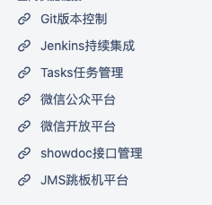
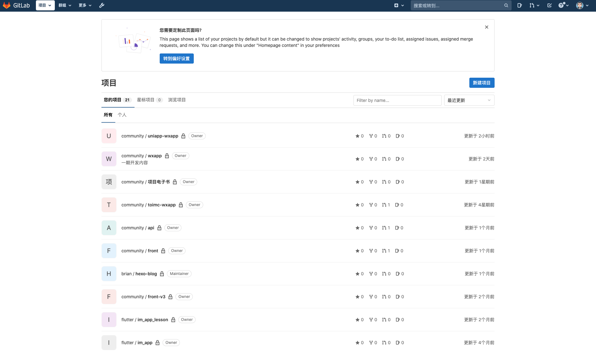
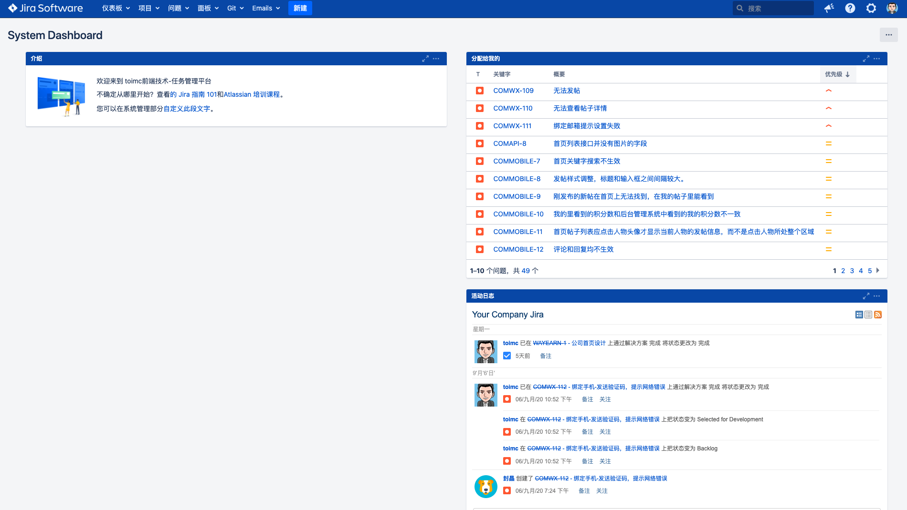
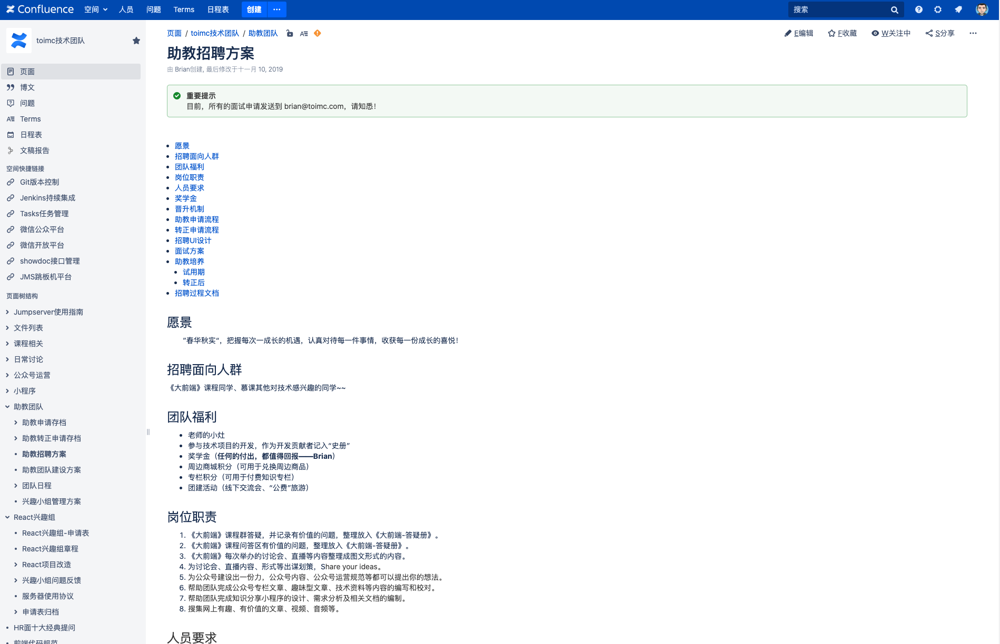
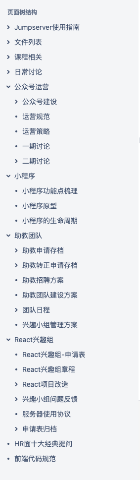
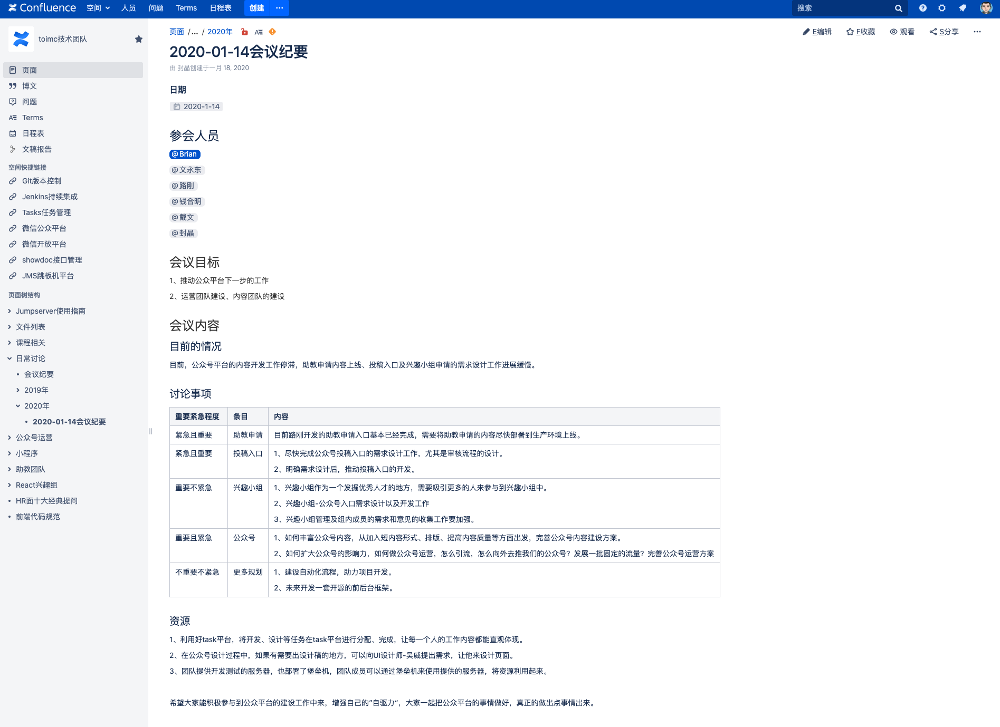

---

sidebarDepth: 2
---

# toimc团队

## 我们的使命

我们旨在以有趣、有料、有价值的内容打造一个服务于前端开发者的社区，帮助前端开发者学习并创造出影响⾏业的技术。

## 我们的愿景

- 传播技术的种子，让分享带来价值
- 让前端开发者成为一个更有价值的职业
- 打造一个伟⼤的前端开发者⽣生态系统
- 引领前端⾏业潮流

## 我们的价值观

开放 多元 奋进 创新

## 工作环境

我们是远程办公团队，建立一整套的敏捷流程的工作环境。

### 概览

### Git版本控制

### Tasks任务管理

### Wiki文档

## 团队日常

### 概览

### 会议纪要

