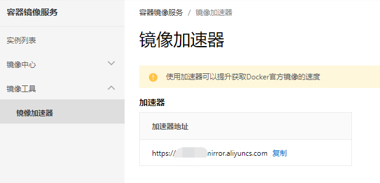
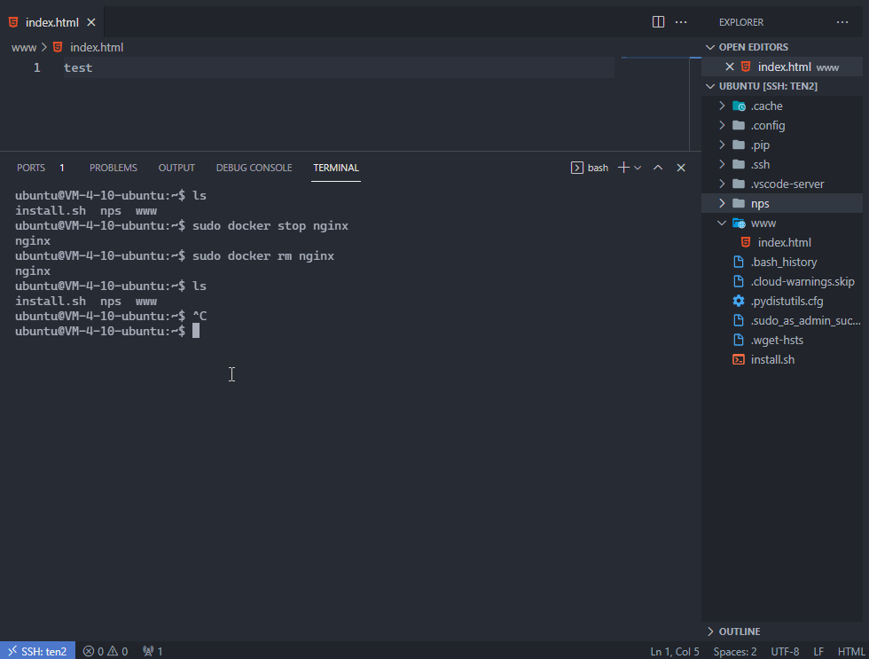
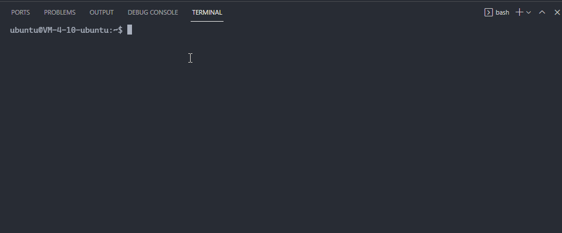

# docker 的基本使用

## 配置docker镜像加速

使用 docker 基本都需要从网络服务器上拉取镜像文件，比如上一节安装测试中，我们使用 `sudo docker run hello-world` 来验证 docker 是否安装成功，实际就是先下载了 `hello-world` 然后再运行的。但因为网络原因，镜像文件稍大，下载需要的时间会很久甚至断连导致失败，因此我们在使用的时候常常会配置一个国内的加速源。

比如阿里云就提供这样的服务，使用自己的账号访问[容器镜像服务](https://cr.console.aliyun.com/cn-shanghai/instances/mirrors), 注册开通后即可获取到自己专属的镜像加速地址。



获取到此地址后，即可在通过 `/etc/docker/daemon.json` 文件来配置使用镜像加速地址。若不存在则新建即可。

```json
{
  "registry-mirrors": ["<你的镜像加速地址>"]
}
```

修改文件后重启 docker daemon 即可。

```sh
sudo systemctl daemon-reload
sudo systemctl restart docker
```

::: tip
以上配置方法仅对 `1.10.0` 以上版本的 docker 客户端有效，若你的版本低于此，配置很复杂，建议参考 [docker 安装](./01-docker安装.md) 一节来安装更新的版本。
:::

## docker 命令

在安装docker一节中我们用 `docker run hello-world` 来验证 docker 是否安装成功。 hello-world 这个镜像在运行时会打印一段信息后退出，而我们实际应用 docker 时的场景肯定不单单是打印一段内容，比如我们运行一个 nginx 镜像，如果单纯以 `docker run nginx` 来运行，则毫无意义，因为我们无法访问这个nginx镜像中的网站、也无法对其进行有效的配置。

因此，我们需要一系列的命令和参数来控制我们的容器。

### run 相关

首先自然就是最重要的 `run` 命令，它用于根据指定的镜像生成容器并运行， 语法格式如下

```sh
docker run [OPTIONS] IMAGE[:TAG|@DIGEST]
```

其中

- `[OPTIONS]` 为命令的选项，其可省略，但我们的实际使用的大部分功能均会在这里进行配置。
- `IMAGE[:TAG|@DIGEST]` 用于指定要运行的镜像image名称，是必须的。后面的 `tag` 或 `@DIGEST` 为可选项。 `tag` 可指定对应的版本。`@DIGEST` 为一个摘要签名，可通过它唯一确定一个镜像，这个很少会用到。

以启动一个 nginx 容器为例，有如下要求：

- 终端关闭容器不能退出。
- 容器名称为 nginx 。
- 映射 80 和 443 两个端口到宿主机的 8080 和 8081 端口。
- 配置环境变量 `NGINX_HOST=example.com`
- 将 `/home/ubuntu/www` 挂载作为 nginx 网站目录。
- 容器可自动重启。

则启动命令可以写为

```sh
sudo docker run -d --name nginx -p 8080:80 -p 8081:443 -e "NGINX_HOST=example.com" -v /home/ubuntu/www:/usr/share/nginx/html --restart=always nginx
```

效果如下：



一些常见的 options 说明如下：

- `-d`: 是否后台运行。
  - 没有此参数的情况下，容器运行在当前的 `terminal` 中，如果 `Ctrl + C` 终止，或者 `terminal` 被关掉，这容器将停止运行。
  - 指定 `-d` 后则不会，容器会在后台运行，并在当前的 `terminal` 中返回并打印生成容器的 id 。
- `-p`: 指定端口映射。可以有多个，格式为: `-p 宿主机端口号:容器端口号`。
  - 比如 nginx 容器将 80 和 443 映射到宿主机的 80 和 443， 则为 `-p 80:80 -p 443:443`。
  - 如果需要很多的端口号且是连续的，支持一次映射出来，如，容器的8000到9000端口映射到主机的18000到19000端口，则可以配置为 `-p 18000-19000:8000-9000`。
- `--name`: 为生成的容器取名。注意这个名字在你的机器上需要是唯一的，即不能有重名的容器。
  - 这个选项也比较有用，大多数场景下可以使用指定的name代替容器的id对容器进行操作。
  - 同时如果多个容器之前需要网络桥接（bridge network）则需要要使用name来进行配置。
- `-e`: 用于为容器设置环境变量，也可以配置多个。 如 `-e "username=cdswyda" -e debug`。
- `--env-file`: 也是用于配置环境变量。不过其值为文件路径，将读取指定文件的内容作为环境变量。
- `--net`: 指定网络类型。
- `-v` `--volume`: 指定文件挂载。 格式为： `-v 主机路径:容器路径`。
- `--restart`: 指定重启类型，有如下几个可选值
  - `no`: 默认值，即不会自动重启。
  - `on-failure[:max-retries]`：仅当容器出错退出后才会重启，可单独为起配置最大重启的次数。
  - `always`: 无论容器的退出状态是什么，总是会自动尝试重启。同时这个选项还可以使得容器在docker的守护进程启动的时候启动容器。通常来说这样，机器重启，容器也自动重启。
  - `unless-stopped`：除非停止了容器，否则都会重启，类似`always`。 与 `always` 不同的是，如果手动停止容器，在重启机器或者守护进程时，此镜像不会配重新启动。
- `--rm`: 在容器停止或退出的时候自动删除掉容器，这个与上面的 `--restart` 不能同时使用。
- `--network`: 配置容器的网络模式。 有如下五个值：
  - `bridge`： 默认值，即使用bridge网络。
  - `none`: 容器中不使用网络，也即没有网络。
  - `host`：在容器内直接使用主机网络。部分情况下这个选项比较有用，可节省很多配置。
  - `container:<name|id>`：在此容器内直接使用另一个容器的网络。
  - `<USER_NETWORK_NAME>`: 使用用户自定义的网络，即用户用户通过 `docker network create` 命令创建的网络。

以上基本列出了常用的选项，其中 `-d` `-p` `-v` `-e` 非常常用，基本每个容器都会遇到需要熟记并掌握。

当然 `docker run` 所支持的选项远不止上面的这些，比如你还可以配置容器的cpu限制、内存限制，具体可通过 `docker run --help` 并结合 [docker run](https://docs.docker.com/engine/reference/run/) 文档查看了结。

### 镜像相关

| 命令                   | 说明                                                                                                   |
| ---------------------- | ------------------------------------------------------------------------------------------------------ |
| `docker image build`   | 通过 `Dockerfile` 文件构建一个镜像，开始主要使用现成的镜像，等熟悉之后我们可以自己写脚本生成构建镜像。 |
| `docker image history` | Show the history of an image                                                                           |
| `docker image import`  | Import the contents from a tarball to create a filesystem image                                        |
| `docker image inspect` | Display detailed information on one or more images                                                     |
| `docker image load`    | Load an image from a tar archive or STDIN                                                              |
| `docker image ls`      | 查看本地已经有的镜像                                                                                   |
| `docker image prune`   | 删除没有在使用的镜像，即没有基于此镜像的容器存在的镜像                                                 |
| `docker image pull`    | 拉取一个镜像                                                                                           |
| `docker image push`    | 将镜像推送到仓库                                                                                       |
| `docker image rm`      | 删除指定的镜像文件                                                                                     |
| `docker image tag`     | 给镜像文件添加tag                                                                                      |

### 容器管理

容器管理也是非常常用的命令，因此docker本身将 `docker container` 的命令直接简化到了 `docker` 命令上， 比如 `docker container` 就是 `docker ps`, `docker container start` 就是 `docker start` ，以下将以简写的形式介绍常用的命令。

| 命令                                      | 说明                                   |
| ----------------------------------------- | -------------------------------------- |
| `docker ps`                               | 查看容器                               |
| `docker ps -a`                            | 查看所有容器，包含已经停止的           |
| `docker start <id/name>`                  | 启动一个或多个已经停止的容器           |
| `docker stop <id/name>`                   | 停止一个或多个在运行的容器             |
| `docker rm <id/name>`                     | 删除一个或多个容器，此容器必须已经停止 |
| `docker restart <id/name>`                | 重启容器                               |
| `docker port <id/name>`                   | 查看指定容器的端口映射                 |
| `docker prune`                            | 删除所有已经停止的容器                 |
| `docker logs`                             | 查看容器日志                           |
| `docker exec [OPTIONS] <id/name> command` | 在一个运行的容器中执行命令             |

```sh
# 查看日志 持续（即终端停留在日志输出的界面，有新日志会立即显示）
docker logs -f <镜像id或name>
# 查看最后 10 行日志
docker logs -n 10 nps

# 在 id 为 b6e09b35b6e4 的 nginx 容器中执行 ls 命令，列出 /usr/share/nginx/html 目录
sudo docker exec b6e09b35b6e4 ls /usr/share/nginx/html
# 如果要执行多条命令，可以直接进入容器内, 再执行相关
# 1. 进入 b6e09b35b6e4 容器 
sudo docker exec -it b6e09b35b6e4 /bin/bash
# 2. 此时已经在nginx容器内了 直接在 terminal 中输入要执行的命令即可。
ls /usr/share/nginx/html
# 3. 执行完了需要退出 则 exit 即可
exit
```

关于 `docker exec` 演示如下:



### docker-compose

`docker-compose` 的安装请参考 [docker 安装一节](./01-docker安装.md)。

`docker-compose` 用一句话来说就是： **一条命令运行多个容器** , 这个在实际使用过程中还是很常用的，比如我们做网站，可能需要 `nodejs` `mysql` `redis` 等。

- `version`: 指定配置文件的版本，这个和 docker 的版本有关， 如 `'2'` 在 `docker 1.10.0+` 均支持。具体的对应关系可参考 [Compose and Docker compatibility matrix](https://docs.docker.com/compose/compose-file/#compose-and-docker-compatibility-matrix)
- `services`: 下可指定多个服务，每个服务即为一个容器。

一个 `nodejs` `mysql` `redis` 的 `docker-compose.yml` 可以如下:

```yml
version: "2"
services:
  node: # 一个 node 容器，服务名称为 node
    image: "node:12" # 使用 node:12 这个镜像
    user: "node" # 设定用户
    working_dir: /home/node/app # 工作目录
    environment: # 配置环境变量
      - NODE_ENV=production
    volumes: # 目录挂载
      - ./app:/home/node/app
    ports: # 端口映射
      - "8080:8080"
    command: "npm start" # 执行的命令
  mysql: # 一个 mysql 容器，服务名称为 mysql
    image: mysql
    environment:
      MYSQL_ROOT_PASSWORD: 123456
      MYSQL_DATABASE: fe
      MYSQL_USER: fe_user
      MYSQL_PASSWORD: 123456
    expose: # 暴露端口
      - "3306"
    volumes: # 目录挂载
      - ./data/mysql:/var/lib/mysql
    restart: always # 容器自动重启
  redis:
    image: redis
    expose:
      - "6379"
    restart: always  # 容器自动重启
```

在 `docker-compose.yml` 所在目录下，使用 `docker-compose up -d` 即可快速创建并启动相关容器，同时**其中的容器都在同一个网络中**。

以上出现了 `ports` 和 `expose` 两个端口相关的配置，`ports` 是将容器端口映射到宿主机上， 而 `expose` 是将容器的此端口暴露给同一个网络下的其他容器，以及其他link到本容器的其他容器。即上面的例子中的 `3306` 和 `6379` 端口在宿主机上是无法访问的，但 `8080` 端口可以。

`docker-compose` 相关命令说明如下：

| 命令                     | 说明                                                                                   |
| ------------------------ | -------------------------------------------------------------------------------------- |
| `docker-compose up`      | 基于当前目录下的 `docker-compose.yml` 文件创建启动多个容器, 通常会 `-d` 选项，后台运行 |
| `docker-compose down`    | 停止并且移除容                                                                         |
| `docker-compose restart` | 重启相关容器                                                                           |

注意，以上命令都需要在当前目录下有 `docker-compose.yml` 配置文件， 更多命令请通过 `docker-compose --help` 结合 [docker-compose](https://docs.docker.com/compose/reference/) 查看。

## Docker Hub

[Docker Hub](https://hub.docker.com/) 是 docker 官方提供的镜像的存储库，我们可以从上面找到很多镜像，也可以将自己创建的镜像推送上去。其非常类似于前端世界的 npm 。

使用 Docker Hub 就不用多说了，我们使用 `docker run` 命令时，如果本地没有指定的镜像文件就会从 Docker Hub 上拉取下载，使用 `docker image pull` 命令时也是一样。

如果要发布自己的镜像则可以下面这样操作。

1. 在 [Docker Hub](https://hub.docker.com/) 上注册账户。
2. 在 Terminal 中使用 `docker login` 命令登录到 Docker Hub 。
3. 提交自己的镜像，并 push 到云端存储库。

```sh
# 登录 之后输入用户名密码即可
docker login

# 提交现有容器 格式如下：
# docker commit [containerID] [username]/[镜像名称](:[版本tag])
# 此命令可基于现有容器产生一个镜像
docker commit 59dd5c775365 cdswyda/my-nps:1.0

# 推送 格式如下 
# docker push [username]/[镜像名称](:[版本tag])
docker push cdswyda/my-nps:1.0
```

如果你的镜像不方便推送到官方的公共云存储上，你还可以搭建自己的 docker 私有仓库存储。那么 docker 本身提供了一个 [registry](https://docs.docker.com/registry/) 镜像来满足这个需求。
