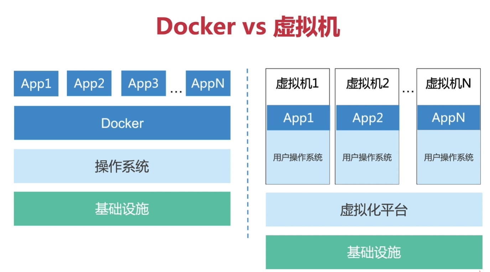
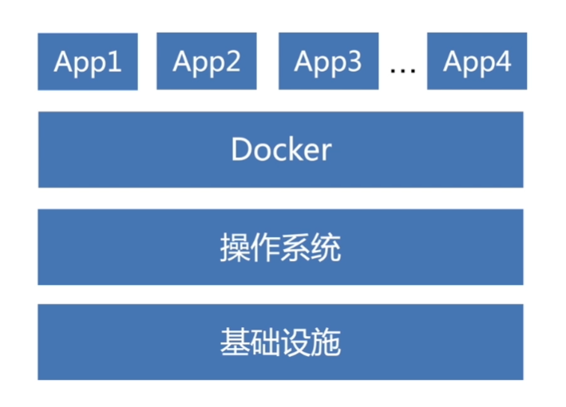

# Docker

Docker 是一种虚拟化的容器技术。不用担心环境问题，相同的镜像如果能跑起来，换到其他任何有docker的机器上都可以工作正常。

**docker VS 虚拟机**

docker 的优势

- 无需操作系统，不占用系统资源。 虚拟器需要独占一部分内存和硬盘空间，其他虚拟机无法共享使用。
- 创建、启动、销毁更快，一条命令即可。 而虚拟机是完整的操作系统，安装启动操作系统都比较慢。
- 体积更小。docker 容器只要包含用到的组件即可，而虚拟机是整个操作系统的打包，所以容器文件比虚拟机文件要小很多。

