<!-- sidebarDepth: 2 -->

# 认识 MongoDB

## 初识 MongoDB？

### 什么是 MongoDB

一个以 json 为数据模型的文档数据库

### 为什么叫文档数据库

文档来自于 "JSON Document"，并非我们理解的 PDF、word 文档

### 主要用途

应用数据库，类似于 Oracle、MySQL 海量数据处理，数据平台

### 主要特点

- 建模为可选
- JSON 数据模型比较适合开发
- 横向扩展可以支撑很大数据量和并发
- 易扩展、高性能、高可用
- 较容易映射复杂数据（key-value）
- 无事务特性要求（ACID 特性）
  - A(Atomicity)： 原子性
  - C(Consistency)： 一致性
  - I(Isolation)： 独立性，也叫隔离性
  - D(Durability)：持久性

## MongoDB 是免费的吗？

- MongoDB 有两个发布版本：社区版和企业版
- 社区办基于 SSPL，一种和 AGPL 基本类似的开源协议
- 企业版是基于商业协议，需要付费使用

## MongoDB 与关系型数据库


## MongoDB 的优势及特点

### 优势

- 面向开发者的医用 + 高效数据库


- 一目了然的对象模型
  > 文档模型与数据库中的文档一一对应


- 灵活：快速响应业务变化
  - 多形性：同一集合可以包含不同字段(类型)的文档对象
  - 动态性：线上修改数据模式，修改时应用与数据库均无需下线
  - 数据治理：支持使用 JSON Schema 来规范数据模式，在保障模式灵活动态的前提下，提供数据治理能力


- 快速：最简单快速的开发方式；JSON 模型之快速特性：
  - 数据库引擎只需要在一个存储区读写
  - 反范式、无关联的组织极大优化查询速度
  - 程序 API 自然开发快速


- 原生的高可用和横向扩展能力
  - Replica Set-2 to 50 个成员
  - 自恢复
  - 多中心容灾能力
  - 滚动服务 - 最小化服务终端


- 横向扩展能力
  - 需要的时候无缝扩展
  - 应用全透明
  - 多种数据分布策略
  - 轻松支持 TB-PB 数量级


## 安装 MongoDB [官网](https://www.mongodb.com/try)

### docker 安装

- 打开[docker hub 官网](https://hub.docker.com/_/mongo)搜 mongodb

使用 dockerfile 的模式安装 mongo

```yaml
version: '3.1'

services:
  mongo:
    image: mongo
    restart: always
    environment:
      MONGO_INITDB_ROOT_USERNAME: root
      MONGO_INITDB_ROOT_PASSWORD: example
    ports:
      - 27001:27017 # 将MongoDB的默认端口映射到宿主机的27001端口上来
    volumes: # 数据持久化配置
      - /home/mongotest:/data/db # 将容器内部的数据映射到宿主机的home文件夹的mongotest文件夹里
```

以我的的服务为例，在 home 文件夹下创建一个 mongotest 文件，然后在里面创建一个 docker-compose.yml，然后将上面的内容复制到 docker-compose.yml 文件中(当然也可以使用 ftp 工具上传)

我这儿就用 vim 编辑 docker-compose.yml 文件

```shell
// 目录已经在/home/mongotest下
$ vim docker-compose.yml
```

然后就将内容复制进去，按`ESC`，然后在分别按`:wq`回车


现在就可以使用`docker-compose up -d`来启动 mongo 服务了，执行命令后 docker 就去拉去 mongo 镜像并创建 mongo 数据

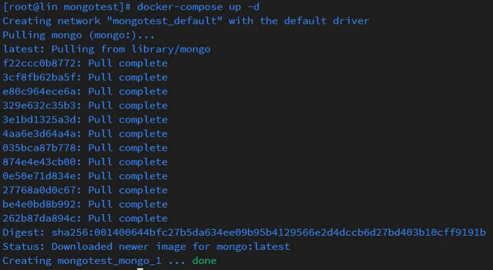

可以使用`docker ps -a`或者`docker-compose`查看现在已启动的 docker 镜像


连接前一定要检查宿主机端口是否开放，centOS 可以使用`firewall-cmd --add-port=27017/tcp --permanent`命令添加端口，添加完成后，重启安全组，命令：`firewall-cmd --reload`


> 如果在添加规则的时候出现如下报错的话，可有一下方案解决
>
> 

- 检查服务器是否有安装`firewalld`，检查命令如下：

```shell
$ rpm -qa firwalld // 回车后如果没有打印出任何东西，则表明没有安装
```

- 安装 firewalld 的命令：

```shell
$ yum install firewalld
```


## 创建用户并分配权限 [参考官方文档](https://docs.mongodb.com/manual/core/authentication/)

### docker 中连接 mongo，docker 交互式终端命令

```shell
$ docker exec -it <容器名称> 镜像名称
```

- 查看 mongo 镜像的运行时的镜像名

```shell
$ docker ps | grep mongo
```


- 连接示例


- 切换数据库

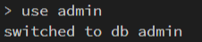

- 添加账号密码， 返回为 1 就成功了


- 查看全部数据库

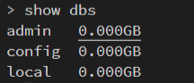

- 切换到 admin 数据库，创建一个用户

```shell
# 切换数据库
use admin

# 创建账号密码
db.createUser({user: "Forest", pwd: "123456", roles: [{role: "dbOwner", db: "test"}]})
```

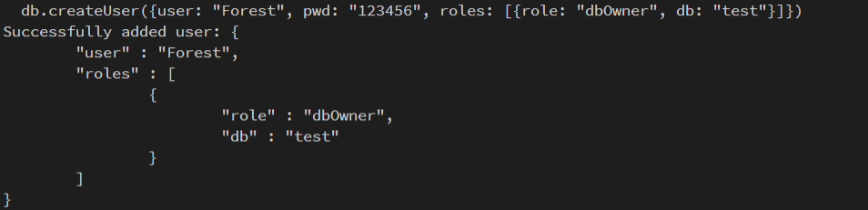

::: warning 上列图示环境

- system：CentOS 8.2 64 位
- CPU&内存：1 核 2 GiB
- docker: 19.03.14

:::

## MongoDB 基本操作

### 连接数据库

- 连接本地数据库

::: tip
windows 系统的话，本地的数据库必须添加环境变量，否则 mongod 或者 mongo 服务找不到
:::

```shell
$ mongod <保存数据的文件夹路径> --port 27017
```

### 查看已有的数据库

```shell
show dbs
```

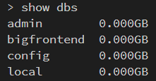

### 查看当前数据库

```shell
db
```


### 创建数据库或者切换数据库

```shell
// 如果有这个数据库的话就是切换，没有的话就是创建
use <数据库名>
```


### 查看当前数据库已有文档（表）

```shell
show collections
```

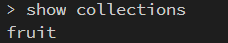

### 添加数据

语法：

```shell
// 添加单条数据
db.<collection>.insertOne(<JSON>)

// 添加多条数据
db.<collection>.insertMany([<JSON 1>, <JSON 2>, ..., <JSON n>])
```

- 添加一条数据


- 添加多条数据

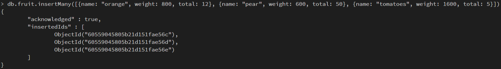

### 查看文档模型中的数据

> - `find()`是 MongoDB 数据库查询数据的基本指令，相当于 SQL 中的 `SELECT`
> - `find()`返回游标

- 查询指定文档模型中的全部数据

  ```shell
  db.<文档模型的名称>.find()
  ```

  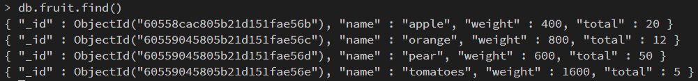

- 单条件查询

  > 查询一条 name 为 apple 的数据

  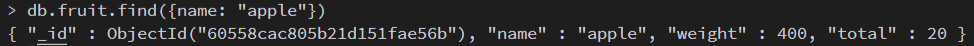

- 多条件 `and` 查询

  > 查询一条 name 为 pear 和 weight 为 400 的数据

  

- `and` 的另一种形式查询

  

- 多条件 `or` 查询

  > 查询 name 为 apple 或者 weight 为 400 的数据

  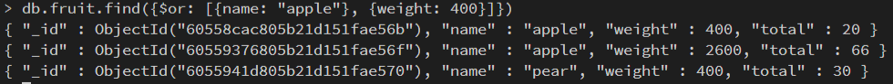

- 按正则表达式查找

  > 查找所有 name 中以 a 开头的所有数据

  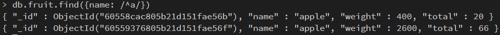

查询条件对照表

| **_逻辑运算符_**       | **_MongoDB 中的写法_**                               |
| ---------------------- | ---------------------------------------------------- |
| a 等于 1               | { a : 1 }                                            |
| a 不等于 1             | { a : { $ne : 1 } }                                  |
| a 大于 1               | { a : { $gt: 1 } }                                   |
| a 小于 1               | { a : { $lt : 1 } }                                  |
| a 大于等于 1           | { a : { $gte : 1 } }                                 |
| a 小于等于 1           | { a : { $lte : 1 } }                                 |
| a 等于 1 和 b 等于 1   | { a : 1, b : 1 }或者{ $and: [{ a : 1 }, { b : 1 }] } |
| a 等于 1 或者 b 等于 1 | { $or: [{ a : 1 }, { b : 1 }] }                      |
| 判断 a 字段不存在      | { a : { $exists : false } }                          |
| a 包含 1, 2, 3         | { a : { $in : [1, 2, 3] } }                          |

::: tip 查询的逻辑运算符

- $lt 存在并小于
- $lte 存在并小于等于
- $gt 存在并大于
- $gte 存在并大于等于
- $ne 不存在或者存在但不等于
- $in 存在并在指定数组中
- $nin 不存在或者不在指定数组中
- $or 匹配两个或多个条件中的一个
- $and 匹配全部条件

:::

#### find 搜索子文档

`find` 支持使用“field.sub_field”的形式查询子文档。假设有一个文档：

```js
db.fruit.insertOne({
  name: 'apple',
  from: {
    country: 'China',
    province: 'Chengdu'
  }
})

db.fruit.find({ 'fruit.country': 'China' })
db.fruit.find({ from: { country: 'China' } }) // 等同于上一行语句
```

#### 使用 `find` 搜索数组

- `find` 支持对数组中的元素进行搜索，假设有一个文档

```js
db.fruit.insert([
  { name: 'Apple', color: ['red', 'green'] },
  { name: 'mango', color: ['yellow', 'green'] }
])

// 查询
db.fruit.find({ color: 'red' }) // 查询颜色为'red'的所有数据

db.fruit.find({ $or: [{ color: 'red' }, { color: green }] }) // 查询颜色为'red'或者为'green'的所有数据

db.movies.insertOne({
  title: 'Raiders of the Lost Ark',
  filming_locations: [
    { city: 'Los Angeles', state: 'CA', country: 'USA' },
    { city: 'Rome', state: 'Lazio', country: 'Italy' },
    { city: 'Florence', state: 'SC', country: 'USA' }
  ]
})

// 查询城市为Rome的记录
db.movies.find({ 'filming_locations.city': 'Rome' })
```

- 在数组中搜索子对象的多个字段时，如果使用 `$elemMatch`，它表示必须是同一个

子对象满足多个条件。考虑以下两个查询：

```js
db.movies.find({
  'filming_locations.city': 'Rome',
  'filming_locations.country': 'USA'
})
db.movies.find({
  filming_locations: {
    $elemMatch: { city: 'Rome', country: 'USA' }
  }
})
```

> 控制 `find` 返回的字段
>
> - `find` 可以指定只返回指定的字段；
>
> - `\_id` 字段必须明确指明不返回，否则默认返回；
>
> - 在 MongoDB 中我们称这为投影（projection）；
>
> ```js
> db.movies.find({"category": "action"},{"\_id":0, title:1})； // \_id 不返回，title 返回
> ```

### 删除数据

- `remove` 命令需要配合查询条件使用
- 匹配查询条件的文档会被删除
- 指定一个文档条件会删除所有记录

```js
db.fruit.remove({ name: 'apple' }) // 删除所有name为apple的记录

db.fruit.remove({ weight: { $lt: 20 } }) // 删除所有weight小于20的记录

db.fruit.remove({}) // 删除所有记录

db.fruit.remove() // 不会删除任何东西，会报错
```

### 更新数据

- `Update` 操作执行格式：`db.<集合>.update(<查询条件>,<更新内容>)`

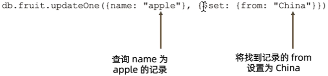

::: tip

- 使用 `updateOne` 表示无论条件匹配多少条记录，始终只会更新一条
- 使用 `updateMany` 标识条件匹配多少条就更新多少条
- `updateOne/updateMany` 方法要求更新条件部分必须具有以下之一，否则将报错
  - $set/$unset
  - $push/$pushAll/$pop
  - $pull/$pullAll
  - $addToSet
    > - $push：增加一个对象到数组最后
    > - $pushAll：增加多个对象到数组最后
    > - $pop：从数组的最后删除一个对象
    > - $pull：如果匹配指定的值，从数组中删除相应的对象
    > - $pullAll：如果匹配任意的值，从数据中删除相对应的对象
    > - $addToSet：如果不存在则增加一个值到数组

:::

### 删除表

- 集合中的所有文档都会被删除
- 吉和相关的索引也会被删除

```js
db.<集合名>.drop()  // db.fruit.drop()
```

### 删除数据库 dropDatabase

- 使用 `db.dropDatabase()`来删除数据库
- 数据库相应的文件也会被删除，磁盘空间将被释放

```js
// 可以使用 db 命令来查看当前所在数据库
db.dropDatabase() // 删除当前库 这一句命令下去就删除了整个数据库
```

### 备份与恢复

- 备份

```shell
$ mongodump -h localhost -u <用户名> -p <密码> -d <数据库名> -o <指定目录>
```

::: tip 参数说明

- -h 指向备份服务器
- -u 用户名
- -p 密码
- -d 指定备份的数据；如果不写这个参数则备份全部数据库
- -o 数据备份到那个目录
  :::

- 恢复

```shell
$ mongorestore -h localhost -u <用户名> -p <密码> --dir <备份文件夹>
```

## 查询

### 聚合查询

#### 什么是 MongoDB 聚合框架

> MongoDB 聚合框架（Aggregation Framework）是一个计算框架，它可以：
>
> - 作用在一个集合或者几个集合上
> - 对集合的数据进行的一些列运算
> - 讲这些数据转化为期望的形式

从效果而言，聚合框架相当于 SQL 查询中的

- GROUP BY
- LEFT OUTER JOIN
- AS 等等

#### 管道(Pipeline)和步骤(Stage)

- 整个聚合运算过程成为管道（Pipeline），它由多个步骤组成；每个管道

- - 接受一系列文档（原始数据）
  - 每个步骤对这些文档进行一系列运算
  - 结果文档输出给下一个步骤


```js
pipeline = [$stage1, $stage2, ......, $stageN]

db.<COLLECTION>.aggregate(pipeline, { options })
```

| 步骤           | 作用     | SQL 等价运算符  |
| -------------- | -------- | --------------- |
| $match         | 过滤     | WHERE           |
| $project       | 投影     | AS              |
| $sort          | 排序     | ORDER BY        |
| $group         | 分组     | GROUP BY        |
| $skip/$limit   | 结果限制 | SKIP/LIMIT      |
| $looup         | 左外连接 | LEFT OUTER JOIN |
| $unwind        | 展开数组 | N/A             |
| $graphLoopup   | 图搜索   | N/A             |
| $facet/$bucket | 分页搜索 | N/A             |

### 聚合运算的使用场景

- 计算；比如

  - 计算一段时间内的销售总额、均值
  - 分析一段时间的净利润
  - 分析购买人的年龄分布
  - 分析学生成绩分布
  - 统计员工绩效
  - .....

- 数据的复杂运用

### MQL 常用步骤与 SQL 对比

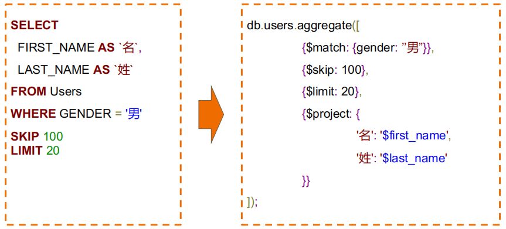


### MQL 特有步骤`$unwind`


### MQL 特有的`$bucket`

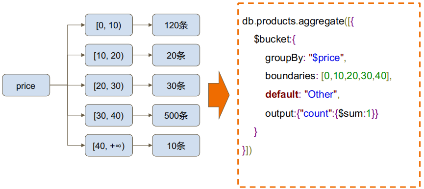

### MQL 特有的`$facet`


## 复制集

### 复制集的作用

> - MongoDB 复制集的主要意义在于实现服务高可用
> - 它的现实依赖于两个方面的功能
>   - 数据写入时将数据迅速复制到另一个独立节点上
>   - 在接受写入的节点发生故障是自动选举出一个新的替代节点
> - 在实现高可用的同事，复制集实现了其他几个附加作用
>   - 数据分发：将数据从一个区域复制到另一个区域，减少另一个区域的读延迟
>   - 读写分离：不同类型的压力分别在不同的节点上执行
>   - 异地容灾：在数据中心发生故障的时候快速切换到异地

### 典型复制集结构

- 一个典型的复制集由 3 个以上具有投票权的节点组成，包括：
  - 一个节点（PRIMARY）：接受读入操作和选举时投票
  - 连个（或多个）从节点(SECONDERY)：复制节点上的新数据和选举时投票
  - 不推荐使用 Arbiter（投票节点）


### 数据是如何复制的？

- 当一个修改操作，无论是插入、更新或者删除，达到主节点时，它对数据的操作将被记录下来（经过一系列必要的转换），这些记录被称为 `oplog`
- 从节点通过在主节点上打开一个 `tailable` 游标不断获取新进入直接点的 `oplog`，并在自己的数据上回放，一次保持跟主节点的数据一致性

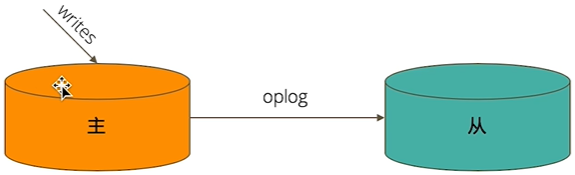

### 选举时如何完成故障恢复的？

- 具有投票权的节点之间凉凉相互发送心跳
- 当 5 次心跳未收到时判断为节点失联（宕机、断网......）
- 如果失联的是主节点，从节点会发起选举，选出新的主节点
- 如果失恋的是从节点则不会产生新的选举
- 选举基于[RAFT 一致性算法](https://raft.github.io/)实现，选举成功的必要条件是大多数投票节点存活
- 复制集中最多可以有 50 个节点，但具有投票权的节点最多 7 个

### 影响选举的因素

- 整个集群必须有大多数节点存活
- 被选举为主节点的节点必须
  - 能够与多数节点建立连接
  - 具有较新的 `oplog`（操作日志）
  - 具有较高的优先级（如果有配置）

### 常见选项

- 复制及节点有以下常见的选置项：
  - 是否具有投票权（v 参数）：有则参与投票（默认都有投票权）
  - 优先级（priority 参数）：优先级越高的节点越优先成为主节点；优先级为 0 的节点无法成为主节点
  - 隐藏（hidden 参数）：复制数据，但对应不可见；隐藏节点可以具有投票权，但优先级必须为 0
  - 延迟（slaveDelay）：复制 n 秒之前的数据，保持与主节点的时间差

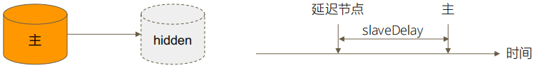

### 复制集注意事项

- 关于硬件

  - 因为正常的复制集节点都有可能成为主节点，他们的地位是一样的，因此硬件配置上必须一致
  - 为例保证节点不会同时宕机，各节点使用的硬件必须具有独立性

- 关于软件

  - 复制集各节点软件版本必须一致，以避免出现不可预知的问题

- 增加节点不会增加系统写性能

### Atlas-MongoDB 公有云托管服务


