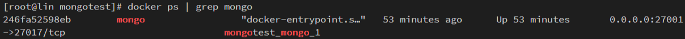
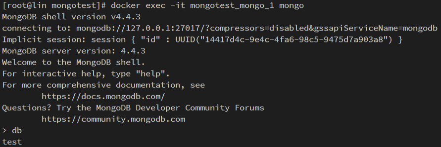
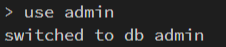
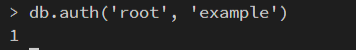
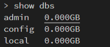
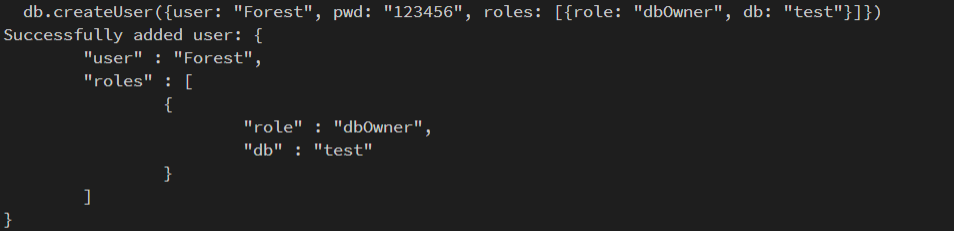

# MongoDB交互终端

## 直装方式

**登录MongoDB实例**

使用mongo shell登录mongodb实例：

```
 mongod --port 27017 --dbpath /data/db1

// 或者
// 更常用
mongo --port 27017 

// 鉴权方式一登录
mongo --port 27017 -u "adminUser" -p "adminPass" --authenticationDatabase "admin"

// 鉴权方式二登录
mongo --port 27017

use admin
db.auth("adminUser", "adminPass")
```


打印：

```js
MongoDB shell version v4.2.1
connecting to: mongodb://127.0.0.1:27017/?compressors=disabled&gssapiServiceName=mongodb
Implicit session: session { "id" : UUID("908acb35-1053-4287-85bc-83d89daec400") }
MongoDB server version: 4.2.1
Welcome to the MongoDB shell.

// 如果没有开启访问控制，则在登录时会提示如下警告信息
** WARNING: Access control is not enabled for the database.
**          Read and write access to data and configuration is unrestricted.
```


## docker方式

**交互式终端命令**

```shell
$ docker exec -it <容器名称> 镜像名称
```

- 查看 mongo 镜像的运行时的镜像名

```shell
$ docker ps | grep mongo
```




**docker 中连接 mongo**

- 连接示例



- 切换数据库



- 添加账号密码， 返回为 1 就成功了



- 查看全部数据库



- 切换到 admin 数据库，创建一个用户

```shell
# 切换数据库
use admin

# 创建账号密码
db.createUser({user: "Forest", pwd: "123456", roles: [{role: "dbOwner", db: "test"}]})
```



::: warning 上列图示环境

- system：CentOS 8.2 64 位
- CPU&内存：1 核 2 GiB
- docker: 19.03.14

:::
