# 基本操作

## 数据库相关

### 查看已有的数据库

```shell
$ show dbs
```


### 查看当前数据库

```shell
$ db
```

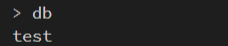

### 创建数据库或者切换数据库

```shell
// 如果有这个数据库的话就是切换，没有的话就是创建并切换
$ use <数据库名>
```

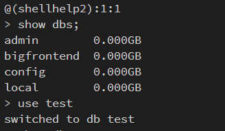

### 查看当前数据库已有文档（表）

```shell
$ show collections
```

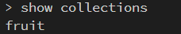

### 删除数据库 dropDatabase

- 使用 `db.dropDatabase()`来删除数据库
- 数据库相应的文件也会被删除，磁盘空间将被释放

```js
// 可以使用 db 命令来查看当前所在数据库
db.dropDatabase() // 删除当前库 这一句命令下去就删除了整个数据库
```


## 增删改查CURD操作

### 添加数据

**_语法_**：

```shell
// 添加单条数据
$ db.<collection>.insertOne(<JSON>)

// 添加多条数据
$ db.<collection>.insertMany([<JSON 1>, <JSON 2>, ..., <JSON n>])
```

- 添加一条数据

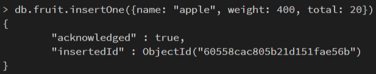

- 添加多条数据

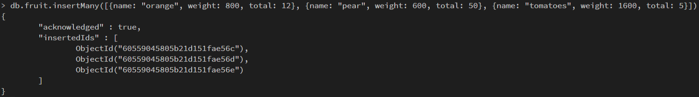

### 查看文档模型中的数据

> - `find()`是 MongoDB 数据库查询数据的基本指令，相当于 SQL 中的 `SELECT`
> - `find()`返回游标

- 查询指定文档模型中的全部数据

  ```shell
  $ db.<文档模型的名称>.find()
  ```

  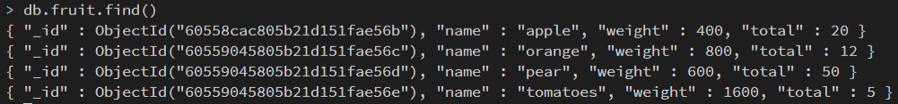

- 单条件查询

  > 查询一条 name 为 apple 的数据

  

- 多条件 `and` 查询

  > 查询一条 name 为 pear 和 weight 为 400 的数据

  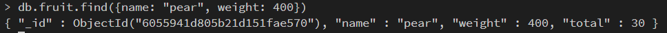

- `and` 的另一种形式查询

  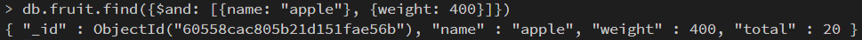

- 多条件 `or` 查询

  > 查询 name 为 apple 或者 weight 为 400 的数据

  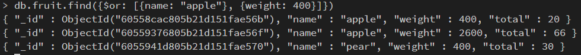

- 按正则表达式查找

  > 查找所有 name 中以 a 开头的所有数据

  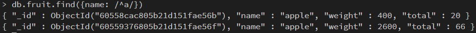

查询条件对照表

| **_逻辑运算符_**       | **_MongoDB 中的写法_**                               |
| ---------------------- | ---------------------------------------------------- |
| a 等于 1               | { a : 1 }                                            |
| a 不等于 1             | { a : { $ne : 1 } }                                  |
| a 大于 1               | { a : { $gt: 1 } }                                   |
| a 小于 1               | { a : { $lt : 1 } }                                  |
| a 大于等于 1           | { a : { $gte : 1 } }                                 |
| a 小于等于 1           | { a : { $lte : 1 } }                                 |
| a 等于 1 和 b 等于 1   | { a : 1, b : 1 }或者{ $and: [{ a : 1 }, { b : 1 }] } |
| a 等于 1 或者 b 等于 1 | { $or: [{ a : 1 }, { b : 1 }] }                      |
| 判断 a 字段不存在      | { a : { $exists : false } }                          |
| a 包含 1, 2, 3         | { a : { $in : [1, 2, 3] } }                          |

::: tip 查询的逻辑运算符

- $lt 存在并小于
- $lte 存在并小于等于
- $gt 存在并大于
- $gte 存在并大于等于
- $ne 不存在或者存在但不等于
- $in 存在并在指定数组中
- $nin 不存在或者不在指定数组中
- $or 匹配两个或多个条件中的一个
- $and 匹配全部条件

:::

#### find 搜索子文档

`find` 支持使用“field.sub_field”的形式查询子文档。假设有一个文档：

```js
db.fruit.insertOne({
  name: 'apple',
  from: {
    country: 'China',
    province: 'Chengdu'
  }
})

db.fruit.find({ 'fruit.country': 'China' })
db.fruit.find({ from: { country: 'China' } }) // 等同于上一行语句
```

#### 使用 `find` 搜索数组

- `find` 支持对数组中的元素进行搜索，假设有一个文档

```js
db.fruit.insert([
  { name: 'Apple', color: ['red', 'green'] },
  { name: 'mango', color: ['yellow', 'green'] }
])

// 查询
db.fruit.find({ color: 'red' }) // 查询颜色为'red'的所有数据

db.fruit.find({ $or: [{ color: 'red' }, { color: green }] }) // 查询颜色为'red'或者为'green'的所有数据

db.movies.insertOne({
  title: 'Raiders of the Lost Ark',
  filming_locations: [
    { city: 'Los Angeles', state: 'CA', country: 'USA' },
    { city: 'Rome', state: 'Lazio', country: 'Italy' },
    { city: 'Florence', state: 'SC', country: 'USA' }
  ]
})

// 查询城市为Rome的记录
db.movies.find({ 'filming_locations.city': 'Rome' })
```

- 在数组中搜索子对象的多个字段时，如果使用 `$elemMatch`，它表示必须是同一个

子对象满足多个条件。考虑以下两个查询：

```js
db.movies.find({
  'filming_locations.city': 'Rome',
  'filming_locations.country': 'USA'
})
db.movies.find({
  filming_locations: {
    $elemMatch: { city: 'Rome', country: 'USA' }
  }
})
```

控制 `find` 返回的字段

- `find` 可以指定只返回指定的字段；

- `\_id` 字段必须明确指明不返回，否则默认返回；

- 在 MongoDB 中我们称这为投影（projection）；

```js
db.movies.find({"category": "action"},{"\_id":0, title:1})； // \_id 不返回，title 返回
```

### 删除数据

- `remove` 命令需要配合查询条件使用
- 匹配查询条件的文档会被删除
- 指定一个文档条件会删除所有记录

```js
db.fruit.remove({ name: 'apple' }) // 删除所有name为apple的记录

db.fruit.remove({ weight: { $lt: 20 } }) // 删除所有weight小于20的记录

db.fruit.remove({}) // 删除所有记录

db.fruit.remove() // 不会删除任何东西，会报错
```


删除表

- 集合中的所有文档都会被删除
- 吉和相关的索引也会被删除

```js
db.<集合名>.drop()  // db.fruit.drop()
```


### 更新数据

- `Update` 操作执行格式：`db.<集合>.update(<查询条件>,<更新内容>)`

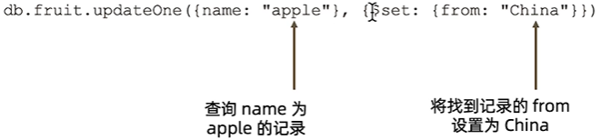

::: tip

- 使用 `updateOne` 表示无论条件匹配多少条记录，始终只会更新一条
- 使用 `updateMany` 标识条件匹配多少条就更新多少条
- `updateOne/updateMany` 方法要求更新条件部分必须具有以下之一，否则将报错
  - $set/$unset
  - $push/$pushAll/$pop
  - $pull/$pullAll
  - $addToSet
    - $push：增加一个对象到数组最后
    - $pushAll：增加多个对象到数组最后
    - $pop：从数组的最后删除一个对象
    - $pull：如果匹配指定的值，从数组中删除相应的对象
    - $pullAll：如果匹配任意的值，从数据中删除相对应的对象
    - $addToSet：如果不存在则增加一个值到数组

:::


## 备份与恢复

- 备份

```shell
$ mongodump -h localhost -u <用户名> -p <密码> -d <数据库名> -o <指定目录>
```

::: tip 参数说明

- -h 指向备份服务器
- -u 用户名
- -p 密码
- -d 指定备份的数据；如果不写这个参数则备份全部数据库
- -o 数据备份到那个目录
  :::

- 恢复

```shell
$ mongorestore -h localhost -u <用户名> -p <密码> --dir <备份文件夹>
```
