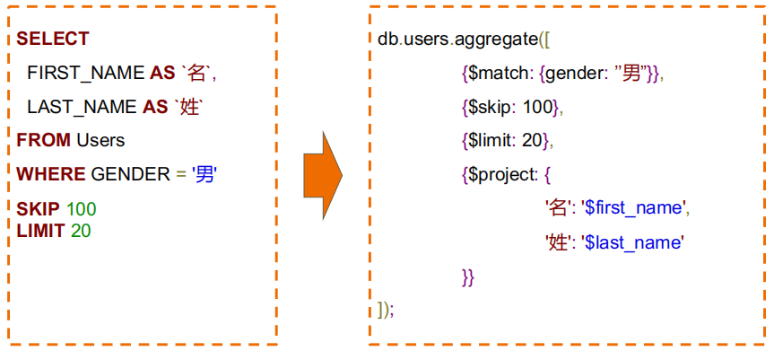
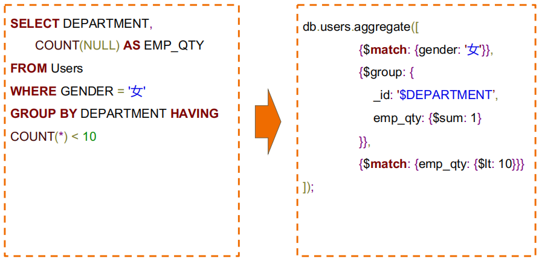
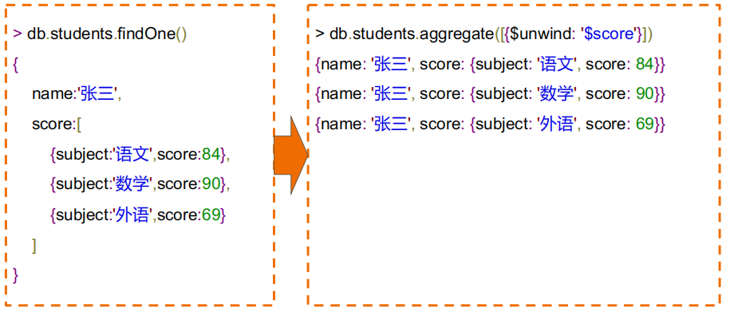
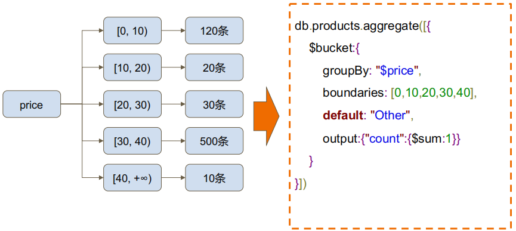
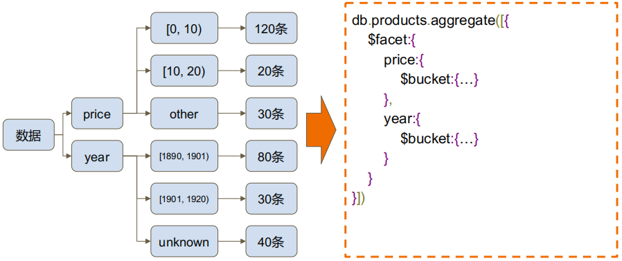

# 高级查询

## 聚合查询

### 什么是 MongoDB 聚合框架

> MongoDB 聚合框架（Aggregation Framework）是一个计算框架，它可以：
>
> - 作用在一个集合或者几个集合上
> - 对集合的数据进行的一些列运算
> - 讲这些数据转化为期望的形式

从效果而言，聚合框架相当于 SQL 查询中的

- GROUP BY
- LEFT OUTER JOIN
- AS 等等

### 管道(Pipeline)和步骤(Stage)

- 整个聚合运算过程成为管道（Pipeline），它由多个步骤组成；每个管道

- - 接受一系列文档（原始数据）
  - 每个步骤对这些文档进行一系列运算
  - 结果文档输出给下一个步骤


```js
pipeline = [$stage1, $stage2, ......, $stageN]

db.<COLLECTION>.aggregate(pipeline, { options })
```

| 步骤           | 作用     | SQL 等价运算符  |
| -------------- | -------- | --------------- |
| $match         | 过滤     | WHERE           |
| $project       | 投影     | AS              |
| $sort          | 排序     | ORDER BY        |
| $group         | 分组     | GROUP BY        |
| $skip/$limit   | 结果限制 | SKIP/LIMIT      |
| $looup         | 左外连接 | LEFT OUTER JOIN |
| $unwind        | 展开数组 | N/A             |
| $graphLoopup   | 图搜索   | N/A             |
| $facet/$bucket | 分页搜索 | N/A             |

## 聚合运算的使用场景

- 计算；比如

  - 计算一段时间内的销售总额、均值
  - 分析一段时间的净利润
  - 分析购买人的年龄分布
  - 分析学生成绩分布
  - 统计员工绩效
  - .....

- 数据的复杂运用

## MQL 常用步骤与 SQL 对比





## MQL 特有步骤`$unwind`



## MQL 特有的`$bucket`



## MQL 特有的`$facet`




