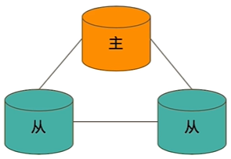
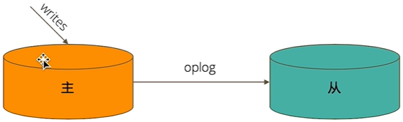
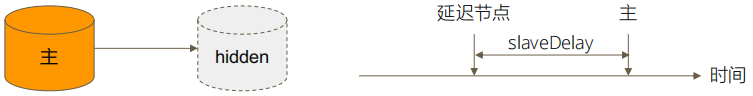
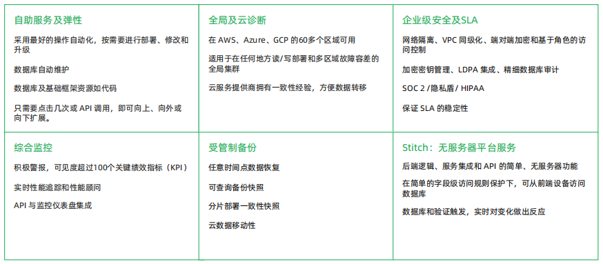

# 复制集

## 复制集的作用

 - MongoDB 复制集的主要意义在于实现服务高可用
 - 它的现实依赖于两个方面的功能
   - 数据写入时将数据迅速复制到另一个独立节点上
   - 在接受写入的节点发生故障是自动选举出一个新的替代节点
 - 在实现高可用的同事，复制集实现了其他几个附加作用
   - 数据分发：将数据从一个区域复制到另一个区域，减少另一个区域的读延迟
   - 读写分离：不同类型的压力分别在不同的节点上执行
   - 异地容灾：在数据中心发生故障的时候快速切换到异地

## 典型复制集结构

- 一个典型的复制集由 3 个以上具有投票权的节点组成，包括：
  - 一个节点（PRIMARY）：接受读入操作和选举时投票
  - 连个（或多个）从节点(SECONDERY)：复制节点上的新数据和选举时投票
  - 不推荐使用 Arbiter（投票节点）

## 数据是如何复制的？

- 当一个修改操作，无论是插入、更新或者删除，达到主节点时，它对数据的操作将被记录下来（经过一系列必要的转换），这些记录被称为 `oplog`
- 从节点通过在主节点上打开一个 `tailable` 游标不断获取新进入直接点的 `oplog`，并在自己的数据上回放，一次保持跟主节点的数据一致性

## 选举时如何完成故障恢复的？

- 具有投票权的节点之间凉凉相互发送心跳
- 当 5 次心跳未收到时判断为节点失联（宕机、断网......）
- 如果失联的是主节点，从节点会发起选举，选出新的主节点
- 如果失恋的是从节点则不会产生新的选举
- 选举基于[RAFT 一致性算法](https://raft.github.io/)实现，选举成功的必要条件是大多数投票节点存活
- 复制集中最多可以有 50 个节点，但具有投票权的节点最多 7 个

## 影响选举的因素

- 整个集群必须有大多数节点存活
- 被选举为主节点的节点必须
  - 能够与多数节点建立连接
  - 具有较新的 `oplog`（操作日志）
  - 具有较高的优先级（如果有配置）

## 常见选项

- 复制及节点有以下常见的选置项：
  - 是否具有投票权（v 参数）：有则参与投票（默认都有投票权）
  - 优先级（priority 参数）：优先级越高的节点越优先成为主节点；优先级为 0 的节点无法成为主节点
  - 隐藏（hidden 参数）：复制数据，但对应不可见；隐藏节点可以具有投票权，但优先级必须为 0
  - 延迟（slaveDelay）：复制 n 秒之前的数据，保持与主节点的时间差

## 复制集注意事项

- 关于硬件

  - 因为正常的复制集节点都有可能成为主节点，他们的地位是一样的，因此硬件配置上必须一致
  - 为例保证节点不会同时宕机，各节点使用的硬件必须具有独立性

- 关于软件

  - 复制集各节点软件版本必须一致，以避免出现不可预知的问题

- 增加节点不会增加系统写性能

## Atlas-MongoDB 公有云托管服务

