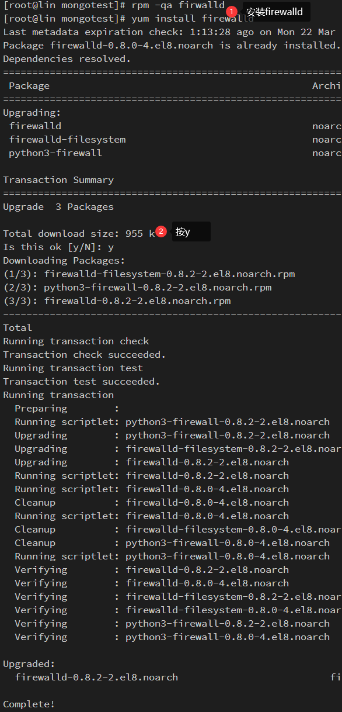

# 认识 MongoDB

## 基本概念

### 什么是 MongoDB

一个以 json 为数据模型的文档数据库；文档来自于 "JSON Document"，并非我们理解的 PDF、word 文档；类似于 Oracle、MySQL 海量数据处理，数据平台

### MongoDB 是免费的吗？

- MongoDB 有两个发布版本：社区版和企业版
- 社区办基于 SSPL，一种和 AGPL 基本类似的开源协议
- 企业版是基于商业协议，需要付费使用

### 主要特点

- 建模为可选
- JSON 数据模型比较适合开发
- 横向扩展可以支撑很大数据量和并发
- 易扩展、高性能、高可用
- 较容易映射复杂数据（key-value）
- 无事务特性要求（ACID 特性）
  - A(Atomicity)： 原子性
  - C(Consistency)： 一致性
  - I(Isolation)： 独立性，也叫隔离性
  - D(Durability)：持久性

### MongoDB 与关系型数据库

|                  | MongoDB                                                    | RDBMS                  |
| ---------------- | ---------------------------------------------------------- | ---------------------- |
| **_数据模型_**   | 文档模型                                                   | 关系模型               |
| **_数据库类型_** | OLTP                                                       | OLTP                   |
| **_CRUD 操作_**  | MQL/SQL                                                    | SQL                    |
| **_高可用_**     | 复制集                                                     | 集群模式               |
| **_横向扩展_**   | 通过原生分片完善支持                                       | 数据分区或者应用侵入式 |
| **_索引支持_**   | B-树、全文索引、地理位置索引、多键(multikey)索引、TTL 索引 | B 树                   |
| **_开发难度_**   | 容易                                                       | 困难                   |
| **_数据容量_**   | 理论上没有上限                                             | 千万、亿               |
| **_扩展方式_**   | 垂直扩展 + 水平扩展                                        | 垂直扩展               |

## MongoDB 的优势及特点

- 面向开发者的医用 + 高效数据库


- 一目了然的对象模型
  
  > 文档模型与数据库中的文档一一对应


- 灵活：快速响应业务变化
  - 多形性：同一集合可以包含不同字段(类型)的文档对象
  - 动态性：线上修改数据模式，修改时应用与数据库均无需下线
  - 数据治理：支持使用 JSON Schema 来规范数据模式，在保障模式灵活动态的前提下，提供数据治理能力


- 快速：最简单快速的开发方式；JSON 模型之快速特性：
  - 数据库引擎只需要在一个存储区读写
  - 反范式、无关联的组织极大优化查询速度
  - 程序 API 自然开发快速


- 原生的高可用和横向扩展能力
  - Replica Set-2 to 50 个成员
  - 自恢复
  - 多中心容灾能力
  - 滚动服务 - 最小化服务终端


- 横向扩展能力
  - 需要的时候无缝扩展
  - 应用全透明
  - 多种数据分布策略
  - 轻松支持 TB-PB 数量级


## 安装 MongoDB [官网](https://www.mongodb.com/try)

<!-- ### docker 安装 -->

- 打开[docker hub 官网](https://hub.docker.com/_/mongo)搜 mongodb

### 使用 dockerfile 模式安装 mongo

```yaml
version: '3.1'

services:
  mongo:
    image: mongo
    restart: always
    environment:
      MONGO_INITDB_ROOT_USERNAME: root
      MONGO_INITDB_ROOT_PASSWORD: example
    ports:
      - 27001:27017 # 将MongoDB的默认端口映射到宿主机的27001端口上来
    volumes: # 数据持久化配置
      - /home/mongotest:/data/db # 将容器内部的数据映射到宿主机的home文件夹的mongotest文件夹里
```

以我的的服务为例，在 home 文件夹下创建一个 mongotest 文件，然后在里面创建一个 docker-compose.yml，然后将上面的内容复制到 docker-compose.yml 文件中(当然也可以使用 ftp 工具上传)

我这儿就用 vim 编辑 docker-compose.yml 文件

```shell
// 目录已经在/home/mongotest下
$ vim docker-compose.yml
```

然后就将内容复制进去，按`ESC`，然后在分别按`:wq`回车


### 启动mongo服务

现在就可以使用`docker-compose up -d`来启动 mongo 服务了，执行命令后 docker 就去拉去 mongo 镜像并创建 mongo 数据


### 查看运行进程

可以使用`docker ps -a`或者`docker-compose`查看现在已启动的 docker 镜像


### 配置开放端口

连接前一定要检查宿主机端口是否开放，centOS 可以使用`firewall-cmd --add-port=27017/tcp --permanent`命令添加端口，添加完成后，重启安全组，命令：`firewall-cmd --reload`


> 如果在添加规则的时候出现如下报错的话，可有一下方案解决
>
> 

- 检查服务器是否有安装`firewalld`，检查命令如下：

```shell
$ rpm -qa firwalld // 回车后如果没有打印出任何东西，则表明没有安装
```

- 安装 firewalld 的命令：

```shell
$ yum install firewalld
```



