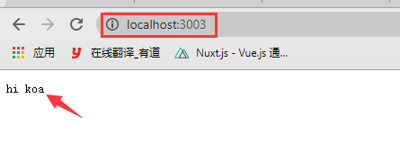
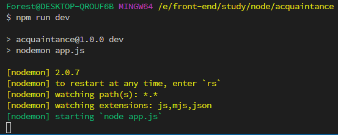
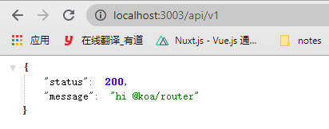
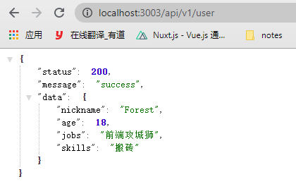
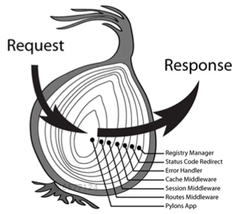

# koa(下一代web框架)

[koa](https://koajs.com/) ([中文网](https://www.koajs.com.cn/))是基于 Node.js 平台的下一代 web 开发框架，致力于成为应用和 API 开发领域中的一个更小、更富有表现力、更健壮的基石；利用*async 函数*丢弃回调函数，并增强错误处理，koa 没有任何预置的中间件，可快速的编写服务端应用程序。

## 核心概念

- Koa Application（应用程序）
- Context（上下文）
- Request（请求）、Response(响应)

## 初识 koa

```shell
// 创建一个 acquaintance 的文件夹
$ mkdir acquaintance

// 进入创建的文件夹
$ cd acquaintance

// 初始化 package.json
$ npm init -y

// 安装 koa，安装完之后
$ npm i koa
```

::: tip
可以在 package.json 中查看安装的所有依赖
:::

在工程目录里创建一个 app.js，代码如下：

```javascript
const Koa = require('koa') // 引入koa
const app = new Koa() // 实例化koa

app.use(ctx => {
  ctx.body = 'hi koa'
})

// 启动应用程序  参数：端口号
app.listen(3003)
```

在终端中使用`node app.js`命令（前提是终端中的路径必须指向所创建工程文件夹的路径）
打开浏览器访问：`http://localhost:3003` 此时浏览器中就会输出`hi koa`，如下图：

<!--  -->


::: warning
上面代码虽然轻松实现了一个 web 服务器，但是返回的数据和所请求都是固定的；并不适应真实的业务场景，比如：获取请求接口时的参数、方法、修改一次代码就要在终端中重新运行启动命令等；
:::

由于使用的`node app.js`启动，所以每次更改都要重新启动，这样给我们开发带来了极大的不便利，所以我们可以使用一些第三方依赖来自动监听文件的变化并重新启动，开发环境可以使用`nodemon` 首先安装`npm i nodemon -D`，也可以全局安装此依赖，生产环境的话可以使用`pm2`
安装之后在`package.json`的`scripts`中添加启动方式；如下

```json
{
  "name": "acquaintance",
  "version": "1.0.0",
  "description": "",
  "main": "index.js",
  "scripts": {
    "dev": "nodemon app.js"
  },
  "keywords": [],
  "author": "",
  "license": "ISC",
  "dependencies": {
    "koa": "^2.13.1"
  },
  "devDependencies": {
    "nodemon": "^2.0.7"
  }
}
```

在终端中执行命令：`npm run dev`,这样就不用我们每次修改都重新启动，执行之后就会在终端中提示，如下：

::: tip
执行命令时，终端的路径必须指向当前程序
:::

## 路由&中间件

### 安装依赖：[@koa/router](https://www.npmjs.com/package/@koa/router)

```git
$ npm i @koa/router
```

### 定义路由

- 在 app.js 中引入`@koa/router`，然后再实例化

```javascript
const Router = require('@koa/router')
const router = new Router({ prefix: '/api/v1' }) // 实例化的时候可以自定义一个接口前缀
```

- 注册 router

```javascript
app.use(router.routes()).use(router.allowedMethods())
```

- 定义接口

```javascript
router.get('/', async ctx => {
  ctx.body = {
    status: 200,
    message: 'hi @koa/router'
  }
})

router.get('/user', async ctx => {
  ctx.body = {
    status: 200,
    message: 'success',
    data: {
      nickname: 'Forest',
      age: 18,
      jobs: '前端攻城狮',
      skills: '搬砖'
    }
  }
})
```

完整代码如下：

```javascript
const Koa = require('koa')
const Router = require('@koa/router')
const app = new Koa()
const router = new Router({ prefix: '/api/v1' }) // 添加接口前缀

router.get('/', async ctx => {
  ctx.body = {
    status: 200,
    message: 'hi @koa/router'
  }
})

router.get('/user', async ctx => {
  ctx.body = {
    status: 200,
    message: 'success',
    data: {
      nickname: 'Forest',
      age: 18,
      jobs: '前端攻城狮',
      skills: '搬砖'
    }
  }
})

app.use(router.routes()).use(router.allowedMethods())
// 启动应用程序  参数：端口号
app.listen(3003)
```

在浏览器中请求：`http://localhost:3003/api/v1`、`http://localhost:3003/api/v1/user`，结果如下图：<br />



### 中间件

中间件其实就是一个个函数，通过`app.use()`注册；在 koa 中只会自动执行第一个中间件，后面的都需要我们自己调用，koa 在执行中间件的时候都会携带两个参数`context`(可简化为`ctx`)和`next`，`context`是 koa 的上下文对象，`next`就是下一个中间件函数;也就是洋葱模型；所谓洋葱模型，就是指每一个 Koa 中间件都是一层洋葱圈，它即可以掌管请求进入，也可以掌管响应返回。换句话说：外层的中间件可以影响内层的请求和响应阶段，内层的中间件只能影响外层的响应阶段。

执行顺序按照 app.use()的顺序执行，中间件可以通过 await next()来执行下一个中间件，同时在最后一个中间件执行完成后，依然有恢复执行的能力。即，通过洋葱模型，await next()控制调用 “下游”中间件，直到 “下游”没有中间件且堆栈执行完毕，最终流回“上游”中间件。

下面这段代码的结果就能很好的诠释，示例：

```javascript
const Koa = require('koa')
const app = new Koa()

app.use(async (ctx, next) => {
  console.log(`this is a middleware 1`)
  await next()
  console.log(`this is a middleware 1 end `)
})

app.use(async (ctx, next) => {
  console.log(`this is a middleware 2`)
  await next()
  console.log(`this is a middleware 2 end `)
})

app.use(async (ctx, next) => {
  console.log(`this is a middleware 3`)
  await next()
  console.log(`this is a middleware 3 end `)
})

app.listen(3004)
```

运行结果：

```base
this is a middleware 1
this is a middleware 2
this is a middleware 3
this is a middleware 3 end
this is a middleware 2 end
this is a middleware 1 end
```

#### 中间件是如何执行的？

```javascript
// 通过 createServer 方法启动一个 Node.js 服务
listen(...args) {
  const server = http.createServer(this.callback());
  return server.listen(...args);
}
```

Koa 框架通过 http 模块的 createServer 方法创建一个 Node.js 服务，并传入 `this.callback()` 方法， `this.callback()` 方法源码精简实现如下：

```javascript
function compose(middleware) {
  // 这里返回的函数，就是上文中的 fnMiddleware
  return function (context, next) {
    let index = -1
    return dispatch(0)

    function dispatch(i) {
      if (i <= index) return Promise.reject(new Error('next() called multiple times'))
      index = i
      // 取出第 i 个中间件为 fn
      let fn = middleware[i]

      if (i === middleware.length) fn = next

      // 已经取到了最后一个中间件，直接返回一个 Promise 实例，进行串联
      // 这一步的意义是保证最后一个中间件调用 next 方法时，也不会报错
      if (!fn) return Promise.resolve()

      try {
          // 把 ctx 和 next 方法传入到中间件 fn 中，并将执行结果使用 Promise.resolve 包装
          // 这里可以发现，我们在一个中间件中调用的 next 方法，其实就是dispatch.bind(null, i + 1)，即调用下一个中间件
          return Promise.resolve(fn(context, dispatch.bind(null, i + 1)));
      } catch (err) {
          return Promise.reject(err)
      }
    }
  }
}
callback() {
  // 从 this.middleware 数组中，组合中间件
  const fn = compose(this.middleware);

  // handleRequest 方法作为 `http` 模块的 `createServer` 方法参数，
  // 该方法通过 `createContext` 封装了 `http.createServer` 中的 `request` 和 `response`对象，并将这两个对象放到 ctx 中
  const handleRequest = (req, res) => {
    const ctx = this.createContext(req, res);
    // 将 ctx 和组合后的中间件函数 fn 传递给 this.handleRequest 方法
    return this.handleRequest(ctx, fn);
  };

  return handleRequest;
}
handleRequest(ctx, fnMiddleware) {
  const res = ctx.res;
  res.statusCode = 404;
  const onerror = err => ctx.onerror(err);
  const handleResponse = () => respond(ctx);
  // on-finished npm 包提供的方法，该方法在一个 HTTP 请求 closes，finishes 或者 errors 时执行
  onFinished(res, onerror);
  // 将 ctx 对象传递给中间件函数 fnMiddleware
  return fnMiddleware(ctx).then(handleResponse).catch(onerror);
}
```

将 Koa 一个中间件组合和执行流程梳理为以下步骤:

- 通过 compose 方法组合各种中间件，返回一个中间件组合函数 fnMiddleware
- 请求过来时，会先调用 handleRequest 方法，该方法完成：
- 调用 createContext 方法，对该次请求封装出一个 ctx 对象；
- 接着调用 this.handleRequest(ctx, fnMiddleware)处理该次请求。
- 通过 fnMiddleware(ctx).then(handleResponse).catch(onerror)执行中间件。

## 常见获取值的几种方式

- 在 params 中取值，`eg：http://localhost:3003/api/v1/user/1`

```javascript
// 前端请求
await axios.post('http://localhost:3003/api/v1/user/1')

// 服务端
router.post('/user/:id',async ctx => {
    //获取url的id
  cosnt { id } = ctx.params; // { id: 1 }
})
```

- 在 query 中取值，也就是获取问号后面的。

```JavaScript
// 前端
await axios.post('http://localhost:3003/api/v1/user?name=Forest&age=18')

// 服务端
router.post('/user', async ctx => {
  //获取url的id
  const { name, age } = ctx.request.query // { name: Forest, age: 18 }
})
```

- 获取 header 中的参数：

```javascript
//请求接口时设置请求头
axios
  .post(
    'http://localhost/user?name=Forest&age=18',
    {
      headers: {
        Author: 'token'
      }
    }
    //......
  )
  .then(res => console.log('res:', res))

//在服务端获取则是：
router.post('/user', async ctx => {
  //获取 url 的 id
  const { Author } = ctx.request.header // { Author: 'token' }
})
```

- 获取 body 中的数据，在服务端获取 body 中的一些数据只能用一些外部的插件；如：`koa-body`、`koa-bodyparser` 等等。
  就以 `koa-body` 为例，首先安装 `npm i koa-body -S`，再引入：

```javascript
// 服务端
const body = require('koa-body);

//然后在注册中间件：
app.use(body());

//在服务端获取则是：
router.post('/user', async ctx => {
    const res = ctx.request.body; // { name: 'Foreset', age: 18 }
});


//请求时有两种传参方式，一种是 json，另一种是 fromData；以 json 为例
axios.post('http://localhost/user', {name: 'Foreset', age: 18}).then(res => {
    console.log('res:', res)
});
```

## 创建 RESTful 接口

```javascript
const Koa = require('koa')
const Router = require('@koa/router')
const koaBody = require('koa-body')
const app = new Koa()
const router = new Router({ prefix: '/api/v1' })

router.get('/', async ctx => {
  ctx.body = {
    status: 200,
    message: 'hi @koa/router'
  }
})

router.get('/user', async ctx => {
  ctx.body = {
    status: 200,
    message: 'success',
    data: {
      query: ctx.query,
      nickname: 'Forest',
      age: 18,
      jobs: '前端攻城狮',
      skills: '搬砖'
    }
  }
})

router.get('/user/:id', async ctx => {
  const { id } = ctx.params
  ctx.body = {
    status: 200,
    message: 'success',
    data: {
      id,
      nickname: 'Forest',
      age: 18,
      jobs: '前端攻城狮',
      skills: '搬砖'
    }
  }
})

router.post('/user', async ctx => {
  const { name, age } = ctx.request.body
  ctx.body = {
    status: 200,
    data: {
      name,
      age
    }
  }
})

app.use(koaBody()).use(router.routes()).use(router.allowedMethods())

app.listen(3003)
```

::: tip
koa-body 中间件的引入顺序必须在 router 之前，否则获取不了 post 请求携带的数据
:::
