# webpack5构建加持

## 项目目标

- 支持 es6+语法
- 开发热更新
- webpack5 构建
- 接口搭建
- 路由合并，路由自动注册
- 添加项目规范
- 配置自定义别名

## 项目目录结构

```shell
service
├─ .husky
│   ├─ _
│   │   └─ husky.sh
│   ├─ .gitignore
│   ├─ pre-commit
├─ config
│   ├─ webpack.config.base.js
│   ├─ webpack.config.dev.js
│   └─ webpack.config.prod.js
├─ src
│   ├─ api
│   │  └─ v1
│   │     ├─ demo.js
│   │     └─ test.js
│   ├─ config
│   ├─ controller
│   │  └─ v1
│   │     ├─ demo.js
│   │     └─ test.js
│   ├─ model
│   ├─ routes
│   │   └─ index.js
│   └─ app.js
├─ package-lock.json
├─ package.json
├─ .prettierrc
├─ .babelrc
├─ .editorconfig
├─ .eslintrc.js
└─ .gitignore

```

## 搭建项目

```shell
// 创建项目目录
$ mkdir service

// 进入service文件夹
$ cd service

// 初始化package.json
$ npm init -y

// 创建源码目录
mkdir src
```

1. **安装`koa`、`@koa/router` （如果已经配置可路过）**

```shell
$ yarn add koa @koa/router
```

2. **创建入口文件**

```shell
$ touch src/app.js
```

3. **安装构建依赖**

```shell
$ yarn add -D webpack webpack-cli @babel/node @babel/core @babel/preset-env babel-loader clean-webpack-plugin nodemon webpack-node-externals webpack-merge rimraf
```

4. **在项目根目录添加`.babelrc`文件**

```json
{
  "presets": [
    [
      "@babel/preset-env",
      {
        "targets": {
          "node": "current"
        }
      }
    ]
  ]
}
```

5. **添加测试接口**

> 在`app.js`中添加测试接口，由于已经配置了`babel`解析，所以可以直接在`app.js`中写 es6+语法

```javascript
import Koa from 'koa'
import Router from '@koa/router'

const app = new Koa()
const router = new Router()

router.get('/', async ctx => {
  ctx.body = {
    status: 200,
    message: 'success',
    data: {
      nickname: 'Forest',
      title: '前端工程师',
      content: 'webpack5构建node应用'
    }
  }
})

app.use(router.routes()).use(router.allowedMethods())

const port = 3002
app.listen(port, () => console.log(`服务启动在${port}端口`))
```

6. **启动服务**

```shell
$ npx babel-node src/app.js
```

7. **在 postman 中请求接口**

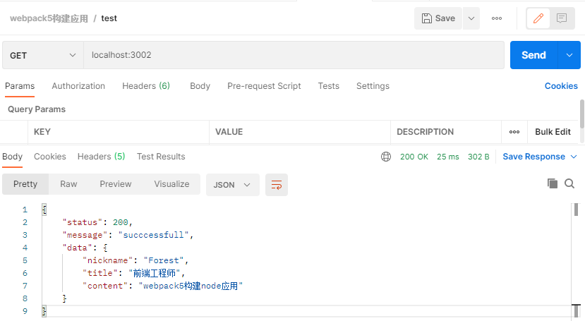

## 配置 webpack

[英文文档](https://webpack.js.org/concepts/) 

[中文文档](https://webpack.docschina.org/concepts/)

::: tip 核心概念

- **entry**：入口；指示 `webpack` 应该使用哪个模块，默认值是 `./src/index.js`

- **output**：输出；`output` 属性告诉 `webpack` 在哪里输出它所创建的 _bundle_，默认值是 `./dist/main.js`

- **loader**：loader 负责完成项目中各种各样资源模块的加载

- **plugins**：插件；用来解决项目中除了资源模块打包以外的其他自动化工作。包括：打包优化，资源管理，注入环境变量

- **mode**：模式；通过选择 `development`, `production` 或 `none` 之中的一个，来设置 `mode` 参数，你可以启用 webpack 内置在相应环境下的优化。其默认值为 `production`。

:::

> 在项目根目录创建`webpack.config.js`文件

```javascript
const { DefinePlugin } = require('webpack')
const nodeExternals = require('webpack-node-externals')
const { CleanWebpackPlugin } = require('clean-webpack-plugin')

module.exports = {
  // 打包编译为某一端侧的可使用代码  默认值：web  https://webpack.docschina.org/configuration/target/
  target: 'node',

  // 打包模式，可选择值：development、production
  mode: 'development',

  // 控制是否生成，以及如何生成 source map。 https://webpack.docschina.org/configuration/devtool/#root
  devtool: 'eval-cheap-source-map',

  // 打包模块入口文件
  entry: {
    server: `${process.cwd()}/src/app.js`
  },

  // 打包后的输入文件
  output: {
    filename: '[name].bundle.js',
    path: `${process.cwd()}/dist`
  },

  // 匹配解析规则
  module: {
    rules: [
      {
        test: /\.(js|jsx)$/,
        use: {
          loader: 'babel-loader'
        },
        exclude: [`${process.cwd()}/node_modules`]
      }
    ]
  },

  // 构建过程中使用的插件
  plugins: [
    new CleanWebpackPlugin(),
    new DefinePlugin({
      'process.env': {
        NODE_ENV: JSON.stringify(
          process.env.NODE_ENV === 'production' ||
            process.env.NODE_ENV === 'prod'
            ? 'production'
            : 'development'
        )
      }
    })
  ],

  // 防止第三方依赖被打包
  externals: [nodeExternals()]
}
```

### 测试构建

```shell
$ npx webpack
```

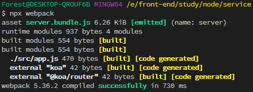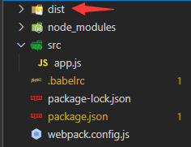

> 构建成功！

::: warning 思考
在实际开发中可能会存在开发环境和生产环境的构建，所以单凭一个配置还不能达到实际的需求，接下来对开发环境和生产环境分别配置。
:::

> 在项目根目录创建 config 文件，并创建三个文件分别是`webpack.config.base.js`、`webpack.config.dev.js`、`webpack.config.prod.js`
>
> - `webpack.config.base.js` 文件存放开发环境和生产环境都是需要的构建配置
> - `webpack.config.dev.js` 文件存放开发环境的构建配置
> - `webpack.config.prod.js` 存放生产环境的构建配置

### 优化构建配置

> - mode 独立于构建环境，开发环境为(`development`)、生产环境为(`production`)
> - devtool 只有在开发环境下才会存在
> - [stats](https://webpack.docschina.org/configuration/stats/) 属性让你更精确地控制打包后的信息该怎么显示

::: tip
由于每个开发环境和生产环境都是独立的构建配置，所以要在构建时要合并基础配置；安装`webpack-merge`合并构建配置

```shell
$ npm i -D webpack-merge
```

:::

- 优化 webpack.config.base.js

```javascript
// config/webpack.config.base.js
const { DefinePlugin } = require('webpack')
const nodeExternals = require('webpack-node-externals')
const { CleanWebpackPlugin } = require('clean-webpack-plugin')

module.exports = {
  // 打包编译为某一端侧的可使用代码  默认值：web  https://webpack.docschina.org/configuration/target/
  target: 'node',

  // 打包模式，可选择值：development、production
  // mode: "development",

  // 控制是否生成，以及如何生成 source map。 https://webpack.docschina.org/configuration/devtool/#root
  // devtool: "eval-cheap-source-map",

  // 打包模块入口文件
  entry: {
    server: `${process.cwd()}/src/app.js`
  },

  // 打包后的输入文件
  output: {
    filename: '[name].bundle.js',
    path: `${process.cwd()}/dist`
  },

  // 匹配解析规则
  module: {
    rules: [
      {
        test: /\.(js|jsx)$/,
        use: {
          loader: 'babel-loader'
        },
        exclude: [`${process.cwd()}/node_modules`]
      }
    ]
  },

  // 构建过程中使用的插件
  plugins: [
    new CleanWebpackPlugin(),
    new DefinePlugin({
      'process.env': {
        // 设置环境变量 NODE_ENV
        NODE_ENV: JSON.stringify(
          process.env.NODE_ENV === 'production' ||
            process.env.NODE_ENV === 'prod'
            ? 'production'
            : 'development'
        )
      }
    })
  ],

  // 防止第三方依赖被打包
  externals: [nodeExternals()]
}
```

- 开发环境的构建配置

```javascript
// config/webpack.config.dev.js
const { merge } = require('webpack-merge')
const baseWebpackConfig = require('./webpack.config.base')

const webpackConfig = merge(baseWebpackConfig, {
  devtool: 'eval-cheap-source-map',
  mode: 'development',

  // 是否添加关于子模块的信息。
  stats: { children: false }
})

module.exports = webpackConfig
```

- 生产环境的构建配置

> 生产环境构建时要进行代码压缩，安装`terser-webpack-plugin`， 命令：`npm i -D terser-webpack-plugin`

```javascript
// config/webpack.config.prod.js
const { merge } = require('webpack-merge')
const TersetWebpackPlugin = require('terser-webpack-plugin')
const baseWebpackConfig = require('./webpack.config.base')

const webpackConfig = merge(baseWebpackConfig, {
  devtool: 'eval-cheap-source-map',
  mode: 'production',
  stats: { children: false },

  // 优化配置
  optimization: {
    // 压缩配置
    minimize: true,
    minimizer: [new TersetWebpackPlugin()],

    // 分块策略
    splitChunks: {
      // 缓存组 https://webpack.docschina.org/plugins/split-chunks-plugin/#splitchunkscachegroups
      cacheGroups: {
        commens: {
          name: 'commons',
          chunks: 'initial',
          minChunks: 3,
          enforce: true
        }
      }
    }
  }
})

module.exports = webpackConfig
```

- 添加构建脚本命令

  > 设置环境变量`NODE_ENV`，由于各环境配置的差异问题，`cross-env`可以有效的解决跨平台设置环境变量的问题；它是运行跨平台设置和使用环境变量(Node 中的环境变量)的脚本。安装命令：`npm i -D cross-env`
  > 安装成功后配置构建命令:
  >
  > - 在`package.json`的`scripts`中添加如下命令：
  >
  > ```json
  > "build": "cross-env NODE_ENV=prod webpack --config config/webpack.config.prod.js",
  > "dev": "cross-env NODE_ENV=dev nodemon --exec babel-node --inspect src/app.js",
  > ```

- 启动开发环境服务

```shell
$ npm run dev
```

运行之后的效果图如下：

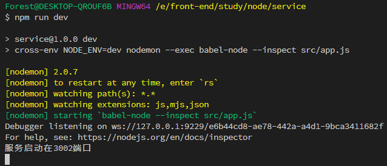

- 启动编译构建命令

```shell
$ npm run build
```

运行效果如下图：


查看 dist 文件夹下被编译后的文件：

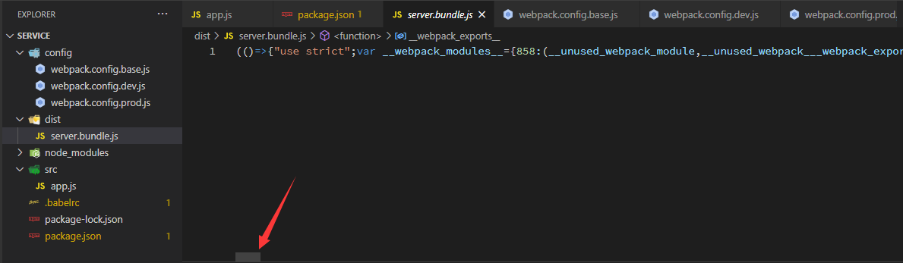

> 被压缩成了一整行！

## 路由自动注册

### 使用require-directory

> 在 src 文件夹下新建 routes 和 api 两文件夹；routes 是集成当前项目的所有路由，api 文件是存放项目的所有接口文件。

- 安装 [`require-directory`](https://github.com/troygoode/node-require-directory/)，这个包的作用可以将一个目录下的所有模块文件

  ```shell
  $ npm i require-dirctory
  ```

- 创建`src/api/v1`下创建`demo.js`和`test.js`文件

  ```js
  // src/api/v1/demo.js
  import Router from '@koa/router'

  const router = new Router({ prefix: '/api/v1' })

  router.get('/demo', async ctx => {
    ctx.body = {
      status: 200,
      message: 'message',
      data: {
        file: 'demo.js',
        title: 'webpack 5 构建node应用',
        content: 'koa + @koa/router + require-dirctory'
      }
    }
  })

  export default router
  ```

  ```js
  //  src/api/v1/test.js
  import Router from '@koa/router'

  const router = new Router({ prefix: '/api/v1' })

  router.get('/test', async ctx => {
    ctx.body = {
      status: 200,
      message: 'message',
      data: {
        file: 'test.js',
        title: 'webpack 5 构建node应用',
        content: 'koa + @koa/router + require-dirctory'
      }
    }
  })

  export default router
  ```

- 配置`src/routes/index.js`

  ```js
  import Router from '@koa/router'
  import requireDirectory from 'require-directory'

  // 接口存放目录路径
  const apiDirectory = `${process.cwd()}/src/api`

  function initLoadRoutes(app) {
    requireDirectory(module, apiDirectory, {
      visit({ default: router }) {
        if (router instanceof Router) {
          app.use(router.routes())
        }
      }
    })
  }

  export default initLoadRoutes
  ```

- 修改`src/app.js`文件

  ```javascript
  import Koa from 'koa'
  import initLoadRoutes from './routes/index'

  const app = new Koa()

  // 在入口文件中执行
  initLoadRoutes(app)

  const port = 3002
  app.listen(port, () => console.log(`服务启动在${port}端口`))
  ```

- 在 postman 中测试请求如下图

  

  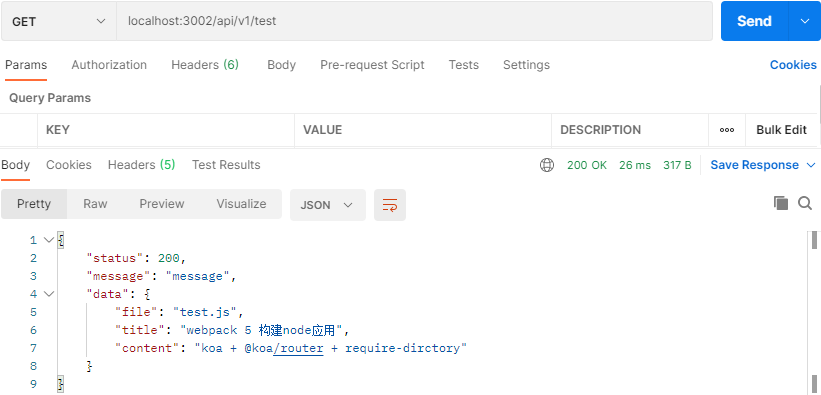

  到此自动注册路由就大功告成了，后面我们定义接口的时候就用手动一个一个的引入，只管往 api 文件夹里写接口就好了。


### 使用require.context（webpack）功能

官方文档：[require](https://webpack.docschina.org/guides/dependency-management/)

举例：

```
.
├── modules
│   ├── adminRouter.js
│   ├── commentsRouter.js
│   ├── contentRouter.js
│   ├── loginRouter.js
│   ├── publicRouter.js
│   ├── userRouter.js
│   └── wxRouter.js
└── routes.js
```

目标：使用`routes.js`来动态加载`modules`目录中的`.js`的路由文件，其他的比如：`vuex`、`vue-router`等场景，都适合。


先上实现出来的代码：

`routes.js`文件

```js
import combineRoutes from 'koa-combine-routers'

// 加载目录中的Router中间件
const moduleFiles = require.context('./modules', true, /\.js$/)

// reduce方法去拼接 koa-combine-router所需的数据结构 Object[]
const modules = moduleFiles.keys().reduce((items, path) => {
  const value = moduleFiles(path)
  items.push(value.default)
  return items
}, [])

export default combineRoutes(modules)
```

使用方法，在`index.js`入口文件中：

```js
import router from './routes/routes'


app.use(router())
```


这里有两个知识点：

1. 使用`koa-combine-routers`可以合并多个路由

2. 使用`require.context`可以动态引入多个文件

   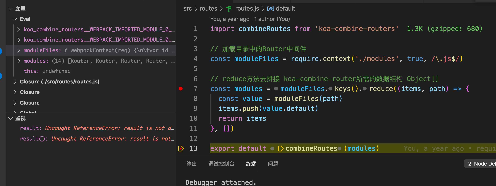

   说明：

   - require.context返回的是一个函数

   - 这个函数的键值，正是文件

     ```
     moduleFiles.keys()
     (14) ['./adminRouter.js', './commentsRouter.js', './contentRouter.js', './loginRouter.js', './publicRouter.js', './userRouter.js', './wxRouter.js', 'routes/modules/adminRouter.js', 'routes/modules/commentsRouter.js', 'routes/modules/contentRouter.js', 'routes/modules/loginRouter.js', 'routes/modules/publicRouter.js', 'routes/modules/userRouter.js', 'routes/modules/wxRouter.js']
     ```

   - 这个函数接收文件名后，可以返回文件的内容，这个内容正好匹配路由，输出一个数组，传递给conbineRoutes方法，即可合并。

     ```
     const value = moduleFiles(path)
     ```

     


## 配置别名

在日常开发中我们引入一些封装好的方法或者模块总是写很长很长的文件路径；比如：`require('../../../../some/very/deep/module')`、`import format from '../../../../utils/format'`，为了告别这种又臭又长的路径我们就可以使用一些解放生产力的方法了（哈哈哈哈，不会偷懒的程序员不是好程序员 🤭）

配置别名有两种方式，一种是 webpack，另一种是通过[`module-alias`](https://www.npmjs.com/package/module-alias)包

### 使用webpack的别名功能

官方文档： [resolve.alias](https://webpack.docschina.org/configuration/resolve/)

配置方式，非常的简单方便：

```
const path = require('path');

module.exports = {
  //...
  resolve: {
    alias: {
      '@': path.resolve(__dirname, 'src/'),
      // ...
    },
  },
};
```


### 使用module-alias

- 安装依赖

  ```shell
  npm i module-alias
  ```

- 在`package.json`中添加自定义别名

  ```json
  "_moduleAliases": {
      "@": "./src",
      "@controller": "./src/controller"
  }
  ```

  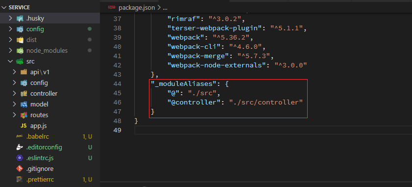

- 在入口文件的顶部引入`module-alias/register`，也就是在`app.js`的顶部引入

  ```javascript
  require('module-alias/register')
  ```

  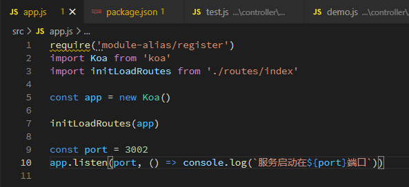

> 配置成功后，将`/src/api/v1`内的逻辑全部提到`src/controller`中，使用别名引入`controller`中文件，修改后如下：

```javascript
// src/api/v1/demo.js
import Router from '@koa/router'
import DemoController from '@controller/demo/'

const router = new Router({ prefix: '/api/v1' })

router.get('/demo', DemoController.demo)

export default router
```

```javascript
// src/api/v1/test.js
import Router from '@koa/router'
import TestController from '@controller/test'

const router = new Router({ prefix: '/api/v1' })

router.get('/test', TestController.test)

export default router
```

```javascript
// src/controller/v1/demo.js
class DemoController {
  constructor() {}

  async demo(ctx) {
    ctx.body = {
      status: 200,
      message: 'message',
      data: {
        file: 'test.js',
        title: 'webpack 5 构建node应用',
        content: 'koa + @koa/router + require-dirctory'
      }
    }
  }
}

export default new DemoController()
```

```javascript
// src/controller/v1/test.js
class TestController {
  constructor() {}

  async test(ctx) {
    ctx.body = {
      status: 200,
      message: 'message',
      data: {
        file: 'test.js',
        title: 'webpack 5 构建node应用',
        content: 'koa + @koa/router + require-dirctory'
      }
    }
  }
}

export default new TestController()
```

- postman 中测试接口

  

  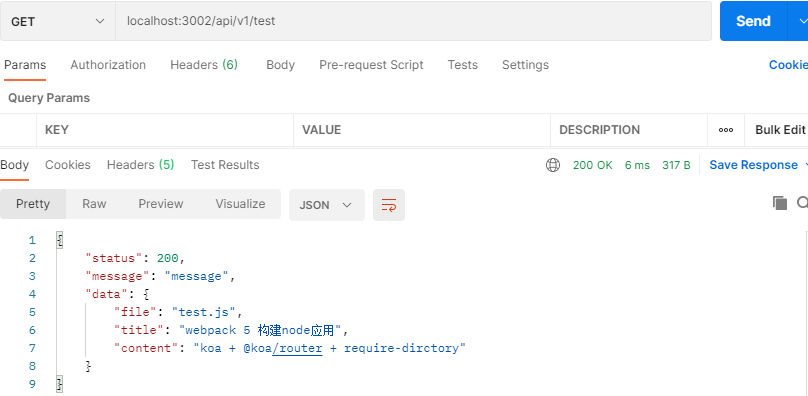

commit 时 lint-staged 没有通过：

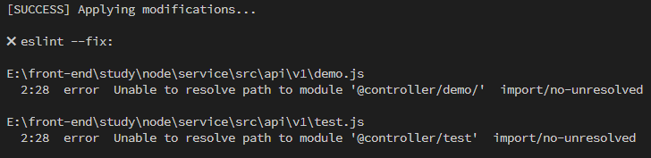

> 上述问题是 eslint 发现`@controller/*`开头的在 node_modules 中没有找到，所以配置 eslint 就好了：
>
> ```js
> // src/eslintrc.js
> module.exports = {
>   //...
>   rules: {
>     'import/no-unresolved': [2, { ignore: ['^@/', '@controller'] }] // @和@controller 是设置的路径别名
>   }
> }
> ```

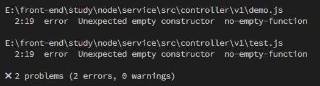

> 这个问题是由于`constructor`构造函数为空引起的，在`eslintrc.js`添加配置即可：'no-empty-function': ['error', { allow: ['constructors'] }]

完整代码见：[GitHub](https://github.com/big-front-end/webpack5-node)
