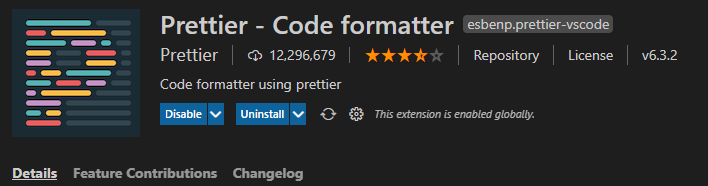
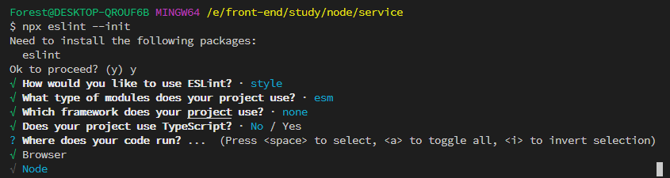
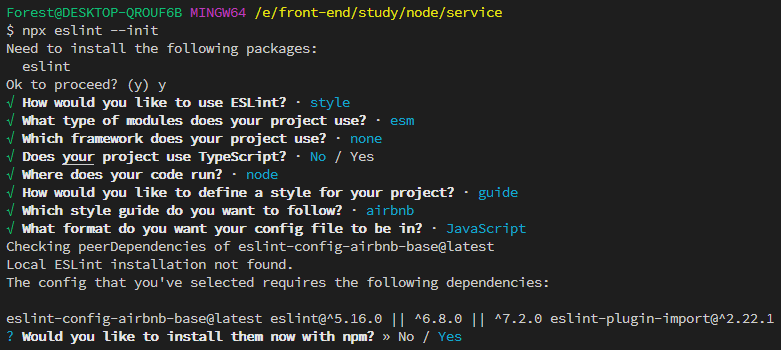
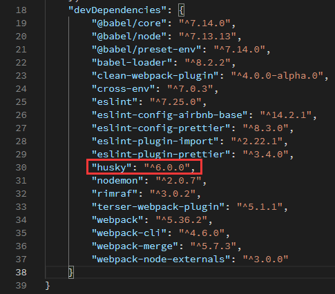
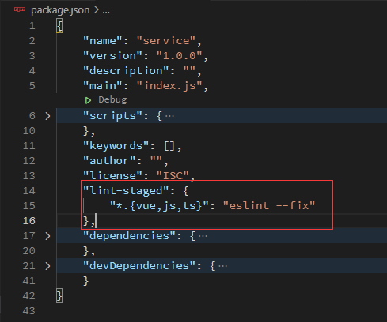
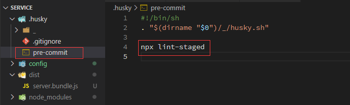

# webpack5 构建

## Tasking

- 支持 es6+语法
- 开发热更新
- webpack5 构建
- 接口搭建
- 路由合并，路由自动注册
- 添加项目规范
- 配置自定义别名

## 项目最终目录结构

```shell
service
├─ .husky
│   ├─ _
│   │   └─ husky.sh
│   ├─ .gitignore
│   ├─ pre-commit
├─ config
│   ├─ webpack.config.base.js
│   ├─ webpack.config.dev.js
│   └─ webpack.config.prod.js
├─ src
│   ├─ api
│   │  └─ v1
│   │     ├─ demo.js
│   │     └─ test.js
│   ├─ config
│   ├─ controller
│   │  └─ v1
│   │     ├─ demo.js
│   │     └─ test.js
│   ├─ model
│   ├─ routes
│   │   └─ index.js
│   └─ app.js
├─ package-lock.json
├─ package.json
├─ .prettierrc
├─ .babelrc
├─ .editorconfig
├─ .eslintrc.js
└─ .gitignore

```

## 搭建项目

```shell
// 创建项目目录
$ mkdir service

// 进入service文件夹
$ cd service

// 初始化package.json
$ npm init -y

// 创建源码目录
mkdir src
```

### 安装`koa`、`@koa/router`

```shell
$ yarn add koa @koa/router
```

### 创建入口文件

```shell
$ touch src/app.js
```

### 安装构建依赖

```shell
$ yarn add -D webpack webpack-cli @babel/node @babel/core @babel/preset-env babel-loader clean-webpack-plugin nodemon webpack-node-externals webpack-merge rimraf
```

### 在项目根目录添加`.babelrc`文件

```json
{
  "presets": [
    [
      "@babel/preset-env",
      {
        "targets": {
          "node": "current"
        }
      }
    ]
  ]
}
```

### 添加测试接口

> 在`app.js`中添加测试接口，由于已经配置了`babel`解析，所以可以直接在`app.js`中写 es6+语法

```javascript
import Koa from 'koa'
import Router from '@koa/router'

const app = new Koa()
const router = new Router()

router.get('/', async ctx => {
  ctx.body = {
    status: 200,
    message: 'success',
    data: {
      nickname: 'Forest',
      title: '前端工程师',
      content: 'webpack5构建node应用'
    }
  }
})

app.use(router.routes()).use(router.allowedMethods())

const port = 3002
app.listen(port, () => console.log(`服务启动在${port}端口`))
```

### 启动服务

```shell
$ npx babel-node src/app.js
```

### 在 postman 中请求接口


### 配置 webpack [英文文档](https://webpack.js.org/concepts/) [中文文档](https://webpack.docschina.org/concepts/)

::: tip 核心概念

- **entry**：入口；指示 `webpack` 应该使用哪个模块，默认值是 `./src/index.js`

- **output**：输出；`output` 属性告诉 `webpack` 在哪里输出它所创建的 _bundle_，默认值是 `./dist/main.js`

- **loader**：loader 负责完成项目中各种各样资源模块的加载

- **plugins**：插件；用来解决项目中除了资源模块打包以外的其他自动化工作。包括：打包优化，资源管理，注入环境变量

- **mode**：模式；通过选择 `development`, `production` 或 `none` 之中的一个，来设置 `mode` 参数，你可以启用 webpack 内置在相应环境下的优化。其默认值为 `production`。

:::

> 在项目根目录创建`webpack.config.js`文件

```javascript
const { DefinePlugin } = require('webpack')
const nodeExternals = require('webpack-node-externals')
const { CleanWebpackPlugin } = require('clean-webpack-plugin')

module.exports = {
  // 打包编译为某一端侧的可使用代码  默认值：web  https://webpack.docschina.org/configuration/target/
  target: 'node',

  // 打包模式，可选择值：development、production
  mode: 'development',

  // 控制是否生成，以及如何生成 source map。 https://webpack.docschina.org/configuration/devtool/#root
  devtool: 'eval-cheap-source-map',

  // 打包模块入口文件
  entry: {
    server: `${process.cwd()}/src/app.js`
  },

  // 打包后的输入文件
  output: {
    filename: '[name].bundle.js',
    path: `${process.cwd()}/dist`
  },

  // 匹配解析规则
  module: {
    rules: [
      {
        test: /\.(js|jsx)$/,
        use: {
          loader: 'babel-loader'
        },
        exclude: [`${process.cwd()}/node_modules`]
      }
    ]
  },

  // 构建过程中使用的插件
  plugins: [
    new CleanWebpackPlugin(),
    new DefinePlugin({
      'process.env': {
        NODE_ENV: JSON.stringify(
          process.env.NODE_ENV === 'production' ||
            process.env.NODE_ENV === 'prod'
            ? 'production'
            : 'development'
        )
      }
    })
  ],

  // 防止第三方依赖被打包
  externals: [nodeExternals()]
}
```

### 测试构建

```shell
$ npx webpack
```


> 构建成功！

::: warning 思考
在实际开发中可能会存在开发环境和生产环境的构建，所以单凭一个配置还不能达到实际的需求，接下来对开发环境和生产环境分别配置。
:::

> 在项目根目录创建 config 文件，并创建三个文件分别是`webpack.config.base.js`、`webpack.config.dev.js`、`webpack.config.prod.js`
>
> - `webpack.config.base.js` 文件存放开发环境和生产环境都是需要的构建配置
> - `webpack.config.dev.js` 文件存放开发环境的构建配置
> - `webpack.config.prod.js` 存放生产环境的构建配置

### 优化构建配置

> - mode 独立于构建环境，开发环境为(`development`)、生产环境为(`production`)
> - devtool 只有在开发环境下才会存在
> - [stats](https://webpack.docschina.org/configuration/stats/) 属性让你更精确地控制打包后的信息该怎么显示

::: tip
由于每个开发环境和生产环境都是独立的构建配置，所以要在构建时要合并基础配置；安装`webpack-merge`合并构建配置

```shell
$ npm i -D webpack-merge
```

:::

- 优化 webpack.config.base.js

```javascript
// config/webpack.config.base.js
const { DefinePlugin } = require('webpack')
const nodeExternals = require('webpack-node-externals')
const { CleanWebpackPlugin } = require('clean-webpack-plugin')

module.exports = {
  // 打包编译为某一端侧的可使用代码  默认值：web  https://webpack.docschina.org/configuration/target/
  target: 'node',

  // 打包模式，可选择值：development、production
  // mode: "development",

  // 控制是否生成，以及如何生成 source map。 https://webpack.docschina.org/configuration/devtool/#root
  // devtool: "eval-cheap-source-map",

  // 打包模块入口文件
  entry: {
    server: `${process.cwd()}/src/app.js`
  },

  // 打包后的输入文件
  output: {
    filename: '[name].bundle.js',
    path: `${process.cwd()}/dist`
  },

  // 匹配解析规则
  module: {
    rules: [
      {
        test: /\.(js|jsx)$/,
        use: {
          loader: 'babel-loader'
        },
        exclude: [`${process.cwd()}/node_modules`]
      }
    ]
  },

  // 构建过程中使用的插件
  plugins: [
    new CleanWebpackPlugin(),
    new DefinePlugin({
      'process.env': {
        // 设置环境变量 NODE_ENV
        NODE_ENV: JSON.stringify(
          process.env.NODE_ENV === 'production' ||
            process.env.NODE_ENV === 'prod'
            ? 'production'
            : 'development'
        )
      }
    })
  ],

  // 防止第三方依赖被打包
  externals: [nodeExternals()]
}
```

- 开发环境的构建配置

```javascript
// config/webpack.config.dev.js
const { merge } = require('webpack-merge')
const baseWebpackConfig = require('./webpack.config.base')

const webpackConfig = merge(baseWebpackConfig, {
  devtool: 'eval-cheap-source-map',
  mode: 'development',

  // 是否添加关于子模块的信息。
  stats: { children: false }
})

module.exports = webpackConfig
```

- 生产环境的构建配置

> 生产环境构建时要进行代码压缩，安装`terser-webpack-plugin`， 命令：`npm i -D terser-webpack-plugin`

```javascript
// config/webpack.config.prod.js
const { merge } = require('webpack-merge')
const TersetWebpackPlugin = require('terser-webpack-plugin')
const baseWebpackConfig = require('./webpack.config.base')

const webpackConfig = merge(baseWebpackConfig, {
  devtool: 'eval-cheap-source-map',
  mode: 'production',
  stats: { children: false },

  // 优化配置
  optimization: {
    // 压缩配置
    minimize: true,
    minimizer: [new TersetWebpackPlugin()],

    // 分块策略
    splitChunks: {
      // 缓存组 https://webpack.docschina.org/plugins/split-chunks-plugin/#splitchunkscachegroups
      cacheGroups: {
        commens: {
          name: 'commons',
          chunks: 'initial',
          minChunks: 3,
          enforce: true
        }
      }
    }
  }
})

module.exports = webpackConfig
```

- 添加构建脚本命令

  > 设置环境变量`NODE_ENV`，由于各环境配置的差异问题，`cross-env`可以有效的解决跨平台设置环境变量的问题；它是运行跨平台设置和使用环境变量(Node 中的环境变量)的脚本。安装命令：`npm i -D cross-env`
  > 安装成功后配置构建命令:
  >
  > - 在`package.json`的`scripts`中添加如下命令：
  >
  > ```json
  > "build": "cross-env NODE_ENV=prod webpack --config config/webpack.config.prod.js",
  > "dev": "cross-env NODE_ENV=dev nodemon --exec babel-node --inspect src/app.js",
  > ```

- 启动开发环境服务

```shell
$ npm run dev
```

运行之后的效果图如下：


- 启动编译构建命令

```shell
$ npm run build
```

运行效果如下图：


查看 dist 文件夹下被编译后的文件：


> 被压缩成了一整行！

## 配置项目规范

### 集成 EditorConfig 配置

> **[EditorConfig](https://editorconfig.org/)** 有助于为不同 IDE 编辑器上处理同一项目的多个开发人员维护一致的编码风格。

在项目根目录下增加 `.editorconfig` 文件， 并配置以下内容：

```yaml
# Editor configuration, see http://editorconfig.org

# 表示是最顶层的 EditorConfig 配置文件
root = true

# 表示所有文件适用
[*]

# 设置文件字符集为 utf-8
charset = utf-8

# 缩进风格（tab | space）
indent_style = space

# 缩进大小
indent_size = 4

# 控制换行类型(lf | cr | crlf)
end_of_line = lf

# 去除行首的任意空白字符
trim_trailing_whitespace = true

# 始终在文件末尾插入一个新行
insert_final_newline = true

# md 文件适用以下规则
[*.md]
max_line_length = off
trim_trailing_whitespace = false
```

::: tip 注意

VSCode 使用 EditorConfig 需要去插件市场下载插件 `EditorConfig for VS Code` 。WebStorm 则不需要安装，直接使用 EditorConfig 配置即可。


:::

### 集成 Prettier 配置

> **[Prettier](https://prettier.io/)** 是一款强大的代码格式化工具，支持 `JavaScript、TypeScript、CSS、SCSS、Less、JSX、Angular、Vue、GraphQL、JSON、Markdown` 等语言，基本上前端能用到的文件格式它都可以搞定，是当下最流行的代码格式化工具。

- 安装 Prettier

```shell
$ npm i prettier -D
```

- 创建 Prettier 配置文件
  Prettier 支持多种格式的配置文件，比如 `.json`、`.yml`、`.yaml`、`.js` 等。
  在本项目根目录下创建 `.prettierrc` 文件。

- 配置 `.prettierrc`
  在本项目中，我们进行如下简单配置，关于更多配置项信息，请前往官网查看 [Prettier-Options](https://prettier.io/docs/en/options.html) 。

```json
{
  "useTabs": false,
  "tabWidth": 4,
  "printWidth": 100,
  "singleQuote": true,
  "trailingComma": "none",
  "bracketSpacing": true,
  "semi": false
}
```

Prettier 安装且配置好之后，就能使用命令来格式化代码

- 格式化所有文件（. 表示所有文件）

```shell
$ npx prettier --write .
```

::: tip 注意
VSCode 编辑器使用 `Prettier` 配置需要下载插件 `Prettier - Code formatter`； WebStorm 则不需要安装，直接使用 EditorConfig 配置即可。



:::

### 集成 ESLint 配置

[ESLint](https://eslint.org/) 是一款用于查找并报告代码中问题的工具，并且支持部分问题自动修复。其核心是通过对代码解析得到的 `AST`（Abstract Syntax Tree 抽象语法树）进行模式匹配，来分析代码达到检查代码质量和风格问题的能力。
使用 `ESLint` 可以尽可能的避免团队成员之间编程能力和编码习惯不同所造成的代码质量问题，一边写代码一边查找问题，如果发现错误，就给出规则提示，并且自动修复，长期下去，可以促使团队成员往同一种编码风格靠拢。

- 安装 eslint

```shell
$ npm i -D eslint
```

- 配置 ESLint

  > ESLint 安装成功后，执行 `npx eslint --init`，然后按照终端操作提示完成一系列设置来创建配置文件。


- How would you like to use ESLint? ...(你想如何使用 ESLint?…)

  > 我这里选择第三个，检查语法，发现问题，并强制代码样式


- What type of modules does your project use? ... （你的项目使用什么类型的模块?…）

  > 项目支持 es6+语法，所以这里就直接选用第一项：JavaScript modules (import/export)

- Which framework does your project use? ... （你的项目使用哪种框架?…）

  > 这里并未使用 vue 和 react，所以选择 none of these


- Does your project use TypeScript? (你的项目使用 TypeScript 吗?)

  > 项目中并没有使用 Typescript，所以选择 No


- Where does your code run?(你的代码在哪里运行?)

  > 这是 node 项目，所以不需要选择浏览器环境



- How would you like to define a style for your project? ... (你想怎样为你的项目定义风格？)

  > 我们这里选择 Use a popular style guide（使用一种流行的风格指南）


- Which style guide do you want to follow? ... (你想遵循哪种风格指南?…)

  

- What format do you want your config file to be in? ... (您希望配置文件的格式是什么?…)

  > 我这里选择 JavaScript

- Would you like to install them now with npm?（你想现在用 npm 安装它们吗?）

  > 默认 Yes，所以可以直接回车

  

- 所有配置如下

  

安装成功后，项目的根目录就会多一个`.eslintrc.js`文件，其中的内容就是我们在终端中选择的相应配置。

::: tip 注意

VSCode 使用 ESLint 配置文件需要去插件市场下载插件 ESLint 。


:::

### 解决 Prettier 和 ESLint 的冲突

本项目中的 ESLint 配置中使用了 `Airbnb JavaScript` 风格指南校验，其规则之一是代码结束后面要加分号，而我们在 Prettier 配置文件中加了代码结束后面不加分号的配置项，这样就有冲突了，会出现用 Prettier 格式化后的代码，ESLint 检测到格式有问题的，从而抛出错误提示。
解决两者冲突问题，需要用到 `eslint-plugin-prettier` 和 `eslint-config-prettier`。

> `eslint-plugin-prettier` 将 Prettier 的规则设置到 ESLint 的规则中。

> `eslint-config-prettier` 关闭 ESLint 中与 Prettier 中会发生冲突的规则。

最后形成优先级：Prettier 配置规则 > ESLint 配置规则。

- 安装插件

```shell
$ npm i eslint-plugin-prettier eslint-config-prettier -D
```

- 在 `.eslintrc.js` 添加 prettier 插件

```javascript
module.exports = {
    ...
    extends: [
        'airbnb-base',
        'plugin:prettier/recommended' // 添加 prettier 插件
    ],
    ...
}
```

这样，我们在执行 `eslint --fix` 命令时，ESLint 就会按照 Prettier 的配置规则来格式化代码，轻松解决二者冲突问题。

### 集成 husky 和 lint-staged

我们在项目中已集成 `ESLint` 和 `Prettier`，在编码时，这些工具可以对我们写的代码进行实时校验，在一定程度上能有效规范我们写的代码，但团队可能会有些人觉得这些条条框框的限制很麻烦，选择视“提示”而不见，依旧按自己的一套风格来写代码，或者干脆禁用掉这些工具，开发完成就直接把代码提交到了仓库，日积月累，`ESLint` 也就形同虚设。
所以，我们还需要做一些限制，让没通过 `ESLint` 检测和修复的代码禁止提交，从而保证仓库代码都是符合规范的。
为了解决这个问题，我们需要用到 `Git Hook`，在本地执行 `git commit` 的时候，就对所提交的代码进行 `ESLint` 检测和修复（即执行 `eslint --fix`），如果这些代码没通过 `ESLint` 规则校验，则禁止提交。
实现这一功能，我们借助 `husky + lint-staged` 。

> husky —— Git Hook 工具，可以设置在 git 各个阶段（pre-commit、commit-msg、pre-push 等）触发我们的命令。
> lint-staged —— 在 git 暂存的文件上运行 linters。

#### 配置 husky

::: tip

使用 `husky-init` 命令快速在项目初始化一个 `husky` 配置。在配置 `husky` 之前必须初始化 `git`，否则可能会配置不成功

:::

```shell
$ npx husky-init && npm install
```

命令执行会经历以下四步流程：

- 安装`husky`为开发依赖

  

- 创建`.husky`文件夹

  

- 在 `.husky` 目录创建 `pre-commit` hook，并初始化 `pre-commit` 命令为 `npm test`

  

- 修改 `package.json` 的 `scripts`，增加 `"prepare": "husky install"`

  

#### 配置 lint-staged

lint-staged 这个工具一般结合 husky 来使用，它可以让 husky 的 `hook` 触发的命令只作用于 `git add`那些文件（即 git 暂存区的文件），而不会影响到其他文件。

接下来，我们使用 lint-staged 继续优化项目。

- 安装 lint-staged

  ```shell
  $ npm i lint-staged -D
  ```

- 在 `package.json`里增加 lint-staged 配置项

  ```json
  "lint-staged": {
    "*.{vue,js,ts}": "eslint --fix"
  },
  ```

  

- 修改 `.husky/pre-commit hook` 的触发命令为：`npx lint-staged`

  

至此，husky 和 lint-staged 组合配置完成。

## 路由自动注册

> 在 src 文件夹下新建 routes 和 api 两文件夹；routes 是集成当前项目的所有路由，api 文件是存放项目的所有接口文件。

- 安装 [`require-dirctory`](https://github.com/troygoode/node-require-directory/)，这个包的作用可以将一个目录下的所有模块文件

  ```shell
  $ npm i require-dirctory
  ```

- 创建`src/api/v1`下创建`demo.js`和`test.js`文件

  ```js
  // src/api/v1/demo.js
  import Router from '@koa/router'

  const router = new Router({ prefix: '/api/v1' })

  router.get('/demo', async ctx => {
    ctx.body = {
      status: 200,
      message: 'message',
      data: {
        file: 'demo.js',
        title: 'webpack 5 构建node应用',
        content: 'koa + @koa/router + require-dirctory'
      }
    }
  })

  export default router
  ```

  ```js
  //  src/api/v1/test.js
  import Router from '@koa/router'

  const router = new Router({ prefix: '/api/v1' })

  router.get('/test', async ctx => {
    ctx.body = {
      status: 200,
      message: 'message',
      data: {
        file: 'test.js',
        title: 'webpack 5 构建node应用',
        content: 'koa + @koa/router + require-dirctory'
      }
    }
  })

  export default router
  ```

- 配置`src/routes/index.js`

  ```js
  import Router from '@koa/router'
  import requireDirectory from 'require-directory'

  // 接口存放目录路径
  const apiDirectory = `${process.cwd()}/src/api`

  function initLoadRoutes(app) {
    requireDirectory(module, apiDirectory, {
      visit({ default: router }) {
        if (router instanceof Router) {
          app.use(router.routes())
        }
      }
    })
  }

  export default initLoadRoutes
  ```

- 修改`src/app.js`文件

  ```javascript
  import Koa from 'koa'
  import initLoadRoutes from './routes/index'

  const app = new Koa()

  // 在入口文件中执行
  initLoadRoutes(app)

  const port = 3002
  app.listen(port, () => console.log(`服务启动在${port}端口`))
  ```

- 在 postman 中测试请求如下图

  

  

  到此自动注册路由就大功告成了，后面我们定义接口的时候就用手动一个一个的引入，只管往 api 文件夹里写接口就好了。

## 配置别名

在日常开发中我们引入一些封装好的方法或者模块总是写很长很长的文件路径；比如：`require('../../../../some/very/deep/module')`、`import format from '../../../../utils/format'`，为了告别这种又臭又长的路径我们就可以使用一些解放生产力的方法了（哈哈哈哈，不会偷懒的程序员不是好程序员 🤭）

配置别名有两种方式，一种是 webpack，另一种是通过[`module-alias`](https://www.npmjs.com/package/module-alias)包，我这里就使用第二种方法

- 安装依赖

  ```shell
  npm i module-alias
  ```

- 在`package.json`中添加自定义别名

  ```json
  "_moduleAliases": {
      "@": "./src",
      "@controller": "./src/controller"
  }
  ```

  

- 在入口文件的顶部引入`module-alias/register`，也就是在`app.js`的顶部引入

  ```javascript
  require('module-alias/register')
  ```

  

> 配置成功后，将`/src/api/v1`内的逻辑全部提到`src/controller`中，使用别名引入`controller`中文件，修改后如下：

```javascript
// src/api/v1/demo.js
import Router from '@koa/router'
import DemoController from '@controller/demo/'

const router = new Router({ prefix: '/api/v1' })

router.get('/demo', DemoController.demo)

export default router
```

```javascript
// src/api/v1/test.js
import Router from '@koa/router'
import TestController from '@controller/test'

const router = new Router({ prefix: '/api/v1' })

router.get('/test', TestController.test)

export default router
```

```javascript
// src/controller/v1/demo.js
class DemoController {
  constructor() {}

  async demo(ctx) {
    ctx.body = {
      status: 200,
      message: 'message',
      data: {
        file: 'test.js',
        title: 'webpack 5 构建node应用',
        content: 'koa + @koa/router + require-dirctory'
      }
    }
  }
}

export default new DemoController()
```

```javascript
// src/controller/v1/test.js
class TestController {
  constructor() {}

  async test(ctx) {
    ctx.body = {
      status: 200,
      message: 'message',
      data: {
        file: 'test.js',
        title: 'webpack 5 构建node应用',
        content: 'koa + @koa/router + require-dirctory'
      }
    }
  }
}

export default new TestController()
```

- postman 中测试接口

  

  

commit 时 lint-staged 没有通过：


> 上述问题是 eslint 发现`@controller/*`开头的在 node_modules 中没有找到，所以配置 eslint 就好了：
>
> ```js
> // src/eslintrc.js
> module.exports = {
>   //...
>   rules: {
>     'import/no-unresolved': [2, { ignore: ['^@/', '@controller'] }] // @和@controller 是设置的路径别名
>   }
> }
> ```


> 这个问题是由于`constructor`构造函数为空引起的，在`eslintrc.js`添加配置即可：'no-empty-function': ['error', { allow: ['constructors'] }]

完整代码见：[GitHub](https://github.com/big-front-end/webpack5-node)
