# 项目规范及工具

## 集成 EditorConfig 

> **[EditorConfig](https://editorconfig.org/)** 有助于为不同 IDE 编辑器上处理同一项目的多个开发人员维护一致的编码风格。

在项目根目录下增加 `.editorconfig` 文件， 并配置以下内容：

```yaml
# Editor configuration, see http://editorconfig.org

# 表示是最顶层的 EditorConfig 配置文件
root = true

# 表示所有文件适用
[*]

# 设置文件字符集为 utf-8
charset = utf-8

# 缩进风格（tab | space）
indent_style = space

# 缩进大小
indent_size = 4

# 控制换行类型(lf | cr | crlf)
end_of_line = lf

# 去除行首的任意空白字符
trim_trailing_whitespace = true

# 始终在文件末尾插入一个新行
insert_final_newline = true

# md 文件适用以下规则
[*.md]
max_line_length = off
trim_trailing_whitespace = false
```

::: tip 注意

VSCode 使用 EditorConfig 需要去插件市场下载插件 `EditorConfig for VS Code` 。WebStorm 则不需要安装，直接使用 EditorConfig 配置即可。

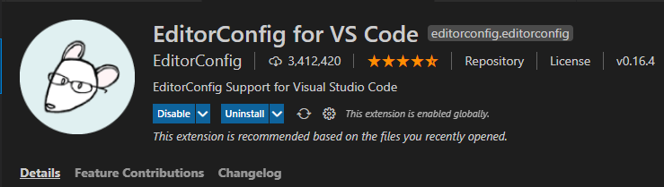

:::

## 集成 Prettier 

> **[Prettier](https://prettier.io/)** 是一款强大的代码格式化工具，支持 `JavaScript、TypeScript、CSS、SCSS、Less、JSX、Angular、Vue、GraphQL、JSON、Markdown` 等语言，基本上前端能用到的文件格式它都可以搞定，是当下最流行的代码格式化工具。

- 安装 Prettier

```shell
$ npm i prettier -D
```

- 创建 Prettier 配置文件
  Prettier 支持多种格式的配置文件，比如 `.json`、`.yml`、`.yaml`、`.js` 等。
  在本项目根目录下创建 `.prettierrc` 文件。

- 配置 `.prettierrc`
  在本项目中，我们进行如下简单配置，关于更多配置项信息，请前往官网查看 [Prettier-Options](https://prettier.io/docs/en/options.html) 。

```json
{
  "useTabs": false,
  "tabWidth": 4,
  "printWidth": 100,
  "singleQuote": true,
  "trailingComma": "none",
  "bracketSpacing": true,
  "semi": false
}
```

Prettier 安装且配置好之后，就能使用命令来格式化代码

- 格式化所有文件（. 表示所有文件）

```shell
$ npx prettier --write .
```

::: tip 注意
VSCode 编辑器使用 `Prettier` 配置需要下载插件 `Prettier - Code formatter`； WebStorm 则不需要安装，直接使用 EditorConfig 配置即可。

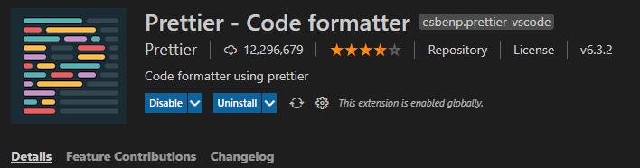

:::

## 集成 ESLint 

[ESLint](https://eslint.org/) 是一款用于查找并报告代码中问题的工具，并且支持部分问题自动修复。其核心是通过对代码解析得到的 `AST`（Abstract Syntax Tree 抽象语法树）进行模式匹配，来分析代码达到检查代码质量和风格问题的能力。
使用 `ESLint` 可以尽可能的避免团队成员之间编程能力和编码习惯不同所造成的代码质量问题，一边写代码一边查找问题，如果发现错误，就给出规则提示，并且自动修复，长期下去，可以促使团队成员往同一种编码风格靠拢。

- 安装 eslint

```shell
$ npm i -D eslint
```

- 配置 ESLint

  > ESLint 安装成功后，执行 `npx eslint --init`，然后按照终端操作提示完成一系列设置来创建配置文件。

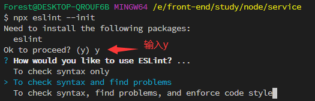

- How would you like to use ESLint? ...(你想如何使用 ESLint?…)

  > 我这里选择第三个，检查语法，发现问题，并强制代码样式

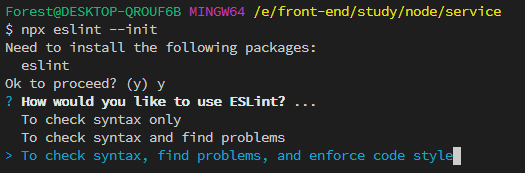

- What type of modules does your project use? ... （你的项目使用什么类型的模块?…）

  > 项目支持 es6+语法，所以这里就直接选用第一项：JavaScript modules (import/export)

- Which framework does your project use? ... （你的项目使用哪种框架?…）

  > 这里并未使用 vue 和 react，所以选择 none of these

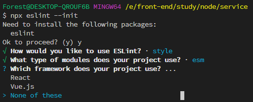

- Does your project use TypeScript? (你的项目使用 TypeScript 吗?)

  > 项目中并没有使用 Typescript，所以选择 No

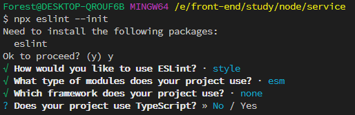

- Where does your code run?(你的代码在哪里运行?)

  > 这是 node 项目，所以不需要选择浏览器环境

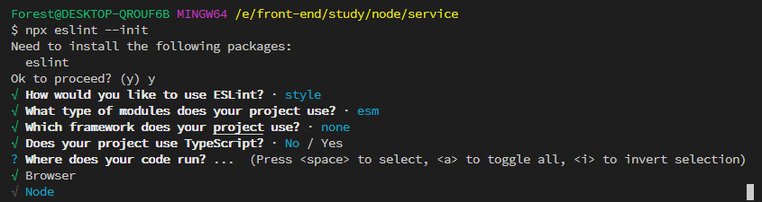

- How would you like to define a style for your project? ... (你想怎样为你的项目定义风格？)

  > 我们这里选择 Use a popular style guide（使用一种流行的风格指南）

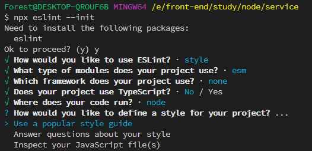

- Which style guide do you want to follow? ... (你想遵循哪种风格指南?…)

  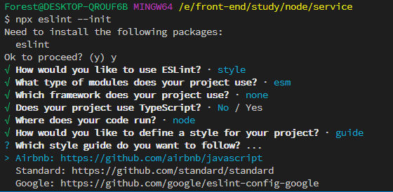

- What format do you want your config file to be in? ... (您希望配置文件的格式是什么?…)

  > 我这里选择 JavaScript

- Would you like to install them now with npm?（你想现在用 npm 安装它们吗?）

  > 默认 Yes，所以可以直接回车

  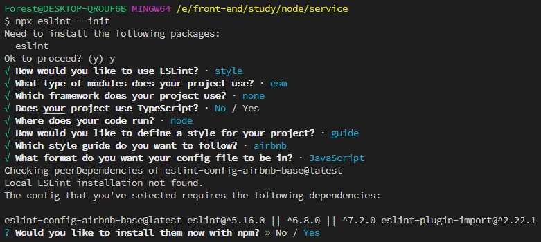

- 所有配置如下

  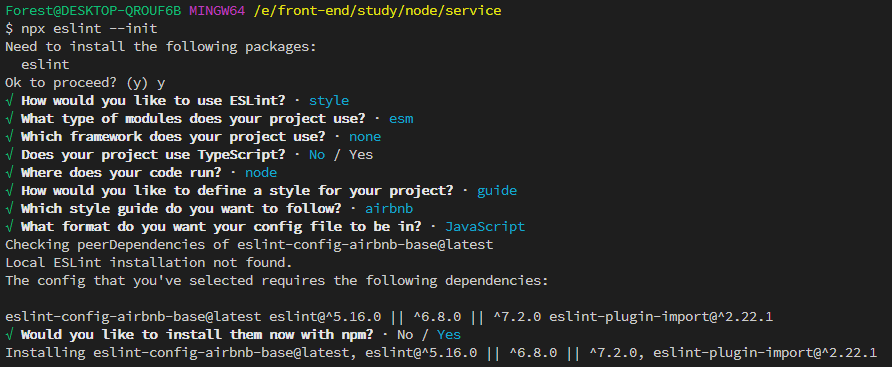

安装成功后，项目的根目录就会多一个`.eslintrc.js`文件，其中的内容就是我们在终端中选择的相应配置。

::: tip 注意

VSCode 使用 ESLint 配置文件需要去插件市场下载插件 ESLint 。
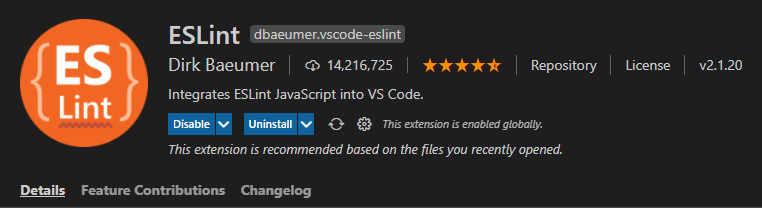

:::

## 解决 Prettier 和 ESLint 的冲突

本项目中的 ESLint 配置中使用了 `Airbnb JavaScript` 风格指南校验，其规则之一是代码结束后面要加分号，而我们在 Prettier 配置文件中加了代码结束后面不加分号的配置项，这样就有冲突了，会出现用 Prettier 格式化后的代码，ESLint 检测到格式有问题的，从而抛出错误提示。
解决两者冲突问题，需要用到 `eslint-plugin-prettier` 和 `eslint-config-prettier`。

> `eslint-plugin-prettier` 将 Prettier 的规则设置到 ESLint 的规则中。

> `eslint-config-prettier` 关闭 ESLint 中与 Prettier 中会发生冲突的规则。

最后形成优先级：Prettier 配置规则 > ESLint 配置规则。

- 安装插件

```shell
$ npm i eslint-plugin-prettier eslint-config-prettier -D
```

- 在 `.eslintrc.js` 添加 prettier 插件

```javascript
module.exports = {
    ...
    extends: [
        'airbnb-base',
        'plugin:prettier/recommended' // 添加 prettier 插件
    ],
    ...
}
```

这样，我们在执行 `eslint --fix` 命令时，ESLint 就会按照 Prettier 的配置规则来格式化代码，轻松解决二者冲突问题。

## 集成 husky 和 lint-staged

我们在项目中已集成 `ESLint` 和 `Prettier`，在编码时，这些工具可以对我们写的代码进行实时校验，在一定程度上能有效规范我们写的代码，但团队可能会有些人觉得这些条条框框的限制很麻烦，选择视“提示”而不见，依旧按自己的一套风格来写代码，或者干脆禁用掉这些工具，开发完成就直接把代码提交到了仓库，日积月累，`ESLint` 也就形同虚设。
所以，我们还需要做一些限制，让没通过 `ESLint` 检测和修复的代码禁止提交，从而保证仓库代码都是符合规范的。
为了解决这个问题，我们需要用到 `Git Hook`，在本地执行 `git commit` 的时候，就对所提交的代码进行 `ESLint` 检测和修复（即执行 `eslint --fix`），如果这些代码没通过 `ESLint` 规则校验，则禁止提交。
实现这一功能，我们借助 `husky + lint-staged` 。

> husky —— Git Hook 工具，可以设置在 git 各个阶段（pre-commit、commit-msg、pre-push 等）触发我们的命令。
> lint-staged —— 在 git 暂存的文件上运行 linters。

### 配置 husky

::: tip

使用 `husky-init` 命令快速在项目初始化一个 `husky` 配置。在配置 `husky` 之前必须初始化 `git`，否则可能会配置不成功

:::

```shell
$ npx husky-init && npm install
```

命令执行会经历以下四步流程：

- 安装`husky`为开发依赖

  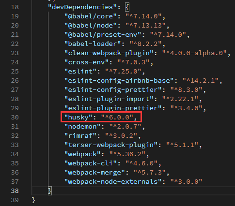

- 创建`.husky`文件夹

  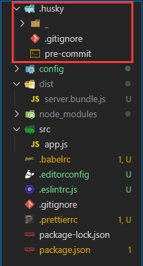

- 在 `.husky` 目录创建 `pre-commit` hook，并初始化 `pre-commit` 命令为 `npm test`

  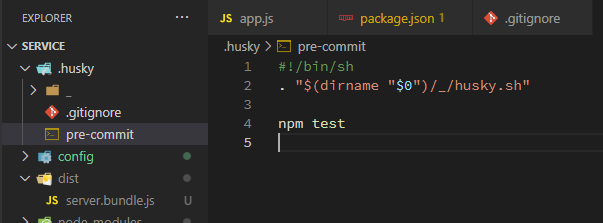

- 修改 `package.json` 的 `scripts`，增加 `"prepare": "husky install"`

  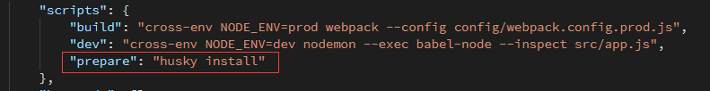

### 配置 lint-staged

lint-staged 这个工具一般结合 husky 来使用，它可以让 husky 的 `hook` 触发的命令只作用于 `git add`那些文件（即 git 暂存区的文件），而不会影响到其他文件。

接下来，我们使用 lint-staged 继续优化项目。

- 安装 lint-staged

  ```shell
  $ npm i lint-staged -D
  ```

- 在 `package.json`里增加 lint-staged 配置项

  ```json
  "lint-staged": {
    "*.{vue,js,ts}": "eslint --fix"
  },
  ```

  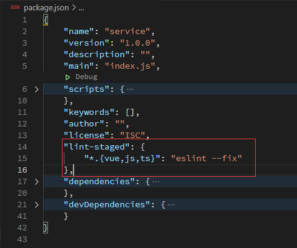

- 修改 `.husky/pre-commit hook` 的触发命令为：`npx lint-staged`

  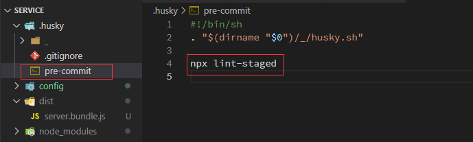

至此，husky 和 lint-staged 组合配置完成。

