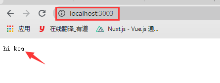
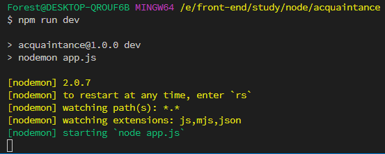
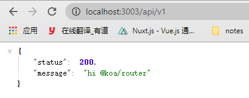
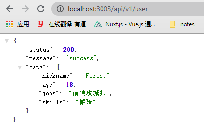
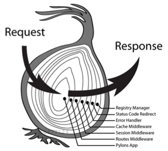

## 什么是 koa？

koa 是基于 Node.js 平台的下一代 web 开发框架，致力于成为应用和 API 开发领域中的一个更小、更富有表现力、更健壮的基石；利用*async 函数*丢弃回调函数，并增强错误处理，koa 没有任何预置的中间件，可快速的编写服务端应用程序。

## 核心概念

- Koa Application（应用程序）
- Context（上下文）
- Request（请求）、Response(响应)

## 初识 koa

```git
$ mkdir acquaintance
$ cd acquaintance
$ npm init -y
$ npm i koa
```

> 上面三条命令是：
>
> - 创建一个 acquaintance 的文件夹
> - 进入创建的文件夹
> - 初始化 package.json
> - 安装 koa，安装完之后可以在 package.json 中查看安装的所有依赖

在工程目录里创建一个 app.js，代码如下：

```javascript
const Koa = require('koa') // 引入koa
const app = new Koa() // 实例化koa

app.use(ctx => {
  ctx.body = 'hi koa'
})

// 启动应用程序  参数：端口号
app.listen(3003)
```

在终端中使用`node app.js`命令（前提是终端中的路径必须指向所创建工程文件夹的路径）
打开浏览器访问：`http://localhost:3003` 此时浏览器中就会输出`hi koa`，如下图：

<!--  -->


::: warning
上面代码虽然轻松实现了一个 web 服务器，但是返回的数据和所请求都是固定的；并不适应真实的业务场景，比如：获取请求接口时的参数、方法、修改一次代码就要在终端中重新运行启动命令等；
:::

由于使用的`node app.js`启动，所以每次更改都要重新启动，这样给我们开发带来了极大的不便利，所以我们可以使用一些第三方依赖来自动监听文件的变化并重新启动，开发环境可以使用`nodemon` 首先安装`npm i nodemon -D`，也可以全局安装此依赖，生产环境的话可以使用`pm2`
安装之后在`package.json`的`scripts`中添加启动方式；如下

```json
{
  "name": "acquaintance",
  "version": "1.0.0",
  "description": "",
  "main": "index.js",
  "scripts": {
    "dev": "nodemon app.js"
  },
  "keywords": [],
  "author": "",
  "license": "ISC",
  "dependencies": {
    "koa": "^2.13.1"
  },
  "devDependencies": {
    "nodemon": "^2.0.7"
  }
}
```

在终端中执行命令：`npm run dev`,这样就不用我们每次修改都重新启动，执行之后就会在终端中提示，如下：

::: tip
执行命令时，终端的路径必须指向当前程序
:::

## 路由基础用法&中间件注册

### 安装依赖：[@koa/router](https://www.npmjs.com/package/@koa/router)

```git
$ npm i @koa/router
```

### 定义路由

- 在 app.js 中引入`@koa/router`，然后再实例化

```javascript
const Router = require('@koa/router')
const router = new Router({ prefix: '/api/v1' }) // 实例化的时候可以自定义一个接口前缀
```

- 注册 router

```javascript
app.use(router.routes()).use(router.allowedMethods())
```

- 定义接口

```javascript
router.get('/', async ctx => {
  ctx.body = {
    status: 200,
    message: 'hi @koa/router'
  }
})

router.get('/user', async ctx => {
  ctx.body = {
    status: 200,
    message: 'success',
    data: {
      nickname: 'Forest',
      age: 18,
      jobs: '前端攻城狮',
      skills: '搬砖'
    }
  }
})
```

完整代码如下：

```javascript
const Koa = require('koa')
const Router = require('@koa/router')
const app = new Koa()
const router = new Router({ prefix: '/api/v1' })

router.get('/', async ctx => {
  ctx.body = {
    status: 200,
    message: 'hi @koa/router'
  }
})

router.get('/user', async ctx => {
  ctx.body = {
    status: 200,
    message: 'success',
    data: {
      nickname: 'Forest',
      age: 18,
      jobs: '前端攻城狮',
      skills: '搬砖'
    }
  }
})

app.use(router.routes()).use(router.allowedMethods())
// 启动应用程序  参数：端口号
app.listen(3003)
```

在浏览器中请求：`http://localhost:3003/api/v1`、`http://localhost:3003/api/v1/user`，结果如下图：<br />



## koa 工作原理

Koa 通过 use 方法注册和串联中间件，也就是洋葱模型；所谓洋葱模型，就是指每一个 Koa 中间件都是一层洋葱圈，它即可以掌管请求进入，也可以掌管响应返回。换句话说：外层的中间件可以影响内层的请求和响应阶段，内层的中间件只能影响外层的响应阶段。

执行顺序：按照 app.use()的顺序执行，中间件可以通过 await next()来执行下一个中间件，同时在最后一个中间件执行完成后，依然有恢复执行的能力。即，通过洋葱模型，await next()控制调用 “下游”中间件，直到 “下游”没有中间件且堆栈执行完毕，最终流回“上游”中间件。这种方式有个优点，特别是对于日志记录以及错误处理等需要非常友好。

下面这段代码的结果就能很好的诠释，示例：

```javascript
const Koa = require('koa')
const app = new Koa()

app.use(async (ctx, next) => {
  console.log(`this is a middleware 1`)
  await next()
  console.log(`this is a middleware 1 end `)
})

app.use(async (ctx, next) => {
  console.log(`this is a middleware 2`)
  await next()
  console.log(`this is a middleware 2 end `)
})

app.use(async (ctx, next) => {
  console.log(`this is a middleware 3`)
  await next()
  console.log(`this is a middleware 3 end `)
})

app.listen(3004)
```

运行结果：

```base
this is a middleware 1
this is a middleware 2
this is a middleware 3
this is a middleware 3 end
this is a middleware 2 end
this is a middleware 1 end
```

## koa 构建 restful 接口及获取参数

- 在 params 中取值，`eg：http://localhost:3003/api/v1/user/1`

```javascript
//请求时若为：http://localhost:3003/api/v1/user
router.post('/user/:id',async ctx => {
    //获取url的id
  cosnt { id } = ctx.params;//{id: 1}
})
```

- 在 query 中取值，也就是获取问号后面的。

```javascript
await axios.post('http://localhost:3003/api/v1/user?name=Forest&age=18')
router.post('/user', async ctx => {
  //获取url的id
  const { name, age } = ctx.request.query //{name: Forest, age: 18}
})
```

- 获取 header 中的参数：

```javascript
//请求接口时设置请求头
axios
  .post(
    'http://localhost/user?name=Forest&age=18',
    {
      headers: {
        Author: 'token'
      }
    }
    //......
  )
  .then(res => console.log('res:', res))

//在服务端获取则是：
router.post('/user', async ctx => {
  //获取 url 的 id
  const { Author } = ctx.request.header //{Author: token}
})
```

- 获取 body 中的数据，在服务端获取 body 中的一些数据只能用一些外部的插件；如：`koa-body`、`koa-bodyparser` 等等。
  就以 `koa-body` 为例，首先安装 `npm i koa-body -S`，再引入：

```javascript
const body = require('koa-body);
//然后在注册中间件：
app.use(body());
//在服务端获取则是：
router.post('/user', async ctx => {
    const res = ctx.request.body;//{name: 'Foreset', age: 18}
});


//请求时有两种传参方式，一种是 json，另一种是 fromData；以 json 为例
axios.post('http://localhost/user', {name: 'Foreset', age: 18}).then(res => {
    console.log('res:', res)
});
```

restful 接口完整代码：

```javascript
const Koa = require('koa')
const Router = require('@koa/router')
const koaBody = require('koa-body')
const app = new Koa()
const router = new Router({ prefix: '/api/v1' })

router.get('/', async ctx => {
  ctx.body = {
    status: 200,
    message: 'hi @koa/router'
  }
})

router.get('/user', async ctx => {
  // const { name, age } = ctx.query
  ctx.body = {
    status: 200,
    message: 'success',
    data: {
      query: ctx.query,
      nickname: 'Forest',
      age: 18,
      jobs: '前端攻城狮',
      skills: '搬砖'
    }
  }
})

router.get('/user/:id', async ctx => {
  const { id } = ctx.params
  console.log('id:', id)
  ctx.body = {
    status: 200,
    message: 'success',
    data: {
      id,
      nickname: 'Forest',
      age: 18,
      jobs: '前端攻城狮',
      skills: '搬砖'
    }
  }
})

router.post('/user', async ctx => {
  const { name, age } = ctx.request.body
  ctx.body = {
    status: 200,
    data: {
      name,
      age
    }
  }
})

app.use(koaBody()).use(router.routes()).use(router.allowedMethods)

app.listen(3003)
```

::: tip
注意 koa-body 中间件的引入顺序必须在 router 之前，否则获取不了 post 请求携带的数据
:::
