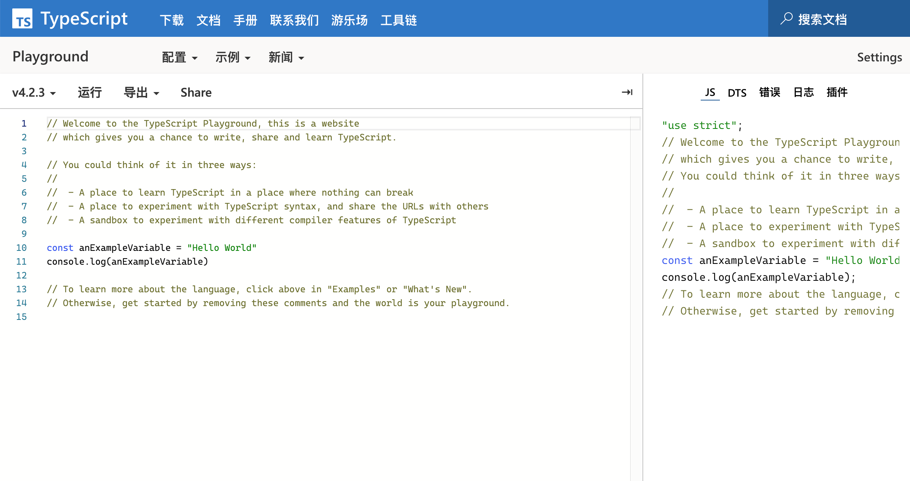

# 环境配置

## 本地环境

`.ts` 文件是不可以直接执行的，需要编译为 `.js` 文件，才能够进行运行。那现在就开始配置 TypeScript 的环境吧。

## tsc 的安装与使用

tsc 是 `typescript compiler` 的缩写，即 ts 的编译器。


```bash
# npm 全局安装 TypeScript
$ npm install typescript -g
```

现在，你可以尝试输入如下指令来检查 ts 环境的工作情况
```bash
# 检查是否存在 tsc 环境变量，配置正确时会回应tsc的版本号
$ tsc -v

# 尝试创建ts文件并写入一些内容
$ touch demo.ts && echo 'console.log("Hello ts!")' > demo.ts

# 将ts文件编译为同名js文件后运行
$ tsc demo.ts && node demo.js

# 将当前目录下所有文件编译为同名js文件
$ tsc * 
```

上方的例子分为了两步（先转换在运行），可以通过 npm（ts-node），来进行合并操作：

```bash
$ npm install ts-node -g
# 直接进行运行
$ ts-node demo.ts
```

## 线上环境

[官方的 playground](https://www.typescriptlang.org/play)


