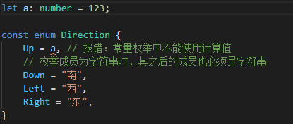
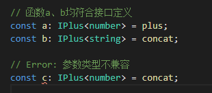

# 基础用法

## 静态类型

```typescript
/** count
 * 不可以为其他类型
 * 编辑器会提示数字类型的所有方法
 */
const count: number = 2021
```

## 基础类型和对象类型

**基础类型：** boolean, number, string, void, undefined, symbol, null <br>
**对象类型：** {}, Class, function, []

```typescript
// 对象类型
class Person {}

const teacher: {
  name: string
  age: number
} = {
  name: 'Zws',
  age: 18
}

const numbers: number[] = [1, 2, 3]

const zws: Person = new Person()

// 对象类型-函数的两种写法儿
// 第一种(可以忽略 number，类型推断会推断出返回值是number)
const func = (str: string): number => {
  return parseInt(str, 10)
}
// 第二种(可以理解为：冒号后面跟的是函数的类型，等号后面是函数体。不能忽略number，不然语法错误)
const func1: (str: string) => number = str => {
  return parseInt(str, 10)
}
```

## 类型注解和类型推断

类型推断(type inference)：TS  会自动的去尝试分析变量的类型。例如：

```typescript
// 这就是典型的类型推断，它们的类型是 number 而且值永远都不会变的
const firstnumber = 1
const secondNumber = 2
const total = firstNumber + secondNumber
```

类型注解(type annotation) ：告诉  TS  变量是什么类型。例如：

```typescript
// 当 TS 无法推断出变量类型的时候需要添加类型注解
function getTotal(firstNumber: number, secondNumber: number) {
  return firstNumber + secondNumber
}
const total = getTotal(1, 2)

// 其他的情况
interface Person {
  name: string
}
const rawData = '{"name": "zws"}'
const newData: Person = JSON.parse(rawData)

// 一个变量是一个数字类型，后续要变成字符串。类似或运算符
let temp: number | string = 123
temp = '456'
```

## 函数相关类型

```typescript
// void类型：没有返回值
function sayHello(): void {
  console.log('hello')
}
// never类型：函数执行不完
function errorEmitter(): never {
  while (true) {}
}
// 函数的解构赋值
function add({ first, second }: { first: number; second: number }): number {
  return first + second
}
add({ first: 1, second: 2 })
```

## 数组和元组

### 数组

```typescript
// 数组可以是数字和字符串类型
const numberArr: (string | number)[] = [1, 2, 3]
// undefined 数组
const undefinedArr: undefined[] = [undefined, undefined, undefined]

// 存储对象类型的内容
const objectArr: { name: string; age: number }[] = [
  {
    name: 'zws',
    age: 18
  }
]
// 使用类型别名(type alias)
type User = { name: string; age: number }
// 存储对象类型的内容
const objectArr: User[] = [
  {
    name: 'zws',
    age: 18
  }
]

// 关于 Class
class Teacher {
  name: string
  age: number
}
const objectArr: Teacher[] = [
  new Teacher(),
  {
    name: 'zws',
    age: 18
  }
]
```

### 元组 tuple

数组长度和类型都固定的情况下，可以使用元组进行管理

```typescript
const teacherInfo: [string, string, number] = ['zws', 'jon', 18]

const teacherList: [string, string, number][] = [
  ['zws', 'jon', 18],
  ['sun', 'dea', 22],
  ['za2', 'wall', 26]
]
```

## Interface 接口

[关于 Interface 代码](https://gitee.com/zblh/typescript/blob/master/interface.ts)

:::tip

interface  和  type  相类似，但不完全一致，type 可以校验基础类型，而 Interface 不支持基础类型的校验。

:::

TS 里，能使用 Interface 的话就使用 Interface。

- 接口只是 TS 帮助我们校验的工具，并不会变成 JS
- 属性前加上?，代表该变量可有可无
- 属性前加上 readonly，代表只读不可修改

```typescript
interface Pereson {
  name: string
  age?: number
  readonly test: string
}
const getPersonName = (person: Pereson) => {
  console.log(person.name)
}

const setPersonName = (person: Pereson, name: string): void => {
  person.name = name
}

const person = {
  name: 'zws',
  age: 18,
  sex: 'male'
}

getPersonName(person)
setPersonName(person, 'lin')
```

- 如果以字面量的形式传给函数，TS 会进行强校验。例如：

```typescript
interface Pereson {
  name: string
  age?: number
}
const getPersonName = (person: Pereson) => {
  console.log(person.name)
}

const setPersonName = (person: Pereson, name: string): void => {
  person.name = name
}

const person = {
  name: 'zws',
  age: 18,
  sex: 'male'
}

getPersonName({
  name: 'zws',
  age: 18,
  sex: 'male'
}) // 会报错，sex不在 Person 种
setPersonName(person, 'lin')

// 修改 Interface 解决（最后一行代表的是，可以是任何字符串类型的键，任何值）
interface Pereson {
  name: string
  age?: number
  [propName: string]: any
}
```

- Interface 里支持方法的写入

```typescript
interface Pereson {
  name: string
  age?: number
  say(): string
}
const person = {
  name: 'zws',
  say() {
    return 'say hello'
  }
}
```

- class 类应用接口

```typescript
interface Pereson {
  name: string
  age?: number
  say(): string
}
// 语法 implements
class User implements Pereson {
  name = 'zws'
  say() {
    return 'say hello'
  }
}
```

- 接口之间互相继承

```typescript
// 关键字 extends
interface Teacher extends Pereson {}
```

- 接口定义函数

```typescript
interface SayHi {
  (word: string): string
}
const say: SayHi = (word: string) => {
  return word
}
```

interface 小案例， 公用属性使用 Interface 进行扩展：

```typescript
interface Person {
  name: string
}
interface Teacher extends Person {}
interface Student extends Person {
  age: number
}
const teacher = {
  name: 'zws'
}
const student = {
  name: 'has',
  age: 18
}
const getUserInfo = (user: Person) => {
  console.log(user.name)
}
getUserInfo(teacher)
getUserInfo(student)
```

## class 类

### 类的定义与继承

[关于类的定义与继承代码](https://gitee.com/zblh/typescript/blob/master/class.ts)

```typescript
// 类里写属性与方法
class Person {
  name = 'zws'
  getName() {
    return this.name
  }
}
const person = new Person()
console.log(person.getName()) // zws

// 继承类，继承类属于字类，被继承的属于父类
class Teacher extends Person {
  getTeacherName() {
    return 'zws Teacher'
  }
  // 子类可以重写父类的属性与方法
  getName() {
    // super 关键字指向了父类，可以直接调用父类。不会受到类重写的影响
    return super.getName() + 'TTT'
  }
}

const teacher = new Teacher()
console.log(teacher.getName()) // zws
console.log(teacher.getTeacherName()) // zws Teacher
```

### 类的访问类型

**访回类型：**

- private：允许在类内使用
- protected：允许在类内及继承的子类中使用
- public：允许在类的内外调用（默认）

**自带方法：**

- readonly：只读属性
- static：将方法挂载到类上而不是实例上

::: tip
直接写在类里的属性或函数，相当于前面加了 public
:::

```typescript
class Person {
  protected name: string = '123'
  private age: number = 10
  public sayHi() {
    console.log('hi' + this.age)
  }
}
class Teacher extends Person {
  public sayBye() {
    return this.name
  }
}
const person = new Person()
person.sayHi()
const teacher = new Teacher()
console.log(teacher.sayBye())
```

### 构造器 constructor

**constructor** 会在 new 实例的时候自动执行

```typescript
// 以下两段代码相同, constructor 里,参数前加上public代表在之前已经声明过这个变量了
// 传统写法
class Person {
  public name: string
  constructor(name: string) {
    this.name = name
  }
}
const person = new Person('zws')
// 简化写法
class Person {
  // public name: string
  constructor(public name: string) {
    // this.name = name
  }
}
const person = new Person('zws')
console.log(person.name)
```

字类集成父类并使用 **constructor** 的话,必须先调用父类的 **constructor** ,并按照父类的参数规则进行

```typescript
// super()代表调用父类的 constructor
// 如果父类没有使用constructor 字类需要调用一个空的super()
class Person {
  constructor(public name: string) {}
}

class Teacher extends Person {
  constructor(public age: number) {
    super('zws')
  }
}

const teacher = new Teacher(28)
```

### 静态属性，Setter 和 Getter

Getter：读

Setter：写

```typescript
// 可以通过getter访问私有属性,通过setter更改私有属性
// 一般用于对数据的加密
class Person {
  constructor(private _name: string) {}
  get name() {
    return this._name + ' has'
  }
  set name(name: string) {
    const realName = name.split(' ')[0]
    this._name = realName
  }
}
const person = new Person('zws')
console.log(person.name)
person.name = 'zwsa has'
console.log(person.name)
```

### 做个小案例

通过 TS 创建一个 Demo 类,这个类只能被调用一次
**思路:**

- 不能在外部以 new Demo 的形式创建一个实例（将 **constructor** 设置为私有属性）
- 使用 static (将方法挂载到类上而不是实例上)来实现
- 使用 instance 方法来保存传入的值,并判断

```typescript
class Demo {
  private constructor(public name: string) {}

  private static instance: Demo
  static getInstance(name: string) {
    if (!this.instance) {
      this.instance = new Demo(name)
    }
    return this.instance
  }
}
const demo1 = Demo.getInstance('zws')
const demo2 = Demo.getInstance('zwsa')
console.log(demo1.name)
console.log(demo2.name)
```

### 抽象类

- 只能被继承，不能实例化
- 抽象类里的抽象方法，不能够写具体实现

```typescript
abstract class Gemo {
  width: number
  getType() {
    return 'Gemo'
  }
  abstract getArea(): number
}
class Cricle extends Gemo {
  // 子类继承了抽象类，里面的抽象方法必须实现一下
  getArea() {
    return 123
  }
}
class Square {}
class Triangle {}
```

## Enum 枚举

你可以使用常量`const`描述某种不会改变的值。但某些值是在一定范围内的一系列常量，如星期（周一~周日）、三原色（红黄蓝）、方位（东南西北）等，这种类型的值称为`枚举`。

### 数值枚举

使用关键字 `enum` 来声明一个枚举类型数据。

:::tip
枚举成员默认为数值类型
:::


```typescript
enum Direction {
  Up,
  Down,
  Left,
  Right
}

console.log(Direction.Up) // 0
console.log(Direction[0]) // "Up"
```

未赋初始值的枚举项会接着上个项的值进行递增。

使用 tsc 将上述代码编译为 js 后，可以发现 ts 使用 `Direction[(Direction["Up"] = 0)] = "Up"` 这样的内部实现对对象成员进行了双向的赋值。

由此可以看出，**enum 具有双向映射的特点**。

```javascript
var Direction
;(function (Direction) {
  Direction[(Direction['Up'] = 0)] = 'Up'
  Direction[(Direction['Down'] = 1)] = 'Down'
  Direction[(Direction['Left'] = 2)] = 'Left'
  Direction[(Direction['Right'] = 3)] = 'Right'
})(Direction || (Direction = {}))

console.log(Direction.Up) // 0
console.log(Direction[0]) // "Up"
```

### 字符串枚举

枚举成员为字符串时，其之后的成员也必须是字符串。

```typescript
enum Direction {
  Up, // 未赋值，默认为0
  Down = '南',
  Left = '西',
  Right = '东'
}
```

### 常量枚举

你可以使用`const`和`enum`关键字组合，声明一个常量枚举。
**常量枚举中不允许使用计算值**（变量或表达式）



## Generics 泛型

泛型指的是，在定义函数、接口或类的时候不预先指定数据类型，而在使用时再指定类型的特性。

> 泛型可以提升应用的可重用性，如使用其创建组件，则可以使组件可以支持多种数据类型。

假如需要一个函数，返回传入它的内容
不使用泛型时，它会是这样的：

```typescript
function echo(arg: any) {
  return arg
}
```

但这样就丢失了一些信息：传入的类型与返回的类型应该是相同的。如果我们传入一个数字，我们只知道任何类型的值都有可能被返回。于是此时需要一种方法使返回值的类型与传入参数的类型是相同的。

### 类型变量

这是一种特殊的变量，只用于表示类型而不是值。
使用泛型改写上述函数：

```typescript
// 类型变量也遵循标识符定义规范，写为T只是习惯上这么做
function echo<T>(arg: T): T {
  return arg
}
```

这样，传入实参时，会同时将实参的类型传递给类型变量 T，同时返回值也是 T。

**场景：交换两个数组元素**

不使用泛型会丢失数据类型：

```typescript
function swap(tuple) {
  return [tuple[1], tuple[0]]
}
```

使用泛型后，不仅会保有类型推断，还可以直接调用实例的方法：

```typescript
function swapGeneric<T, U>(tuple: [T, U]): [U, T] {
  return [tuple[1], tuple[0]]
}

const result2 = swapGeneric(['string', 0.123])

// ts的类型推断系统能够明确得知第一个元素会是数值，而第二个元素会是字符串
result2[0].toFixed(2)
result2[1].toLocaleUpperCase()
```

### 约束泛型

假设有这样一个场景：
有时想操作某类型的一组值，并且我们知道这组值具有什么样的属性。下例中，我们想访问 arg 的 `length` 属性，但是编译器并不能推断每次传入的参数都有 `length` 属性，于是就报错了。

```typescript
function echoWithArray<T>(arg: T): T {
  console.log(arg.length) // Error: T doesn't have .length
  return arg
}
```

经过不充分的考虑后，我们尝试将类型变量指定为数组：

```typescript
function echoWithArray<T>(arg: T[]): T[] {
  console.log(arg.length)
  return arg
}
```

此时你也许会发现，这样只能传入数组，不能传入同样具有 `length` 属性的字符串、类数组对象等。

我们可以定义一个接口来描述约束条件，然后由类型变量继承此接口实现泛型约束：

```typescript
// 一些编程规范约定接口以大写 I 作为前缀
interface IWithLength {
  length: number
}
function echoWithLength<T extends IWithLength>(arg: T): T {
  console.log(arg.length)
  return arg
}

// 只要包含 length 属性且为数值 均不会报错
const str1 = echoWithLength('str')
const obj = echoWithLength({ length: 10, width: 10 })
const arr2 = echoWithLength([])
```

### 泛型类

场景：定义一个类，能实现被 push 入的队列元素与 pop 出的元素的类型一致。

```typescript
class Queue<T> {
  private data = []
  push(item: T) {
    return this.data.push(item)
  }
  pop(): T {
    return this.data.pop()
  }
}

//泛型类实例化时要指定具体的类型
const queue = new Queue<number>()
queue.push(1)
queue.push('str') // Error: 类型“string”的参数不能赋给类型“number”的参数。
```

### 泛型接口

万能的泛型同样可以用来描述接口：

```typescript
interface KeyPair<T, U> {
  key: T
  value: U
}

// 泛型接口描述的对象，同样需要满足类型要求
let kp1: KeyPair<number, string> = { key: 123, value: 'str' }
let kp2: KeyPair<string, number> = { key: 'test', value: 123 }

// 描述函数的泛型接口
interface IPlus<T> {
  // 函数应具有两个形参，和一个返回值，它们的类型相同
  (a: T, b: T): T
}

function plus(a: number, b: number): number {
  return a + b
}
function concat(a: string, b: string): string {
  return a + b
}
```

参数类型不兼容：


