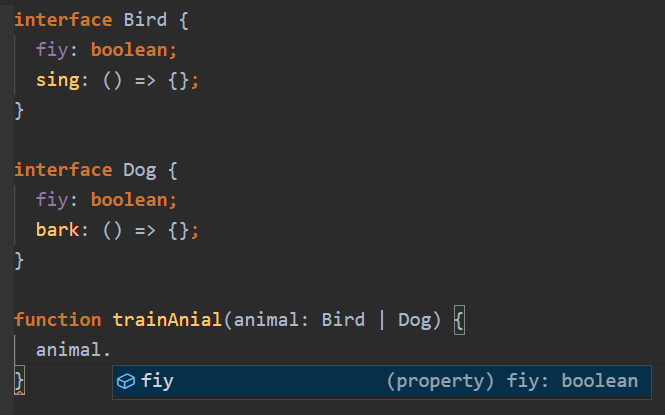

# TypeScript 概念

## TypeScript 的定义

[TypeScript](https://www.typescriptlang.org/)：是 JavaScript 的超集，拥有类型机制，不会再浏览器直接执行，而是编译成 JavaScript 后才会运行。

- 超集（superset）：比如 ES6 包含了 ES5 所有的内容，还有一些独特的语法特性，就可以理解为 ES6 是 ES5 的超集
- 类型：指的是静态的类型，js 中一个存放字符串的变量，后续依旧可以将数字、对象、数组等类型赋值到该变量，这是动态类型。而 ts 则是静态类型，后续不可更改类型

## TypeScript 带来的优势？

通过一个例子（勾股定理），来体会 js 与 ts 的差异：
```javascript
// javascript
function demo (data) {
  return Math.sqrt(data.x ** 2 + data.y ** 2)
}
demo()
```
```typescript
// typescript---可以给它限制实参的类型
function tsDemo (data: { x: number, y: number }) {
  return Math.sqrt(data.x ** 2 + data.y ** 2)
}

tsDemo({ x: 1, y: 1 }); // 如果不传参数或参数类型不符，就会报错
```


<br>

## 配置 TS 环境

我们知道：.ts 文件是不可以直接执行的，需要转换成 .js 文件，才能够进行运行。那现在就开始配置 TypeScript 的环境吧 ：
```bash
# npm 全局安装 TypeScript
$ npm install typescript -g
# 将ts文件转换成js文件
$ ts demo.ts
# 通过node 运行js文件
$ node demo.js
```
上方的例子分为了两步（先转换在运行），可以通过npm（ts-node），来进行合并操作：
```bash
$ npm install ts-node -g
# 直接进行运行
$ ts-node demo.ts
```

## 静态类型的深度理解

```typescript
/** count
 * 不可以为其他类型
 * 编辑器会提示数字类型的所有方法
 */
const count: number = 2021
```

## 基础类型和对象类型

**基础类型：** boolean, number, string, void, undefined, symbol, null <br>
**对象类型：** {}, Class, function, []

```typescript
// 对象类型
class Person { }

const teacher: {
  name: string,
  age: number
} = {
  name: 'Zws',
  age: 18
}

const numbers: number[] = [1, 2, 3]

const zws: Person = new Person()


// 对象类型-函数的两种写法儿
// 第一种(可以忽略 number，类型推断会推断出返回值是number)
const func = (str: string): number => {
  return parseInt(str, 10)
}
// 第二种(可以理解为：冒号后面跟的是函数的类型，等号后面是函数体。不能忽略number，不然语法错误)
const func1: (str: string) => number = (str) => {
  return parseInt(str, 10)
}
```

## 类型注解和类型推断

类型推断(type inference)：TS 会自动的去尝试分析变量的类型。例如：
```typescript
// 这就是典型的类型推断，它们的类型是 number 而且值永远都不会变的
const firstnumber = 1;
const secondNumber = 2;
const total = firstNumber + secondNumber;
```
类型注解(type annotation) ：告诉 TS 变量是什么类型。例如：
```typescript
// 当 TS 无法推断出变量类型的时候需要添加类型注解
function getTotal (firstNumber: number, secondNumber: number) {
  return firstNumber + secondNumber
}
const total = getTotal(1, 2)

// 其他的情况
interface Person {
  name: string
}
const rawData = '{"name": "zws"}'
const newData: Person = JSON.parse(rawData)

// 一个变量是一个数字类型，后续要变成字符串。类似或运算符
let temp: number | string = 123;
temp = '456'
```

## 函数相关类型

```typescript
// void类型：没有返回值
function sayHello (): void {
  console.log('hello');
}
// never类型：函数执行不完
function errorEmitter(): never {
  while (true){}
}
// 函数的解构赋值
function add ({ first, second }: { first: number, second: number }): number {
  return first + second
}
add({ first: 1, second: 2 })
```

## 数组和元组

### 数组

```typescript
// 数组可以是数字和字符串类型
const numberArr: (string | number)[] = [1, 2, 3]
// undefined 数组
const undefinedArr: undefined[] = [undefined, undefined, undefined]

// 存储对象类型的内容
const objectArr: { name: string, age: number }[] = [{
  name: 'zws',
  age: 18
}]
// 使用类型别名(type alias) 
type User = { name: string, age: number }
// 存储对象类型的内容
const objectArr: User[] = [{
  name: 'zws',
  age: 18
}]

// 关于 Class
class Teacher {
  name: string;
  age: number;
}
const objectArr: Teacher[] = [
  new Teacher(),
  {
    name: 'zws',
    age: 18
  }
]
```

### 元组 tuple

数组长度和类型都固定的情况下，可以使用元组进行管理
```typescript
const teacherInfo: [string, string, number] = ['zws', 'jon', 18]

const teacherList: [string, string, number][] = [
  ['zws', 'jon', 18],
  ['sun', 'dea', 22],
  ['za2', 'wall', 26]
]
```

## Interface 接口

[关于Interface代码](https://gitee.com/zblh/typescript/blob/master/interface.ts)
interface 和 type 相类似，但不完全一致。type 可以校验基础类型。而 Interface 不支持基础类型的校验。TS 里，能使用Interface的话就使用Interface

### 关于 interface：

- 接口只是 TS 帮助我们校验的工具，并不会变成 JS
- 属性前加上?，代表该变量可有可无
- 属性前加上readonly，代表只读不可修改
```typescript
interface Pereson {
  name: string
  age?: number
  readonly test: string
}
const getPersonName = (person: Pereson) => {
  console.log(person.name)
}

const setPersonName = (person: Pereson, name: string): void => {
  person.name = name
}

const person = {
  name: 'zws',
  age: 18,
  sex: 'male',
}

getPersonName(person)
setPersonName(person, 'lin')

```

- 如果以字面量的形式传给函数，TS 会进行强校验。例如：

```typescript
interface Pereson {
  name: string
  age?: number
}
const getPersonName = (person: Pereson) => {
  console.log(person.name)
}

const setPersonName = (person: Pereson, name: string): void => {
  person.name = name
}

const person = {
  name: 'zws',
  age: 18,
  sex: 'male',
}

getPersonName({
  name: 'zws',
  age: 18,
  sex: 'male'
}) // 会报错，sex不在 Person 种
setPersonName(person, 'lin')

// 修改 Interface 解决（最后一行代表的是，可以是任何字符串类型的键，任何值）
interface Pereson {
  name: string
  age?: number
  [propName: string]: any
}
```

- Interface 里支持方法的写入
```typescript
interface Pereson {
  name: string
  age?: number
  say(): string
}
const person = {
  name: 'zws',
  say() {
    return 'say hello'
  }
}
```

- class类应用接口
```typescript
interface Pereson {
  name: string
  age?: number
  say(): string
}
// 语法 implements
class User implements Pereson {
  name = 'zws'
  say() {
    return 'say hello'
  }
}
```

- 接口之间互相继承
```typescript
// 关键字 extends
interface Teacher extends Pereson {}
```

- 接口定义函数
```typescript
interface SayHi {
  (word: string): string
}
const say: SayHi = (word: string) => {
  return word
}
```

### 使用 interface 实现公用

```typescript
interface Person {
  name: string
}
interface Teacher extends Person {}
interface Student extends Person {
  age: number
}
const teacher = {
  name: 'zws'
}
const student = {
  name: 'has',
  age: 18
}
const getUserInfo = (user: Person) => {
  console.log(user.name)
}
getUserInfo(teacher)
getUserInfo(student)
```

## class-类

### 类的定义与继承

[关于类的定义与继承代码](https://gitee.com/zblh/typescript/blob/master/class.ts)
```typescript
// 类里写属性与方法
class Person {
  name = 'zws'
  getName() {
    return this.name
  }
}
const person = new Person()
console.log(person.getName()) // zws

// 继承类，继承类属于字类，被继承的属于父类
class Teacher extends Person {
  getTeacherName() {
    return 'zws Teacher'
  }
  // 子类可以重写父类的属性与方法
  getName() {
    // super 关键字指向了父类，可以直接调用父类。不会受到类重写的影响
    return super.getName() + 'TTT'
  }
}

const teacher = new Teacher()
console.log(teacher.getName()) // zws
console.log(teacher.getTeacherName()) // zws Teacher

```
### 类的访问类型和构造器

#### 访回类型：

- private：允许在类内使用
- protected：允许在类内及继承的子类中使用
- public：允许在类的内外调用（默认）

#### 自带方法：

- readonly：只读属性
- static：将方法挂载到类上而不是实例上

**tips: **直接写在类里的属性或函数，相当于前面加了public
```typescript
class Person {
  protected name: string = '123'
  private age: number = 10
  public sayHi() {
    console.log('hi' + this.age)
  }
}
class Teacher extends Person {
  public sayBye() {
    return this.name
  }
}
const person = new Person()
person.sayHi()
const teacher = new Teacher()
console.log(teacher.sayBye())

```

#### 构造器 constructor

**constructor** 会在 new 实例的时候自动执行
```typescript
// 以下两段代码相同, constructor 里,参数前加上public代表在之前已经声明过这个变量了
// 传统写法
class Person {
  public name: string
  constructor(name: string) {
    this.name = name
  }
}
const person = new Person('zws')
// 简化写法
class Person {
  // public name: string
  constructor(public name: string) {
    // this.name = name
  }
}
const person = new Person('zws')
console.log(person.name)
```
字类集成父类并使用 **constructor** 的话,必须先调用父类的 **constructor** ,并按照父类的参数规则进行
```typescript
// super()代表调用父类的 constructor
// 如果父类没有使用constructor 字类需要调用一个空的super()
class Person {
  constructor(public name: string) {}
}

class Teacher extends Person {
  constructor(public age: number) {
    super('zws')
  }
}

const teacher = new Teacher(28)
```

### 静态属性，Setter和Getter

Getter：
Setter：
```typescript
// 可以通过getter访问私有属性,通过setter更改私有属性
// 一般用于对数据的加密
class Person {
  constructor(private _name: string) {}
  get name() {
    return this._name + ' has'
  }
  set name(name: string) {
    const realName = name.split(' ')[0]
    this._name = realName
  }
}
const person = new Person('zws')
console.log(person.name)
person.name = 'zwsa has'
console.log(person.name)
```

#### 做个小案例

通过 TS 创建一个 Demo 类,这个类只能被调用一次
**思路:**

- 不能在外部以new Demo 的形式创建一个实例（将 **constructor** 设置为私有属性）
- 使用 static (将方法挂载到类上而不是实例上)来实现
- 使用 instance 方法来保存传入的值,并判断
```typescript
class Demo {
  private constructor(public name: string) {}

  private static instance: Demo
  static getInstance(name: string) {
    if (!this.instance) {
      this.instance = new Demo(name)
    }
    return this.instance
  }
}
const demo1 = Demo.getInstance('zws')
const demo2 = Demo.getInstance('zwsa')
console.log(demo1.name)
console.log(demo2.name)
```

### 抽象类

- 只能被继承，不能实例化
- 抽象类里的抽象方法，不能够写具体实现
```typescript
abstract class Gemo {
  width: number
  getType() {
    return 'Gemo'
  }
  abstract getArea(): number
}
class Cricle extends Gemo {
  // 字类继承了抽象类，里面的抽象方法必须实现一下
  getArea() {
    return 123
  }
}
class Square {}
class Triangle {}
```

## TS 中的配置文件

[编译选项，官方文档](https://www.tslang.cn/docs/handbook/compiler-options.html)
只有当运行 `**$ tsc**` 命令的时候才会走 **tsconfig.ts** 文件的配置项，**命令后**如果接文件名，并不会运行** tsconfig.ts** 的配置项。运行 `**$ tsc**` 命令的时候，如果没有做处理的话，那么会默认的把根目录的 ts 文件做一次编译。 
添加  `"include":["./demo.ts"]`** **，指定需要编译的文件。`"exclude":["./demo.ts"]`，代表编译除了 demo.ts 文件的所有文件，[**文档**](https://www.tslang.cn/docs/handbook/tsconfig-json.html)


**一些重要的配置项说明：**

| 属性 | 默认值 | 描述 |
| --- | --- | --- |
| removeComments | false | 删除除了 /!* 开头的版权信息外的所有注释 |
| strict | true | 开启严格类型模式的检查 |
| noImplicitAny | true | 不允许生成隐式的 any |
| strictNullChecks | true | 不允许将null 赋值给基础类型 |
| rootDir | ./ | 指定输入文件的根目录 |
| outDir | ./ | 重定向输出目录 |
| outFile | ./ | 将目录的多个ts文件，转换成一个js文件。同时需要修改 module |
| incremental | false | 启用增量编译（只编译新增的内容） |
| allowJs | false | 是否将 js 文件进行编译 |
| checkJs | false | 是否检测 js 的语法 |
| noUnusedLocals | false  | 报告未使用到的变量（警告提示） |
| noUnusedParameters | false | 报告函数内未使用的形参（警告提示）  |
| baseUrl | ./ | 项目的根目录的路径 |

## 联合类型和类型保护

使用联合类型，只会提示共有的方法 <br>
 <br>
**解决联合类型的几种方式：** <br>

[对 in 语法的理解](https://www.cnblogs.com/memphis-f/p/12073013.html)
[instanceof 语法](https://developer.mozilla.org/zh-CN/docs/Web/JavaScript/Reference/Operators/instanceof)
```typescript
interface Bird {
  fiy: boolean;
  sing: () => {};
}

interface Dog {
  fiy: boolean;
  bark: () => {};
}
// 解决联合类型的几种方式：

// 类型断言的方式
function trainAnial(animal: Bird | Dog) {
  if (animal.fiy) {
    (animal as Bird).sing();
  } else {
    (animal as Dog).bark();
  }
}
// in 语法来做类型保护
function trainAnialSecond(animal: Bird | Dog) {
  if ("sing" in animal) {
    animal.sing();
  } else {
    animal.bark();
  }
}
// typeof 语法来做类型保护
function add(first: number | string, second: number | string) {
  if (typeof first === "string" || typeof second === "string") {
    return `${first}${second}`;
  }
  return first + second;
}

// instanceof 语法来做类型保护（只有class才具备用instanceof操作符
class NumberObj {
  count!: number;
}
function addSecond(first: object | NumberObj, second: object | NumberObj) {
  if (first instanceof NumberObj && second instanceof NumberObj) {
    return first.count + second.count;
  } else {
    return 0;
  }
}

```

## Enum 枚举类型

使用枚举我们可以定义一些带名字的常量。 使用枚举可以清晰地表达意图或创建一组有区别的用例。 TypeScript支持数字的和基于字符串的枚举。
```typescript
const Status = {
  OFFLINE: 0,
  ONLINE: 1,
  DELETED: 2,
};
function getResult(status: number) {
  if (status === Status.OFFLINE) {
    return "offline";
  } else if (status === Status.ONLINE) {
    return "online";
  } else if (status === Status.DELETED) {
    return "deleted";
  }
  return "error";
}
const result = getResult(Status.OFFLINE);
console.log(result);
```
使用枚举类型：
```typescript
enum Status {
  OFFLINE,
  online,
  DELETED,
}
function getResult(status: number) {
  if (status === Status.OFFLINE) {
    return "offline";
  } else if (status === Status.ONLINE) {
    return "online";
  } else if (status === Status.DELETED) {
    return "deleted";
  }
  return "error";
}
const result = getResult(Status.OFFLINE);
console.log(result);

```
枚举的下标默认是从 0 开始，递增加1，也可以设置默认下标，后面的属性下标会在默认下标基础上递增加1。通过下标，可以查寻到对应的枚举名称

## TS 泛型-generic

**泛指的类型**

### 函数泛型

调用函数的时候规定这个函数是什么类型，关键字<>

#### 基本的函数泛型

```typescript
function join<T>(first: T, second: T) {
  return `${first}${second}`;
}

join<number>(1, 1);
```

### 数组里是字符串类型

```typescript
function map<T>(params: T[]) {
  return params;
}
map<string>(["1"]);
```
### 定义多个泛型
```typescript
function joinSecond<T, P>(first: T, second: P) {
  return `${first}${second}`;
}
// 不写具体类型，也可以自动类型推断
joinSecond<number, string>(1, "1");
```

### 类中的泛型以及泛型类型

简单的 class 引用泛型

```typescript
class Test<T> {
  constructor(private data: T[]) {}
  getItem(index: number): T {
    return this.data[index];
  }
}
const test = new Test(["123"]);
```

通过继承 interface 使用泛型

```typescript
interface Item {
  name: string;
}
class Test<T extends Item> {
  constructor(private data: T[]) {}
  getItem(index: number): string {
    return this.data[index].name;
  }
}
const test = new Test([
  {
    name: "1212",
  },
]);
```

### 将泛型在类型对应上做一些约束

```typescript
// T 只能是 string 或 number
class Test<T extends string | number> {
  constructor(private data: T[]) {}
  getItem(index: number): T {
    return this.data[index];
  }
}

const test = new Test<number>([123]);

```

### 如何用泛型做一个具体的类型注解

```typescript

function hello<T>(params: T) {
  return params;
}
const func: <T>(params: T) => T = hello;

```

## 命名空间

原生开发的时候，要写一个页面，里面包含头部、内容、底部，那我们可以用面向对象的方式来这样做：
```typescript
class Header {
  constructor() {
    const elem = document.createElement("div");
    elem.innerText = "This is a header";
    document.body.appendChild(elem);
  }
}

class Content {
  constructor() {
    const elem = document.createElement("div");
    elem.innerText = "This is a content";
    document.body.appendChild(elem);
  }
}

class Footer {
  constructor() {
    const elem = document.createElement("div");
    elem.innerText = "This is a footer";
    document.body.appendChild(elem);
  }
}

class Page {
  constructor() {
    new Header();
    new Content();
    new Footer();
  }
}

```
index.html
```javascript
new Page()
```
但是，暴漏给全局的变量太多了，会将项目变得不好维护，所以可以使用命名空间进行改进
**namespace：**类似模块化开发，暴漏更少的全局变量。把一组相关内容封装到一起，对外提供统一的暴漏接口
```typescript
namespace Home {
  class Header {
    constructor() {
      const elem = document.createElement("div");
      elem.innerText = "This is a header";
      document.body.appendChild(elem);
    }
  }

  class Content {
    constructor() {
      const elem = document.createElement("div");
      elem.innerText = "This is a content";
      document.body.appendChild(elem);
    }
  }

  class Footer {
    constructor() {
      const elem = document.createElement("div");
      elem.innerText = "This is a footer";
      document.body.appendChild(elem);
    }
  }

  export class Page {
    constructor() {
      new Header();
      new Content();
      new Footer();
    }
  }
}

```
index.html
```javascript
new Home.Page()
// 或
new Home.Page()
```

### 拆分代码

将 page.js 文件拆分成多个 ts 文件，新增文件 components.ts ，里面创建一个components 命名空间，并将 page.js 文件的内容部分剪切过去
```typescript
namespace Components {
  export class Header {
    constructor() {
      const elem = document.createElement("div");
      elem.innerText = "This is a header";
      document.body.appendChild(elem);
    }
  }

  export class Content {
    constructor() {
      const elem = document.createElement("div");
      elem.innerText = "This is a content";
      document.body.appendChild(elem);
    }
  }

  export class Footer {
    constructor() {
      const elem = document.createElement("div");
      elem.innerText = "This is a footer";
      document.body.appendChild(elem);
    }
  }
}
```
而此时，page.ts 需要通过全局变量 Components ，来进行模块儿的引入：
```typescript
///<reference path='./components.ts' />
namespace Home {
  export class Page {
    constructor() {
      new Components.Header();
      new Components.Content();
      new Components.Footer();
    }
  }
}
```
如若想在页面看到同样的效果，需要引入新增并编译过后的 components.js 文件，会显示同样的效果。当然，我们想引入一个文件，也是可以的，修改 tsconfi.json 文件，新增选项 "outFile":"./build/page.js"后，再次运行 `$ tsc`命令，之后会将两个文件合二为一打包到 build 目录下，文件名是 page.js。页面通过script标签引入即可。

### 命名空间的嵌套-子命名空间
```typescript
namespace Components {
  export namespace SubComponents {
    export class Test {}
  }
}
```
之后可以使用 **Components.SubComponents.Test** 来进行调用

## 描述文件中的全局类型

目的：引入一个 js 库的时候，TS 不能理解 js 编写的方法，所以需要描述文件（d.ts）来帮助 ts 去理解。

### 初始化

将拿jquery来进行举例，先看下目录吧：
**TypeScript**
**|---src**
**|---index.html**
**|---page.ts**
**|---node_modules**
**|---package.json**


package.json
```json
{
  ...
  "scripts": {
    "start": "parcel ./src/index.html"
  }
  ...
}
```

### 开始体验描述文件

#### 理解其意

page.ts
```typescript
$(function () {
});
```
现在 page.ts 文件肯定是报错的，找不到 $。我们在 **src目录** 下新建 jquery.d.ts ，里面声明一个全局变量（语法：declare）：
```typescript
// 定义全局变量
declare var $: (param: () => void) => void;
```
还可以定义全局函数
```typescript
// 定义全局函数
declare function $(params: () => void): void;
```

#### 函数重载

此时略微改动下代码，page.ts :
```typescript
$(function () {
  $("body").html("<div>123</div>");
});
```
此时又会报错，之前定义的 $ 函数里并没有定义值，而且没有 html 函数方法，继续添加 jquery.d.ts 文件内容：
```typescript
// 定义全局函数
declare function $(params: () => void): void;
// 函数重载：一个函数名字可以定义多个函数。根据传递的参数不同，来进行理解函数
declare function $(
  params: string
): {
  html: (html: string) => {};
};

```
那现在 page.ts 文件就不会报错

#### interface 进行优化

```typescript
// 定义全局函数
interface jqueryInstance {
  html: (html: string) => jqueryInstance;
}

// 函数重载
declare function $(readyFunc: () => void): void;
declare function $(selector: string): jqueryInstance;
```

**interface 进行函数重载**

```typescript
// 定义全局函数
interface jqueryInstance {
  html: (html: string) => jqueryInstance;
}
// 使用 interface 的语法，实现函数重载
interface jQuery {
  (readyFunc: () => void): void;
  (selector: string): jqueryInstance;
}

declare var $: jQuery;
```

#### 对象、类的类型定义，以及命名空间嵌套

改写 page.ts :
```typescript
$(function () {
  $("body").html("<div>123</div>");
  new $.fn.init();
});
```
改写 jquery.d.ts
```typescript
// 定义全局函数
interface jqueryInstance {
  html: (html: string) => jqueryInstance;
}
// 函数重载
declare function $(readyFunc: () => void): void;
declare function $(selector: string): jqueryInstance;

// 如何对对象进行类型定义，以及对类进行类型定义，以及命名空间的嵌套
declare namespace $ {
  namespace fn {
    class init {}
  }
}
```

#### ES6 模块化

不再使用cdn的方式引入jquery，改用npm包的形式
page.ts，引入jQuery会提示：没有jQuery模块的声明文件
```typescript
import $ from "jquery";
$(function () {
  $("body").html("<div>123</div>");
  new $.fn.init();
});
```
jquery.d.ts：模块化定义 jquery，里面添加 $ ，最后讲 $ 导出
```typescript
declare module "jquery" {
  interface jqueryInstance {
    html: (html: string) => jqueryInstance;
  }

  // 混合类型
  function $(readyFunc: () => void): void;
  function $(selector: string): jqueryInstance;
  namespace $ {
    namespace fn {
      class init {}
    }
  }
  export = $;
}
```

## 泛型中 keyof 的使用

声明一个 class类，**constructor **里面接收一组数据，通给过方法 getInfo 传入key值获取key对应的值。
```typescript
interface Person {
  name: string;
  age: number;
  gender: string;
}
class Teacher {
  constructor(private info: Person) {}
  getInfo(key: string) {
    return this.info[key];
  }
}
const teacher = new Teacher({
  name: "zws",
  age: 19,
  gender: "male",
}).getInfo("gender");
console.log(teacher);

```
讲上述 TS 文件编译成 JS 文件是完全没有问题的，但是在 TS 中会有报错。此时传入 getInfo 一个不存在的 key ，会返回undefined ，那该如何解决呢？

### keyof

此时可以通过 keyof语法 泛型的方式去解决
```typescript
interface Person {
  name: string;
  age: number;
  gender: string;
}
class Teacher {
  constructor(private info: Person) {}
  getInfo<T extends keyof Person>(key: T): Person[T] {
    return this.info[key];
  }
}
const teacher = new Teacher({
  name: "zws",
  age: 19,
  gender: "male",
}).getInfo("gender");
console.log(teacher);

```
类型不仅限于那些基础类型，甚至可以是固定的一组字符串。例如：
```typescript
type NAME = "name";
// 此时 userName 的值只能是字符串name
const userName: NAME = "name";
```

## TS 装饰器

### 类的装饰器

- 装饰器本身是一个函数
- 装饰器接收的参数是构造函数
- 装饰器通过 @ 符号来使用
- 装饰器是在类创建好之后去执行，对类做一些装饰（跟调用实例没关系）

#### 构造器的简单实例

```typescript
function testDecorator(constructor: any) {
  // 动态扩展的属性
  constructor.prototype.apiUrl = "xxx";
  // 动态扩展的方法
  constructor.prototype.run = function () {
    console.log("我是一个run方法");
  };
}

// 使用类装饰器（普通装饰器，无法传参）
@testDecorator
class HttpClient {}

let http = new HttpClient();
console.log((http as any).apiUrl);

```

#### 使用多个装饰器

装饰器的执行顺序是从下往上，从右往左
```typescript
function testDecorator1(constructor: any) {
  console.log("testDecorator1");
}
function testDecorator2(constructor: any) {
  console.log("testDecorator2");
}
@testDecorator1
@testDecorator2
class HttpClient {}

let http = new HttpClient();

// testDecorator2 testDecorator1
```

#### 定义装饰器工厂

```typescript
function testDecorator(flag: boolean) {
  if (flag) {
    return function (constructor: any) {
      constructor.prototype.getName = () => {
        console.log("zws");
      };
    };
  } else {
    return function (constructor: any) {};
  }
}
// 装饰器工厂：可传参
@testDecorator(true)
class HttpClient {}

let http = new HttpClient();
(http as any).getName();
```

从下往上执行，所以name的值会覆盖
```typescript
// 创建一个泛型：new (...args: any[]) => any 这是一个构造函数，返回 any 类型，接收任意的参数，每个参数的类型不做约束
// 现在 constructor 的类型是一个泛型，这个泛型可以通过实例化创建出一个类，这个类应该包含一个构造函数
function testDecorator<T extends new (...args: any[]) => any>(constructor: T) {
  // 对构造函数进行扩展
  return class extends constructor {
    name = "zbl";
  };
}
@testDecorator
class Test {
  name: string;
  constructor(name: string) {
    this.name = name;
    getName() {
      return this.name;
    }
  }
}

let test = new Test("zws");
console.log(test); // class_1 { name: 'zbl' }
console.log((test as any).getName());
```
因为 getName 是装饰器“偷偷”加进来的，所以现在我们调用实例上的方法会报错，通过类型断言的方式可以使其不报错，但这样显然是不对的：
```typescript
function testDecorator() {
  return function <T extends new (...args: any[]) => any>(constructor: T) {
    return class extends constructor {
      name = "zbl";
      getName() {
        return this.name;
      }
    };
  };
}
// 将装饰器以函数的方式执行，用装饰器去直接修饰 class，生成一个新的类，给到 Test
const Test = testDecorator()(
  class {
    name: string;
    constructor(name: string) {
      this.name = name;
    }
  }
);

let test = new Test("zws");
// 不报错，并且有提示
console.log(test.getName());

```

### 方法装饰器

- 普通方法，target 对应的是类的 prototype;
- 静态方法，target 对应的是类的构造函数
- key 对应的是方法名; descriptor 可以操控属性描述符（ prototype descriptor ）对象
- 方法装饰器也是等类创建好之后就会立即执行
```typescript
function getNameDecorator(target: any,key: string,descriptor: PropertyDescriptor) {
  // 方法将不能重写
  descriptor.writable = false;
  // 返回值变为 descriptor
  descriptor.value = () => {
    return "descriptor";
  };
  console.log(target, key);
}
class Test {
  name: string;
  constructor(name: string) {
    this.name = name;
  }
  @getNameDecorator
  getName() {
    return this.name;
  }
}

let test = new Test("zws");
console.log(test.getName()); // descriptor

```

### 访问器装饰器

- 访问器装饰器跟方法装饰器接收的参数一样
```typescript
function visitDecorator(
  target: any,
  key: string,
  descriptor: PropertyDescriptor
) {
  console.log(key);
}
class Test {
  private _name: string;
  constructor(name: string) {
    this._name = name;
  }
  get name() {
    return this._name;
  }
  @visitDecorator
  set name(name: string) {
    this._name = name;
  }
}

let test = new Test("zws");
test.name = "zws";
console.log(test.name);

```

### 属性装饰器

- 接收两个参数：target（test 对应的prototype），key（属性名）
- 修改的是并不是实例上的 name，而是原型上的 name
```typescript
function nameDecorator(target: any, key: string): any {
  target[key] = "zbl";
}

class Test {
  @nameDecorator
  name = "zws";
}

let test = new Test();
console.log(test.name, (test as any).__proto__.name);
```

### 参数装饰器

- 接收三个参数：原型、方法名、参数所在位置
```typescript
function paramDecorator(target: any, key: string, parameIndex: number): any {
  console.log(target, key, parameIndex);
}

class Test {
  getInfo(@paramDecorator name: string, age: number) {
    console.log(`姓名：${name};年龄：${age}`);
  }
}

let test = new Test();
test.getInfo("zws", 13);

```

### 装饰器使用的小例子

将 catch 捕获到的错误封装到装饰器里：
```typescript
const userInfo: any = undefined;

function catchError(msg: string) {
  return function (target: any, key: string, descriptor: PropertyDescriptor) {
    const fn = descriptor.value;
    descriptor.value = function () {
      try {
        fn();
      } catch (e) {
        console.log(msg);
      }
    };
  };
}

class Test {
  @catchError("userInfo.name 不存在")
  getName() {
    return userInfo.name;
  }
  @catchError("userInfo.age 不存在")
  getAge() {
    return userInfo.age;
  }
}

const test = new Test();
test.getName();
test.getAge();

```


