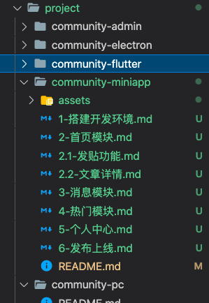

# 贡献规范

在参与贡献之前，请先熟读本规范。


## 必备的知识

- 必须要会使用MarkDown语法，并遵循 [编写规范](./01-编写规范)

- 学习vuepress的使用，参考[文档](../vuepress/)

- 需要了解 Github 的PR方式，并按照如下要求提交Commit，例如：

  ``` 
  格式: [todo] message
  
  todo: A - ADD, U - UPDATE, D - DELETE, F - FIX BUGS
  ```

  参考[链接](/course/update-logs/)


## 贡献流程

- 下载仓库代码，本地安装，并使用`npm run dev`运行项目；

- 明确自己更新的文章或者内容的范畴。

  - 如果是大的篇章，需要更新`config.js`中的目录；
  - 如果是小更新，只需要在先前别人的文章基础之上进行修订即可

- 新建`xxx.md`文章

  ::: warning

  如果是根目录，则需要创建一个README.md的文件

  :::

  系列文章的目录需要按照如下要求进行命名：

  

  说明：

  - 保证文章列表的顺序：文章以`0`或者不加`0`，从1开始，子篇章使用`.`进行扩展
  - 文章内，不要设置`sidebar: auto`
  - 文章内的一级标题与文件名同名，并去除标号，如：`1-搭建开发环境.md`的一级标题应该是`搭建开发环境`
  - 所有.md的文件的图片，存放在相对目录的`assets`目录中

- 配置`config.js`添加自定义目录

  ```js
  const sidebar = {
  // ...
    {
      title: '小程序',
      collapsable: false,
      children: genSidebarConfig('project/community-miniapp', siderBarOptions)
    },
  }
  ```

  关于`genSidebarConfig`，主要的目的是为了自动形成数组目录，参考[说明](/course/vuepress/01-配置说明.html#配置文件)：

  ```js
  const result = genSidebarConfig('project/community-miniapp', siderBarOptions)
  console.log(result)
  
  // 结果如下
  [
    'community-miniapp/',
    'community-miniapp/1-搭建开发环境',
    'community-miniapp/2-首页模块',
    'community-miniapp/2.1-发贴功能',
    'community-miniapp/2.2-文章详情',
    'community-miniapp/3-消息模块',
    'community-miniapp/4-热门模块',
    'community-miniapp/5-个人中心',
    'community-miniapp/6-发布上线'
  ]
  ```

- 按照 [编写规范](./01-编写规范)书写，一定注意不要有4级标题；

- 每完成一个部分进行一次commit；

- 完成一个大的功能介绍之后，提交一次PR；

- 管理员完成PR检查后，会自动合并，并部署发布出来。


## 福利社

- 前期所有的参与的人员，获得永久本笔记更新的授权码一份；

- 优质的贡献内容，后期提供稿酬，标准拟定中...；

- 贡献人员，可以抽取课程大额优惠券；

  

  

