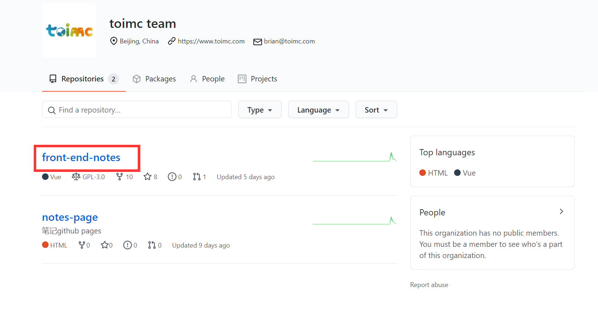
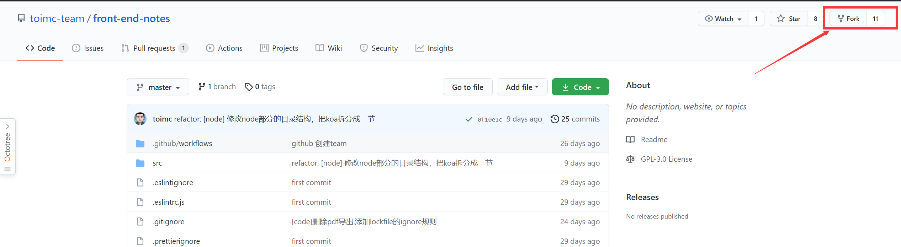
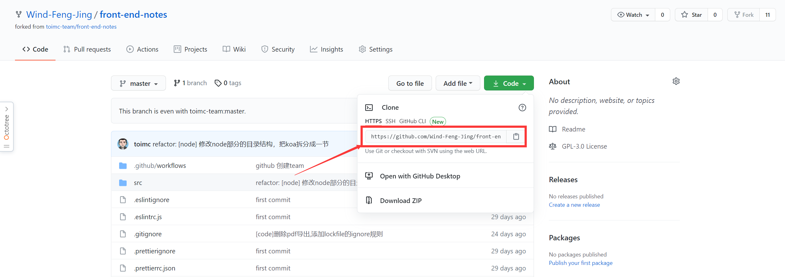
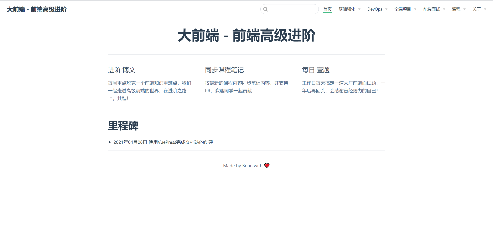
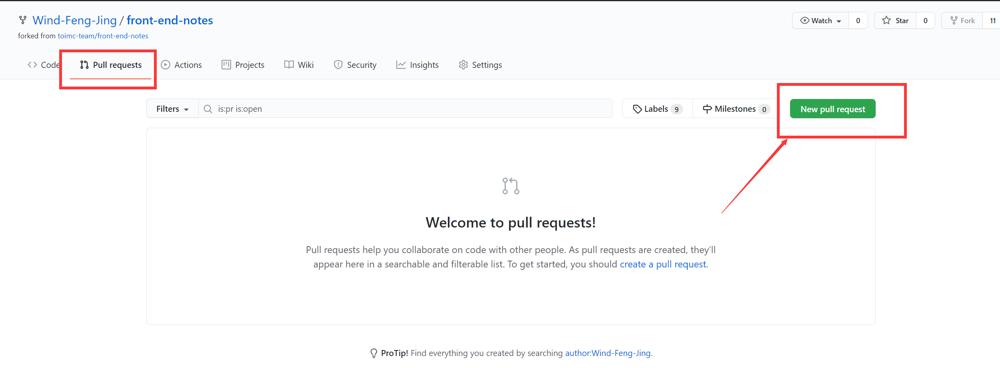
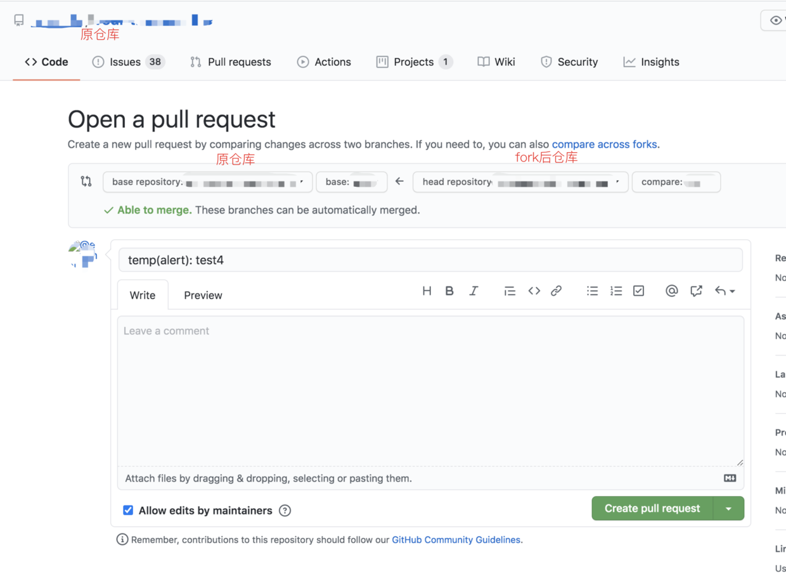

# Pull Request流程

本章节将从项目准备到内容创作到最后的提交PR，来指导大家如何正确提交PR，为项目贡献内容。

## 项目准备

1. 打开[toimc team的GitHub地址](https://github.com/toimc-team)，登录你的GitHub账号，找到`front-end-notes`



进入项目，点击右上角的`Fork`到自己仓库。



打开自己仓库里的`front-end-notes`，点击`Code`获得地址，



打开命令行，输入以下命令

```sh
# 拉取代码，首次使用GitHub拉取代码需要输入GitHub的账号和密码
$ git clone 你复制的clone地址

# 进入项目目录
$ cd front-end-notes

# 安装项目依赖
$ npm i

# 等待依赖安装完成，运行项目

$ npm run dev

```

等待项目启动完成，浏览器输入`localhost:8080`，即可访问项目。



##  内容创作

参与内容创作前，你需要先了解[VuePress](../vuepress/README.md)以及[Typora相关的配置](https://toimc-team.github.io/notes-page/course/vuepress/#md%E8%BD%AF%E4%BB%B6%E4%B8%8B%E8%BD%BD)。

做完以上配置后，你需要了解大前端电子书开源项目的文档[编写规范](../notes/01-编写规范.md)。

使用Vscode或WebStorm打开项目，按照[贡献流程](https://toimc-team.github.io/notes-page/course/notes/#%E8%B4%A1%E7%8C%AE%E6%B5%81%E7%A8%8B)在项目中添加或修改内容，完成内容创作后，接下来就可以准备提交PR啦。

## 提交PR

在提交PR前，我希望同学们先了解以下三个文档：

* [贡献规范](../notes/README.md)
* [Commit 规范](../vuepress/02-commit规范.md)
* [Pull Request规范](../vuepress/03-PR规范.md)

打开命令行，关联upstream原仓库，

```sh
$ git remote add upstream https://github.com/toimc-team/front-end-notes.git
```

内容创作完成后，执行下面的命令，

```sh
# 全量提交
$ git add .

# or 提交某个文件
$ git add 文件名

# commit，添加commit信息
$ git commit -m 'message'

# push推送到fork远程仓库
$ git push origin master
```

完成推送后，打开大前端电子书项目GitHub地址，选择`Pull requests`，点击`New pull request`。


按照规范填写title及备注信息，点击`Create pull request`即可完成提交。


最后等待审核者审核即可。
