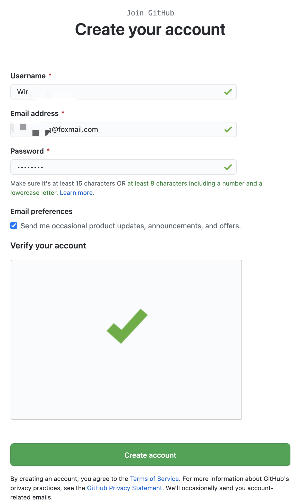
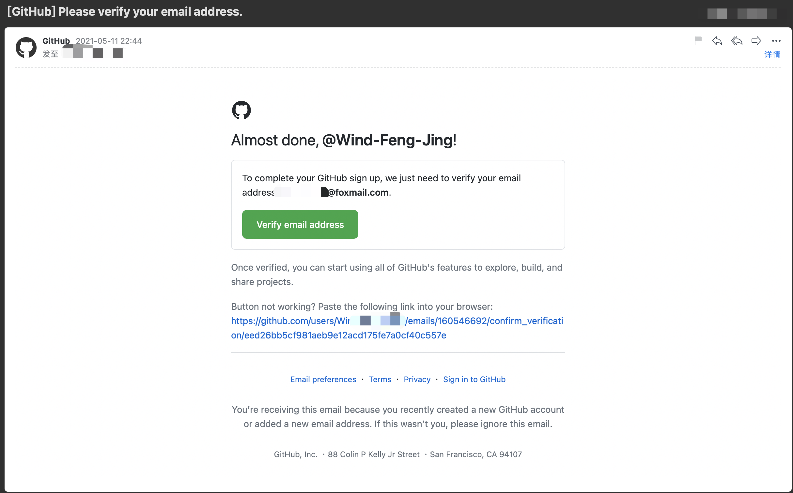
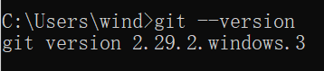
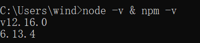

# 环境准备

在参与开源电子书项目之前，你需要准备以下环境：

* GitHub账号
* Git
* Node.js
* Markdown编辑器

## 注册GitHub账号

首先，打开[GitHub官网](https://github.com/)，如果官网打开缓慢或者无法打开，可以使用[DevSidecar](https://gitee.com/docmirror/dev-sidecar/releases)进行加速，点击`Sign Up`，填写以下信息



点击`Create account`完成账号注册。完成注册后，你填写的邮箱会收到一封确认的邮件，点击`Verify email address`，



完成确认后，你的GitHub账号就注册成功啦。

## 配置Git

前往[Git官网](https://git-scm.com/)，根据操作系统自行选择对应的版本进行安装，这边以 Windows 为例，Mac安装请参考[Mac build git](https://git-scm.com/download/mac)。

[下载](https://git-scm.com/download/win)Git安装包，双击打开，按照指引，下一步完成安装即可。打开命令行，输入`git --version`，如出现对应的版本号，则表示安装成功。



接下来我们需要创建一个全局用户名和全局邮箱作为配置信息，

```sh
$ git config --global user.name "your_name"
$ git config --global user.email "your_email@youremail.com"
```

这里的`your_name`以及`your_email@youremail.com`为方便统计贡献信息请尽量与你GitHub里的信息保持一致。

## 安装Node.js

打开[Node.js官网](https://nodejs.org/zh-cn/)，根据操作系统自行选择对应的版本进行安装，这边以 Windows 为例，Mac安装请下载对应的Mac安装包。

[下载](https://nodejs.org/zh-cn/download/)Node安装包，这里我们选择`LTS`版本，这个是Node发行的稳定版本，双击打开，按照指引，下一步完成安装即可，打开命令行，输入`node -v & npm -v`，出现对应的版本号，则表示安装成功。



npm默认的镜像源为国外镜像源，下载可能会出现缓慢或卡死的情况，建议采用一下方式进行处理。

1. 安装cnpm，配置淘宝镜像源；

```sh
$ npm install -g cnpm --registry=https://registry.npm.taobao.org
```

2. 使用DevSidecar打开npm加速。

## Markdown编辑器

由于项目中图文内容基于Markdown语法进行创作，我们需要一款优秀的Markdown编辑器，这里我们推荐[Typora](https://www.typora.io/)，干净、简洁、语法支持丰富，让你专注创作，打开官网，下载对应的安装包，安装即可。

当然，同学们可以根据自己的喜好使用自己平时常用的编辑器进行创作，如果有同学还不熟悉Markdown语法，可以参考[Markdown语法整理](http://note.youdao.com/s/cFmUBzQt)。

至此，基础环境已经准备完成，接下来将教同学们如何配置项目，提交PR（Pull Request）。
