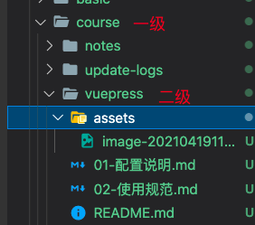

# 项目配置

## 配置文件

:::tip

配置文件的路径：`src/.vuepress/config.js`

:::

1. nav顶部导航

   ```js
   [
     {
       text: '首页',
       link: '/'
     },
     {
       text: '基础强化',
       items: [
         {
           text: '环境搭建',
           items: [
             {
               text: 'Vue',
               link: '/basic/vue/'
             },
             {
               text: 'Node.js',
               link: '/basic/node/'
             },
             // ...
           ]
         },
         //....
       ]
     },
     // ...
   ]
   ```

   **说明：**

   - `text`为标题文字
   - `items`为子项
   - `link`为链接，可以为`markdown`文件，也可以为`http(s)`链接

2. sidebar侧栏

   ```
   const sidebar = {
     '/project/': [
       {
         title: '小程序',
         collapsable: false,
         children: genSidebarConfig('project/community-miniapp', siderBarOptions)
       },
       {
         title: 'React',
         collapsable: false,
         children: [
           'react/'
         ]
       }
     ],
     '/course/': [
       {
         title: 'vuepress使用规范',
         collapsable: false,
         children: genSidebarConfig('course/vuepress', siderBarOptions)
       },
       {
         title: '博文规范',
         collapsable: false,
         children: genSidebarConfig('course/notes', siderBarOptions)
       }
     ],
     '/': [
       {
         title: '首页',
         collapsable: false
       }
     ]
   }
   ```

   **说明：**

   - 首页一定要放在最后；

   - `genSidebarConfig`是一个自动解析目录的函数，目录要求：

     

     参数说明，第一个参数是`一级目录/二级目录`，第二个参数是过滤条件 + 是否是二级目录的标记位`hasSub`：

     ```js
     const siderBarOptions = { hasSub: true, exclude: ['README.md', 'assets', '.DS_Store', 'docs', 'images'] }
     ```

     情况一：

     如果添加了一些非Markdown的文件，可以在上面这个目录中添加，相当于是ignore目录；

     情况二：

     如果是一级目录，可以添加一个属性`hasSub：false`，来覆盖默认的配置：

     ```
     genSidebarConfig('course', {...siderBarOptions, hasSub: false})
     ```


## 打包与部署

项目开启了github actions，只需要推送到github，会自动：

- 完成项目的打包 -> 部署github pages
- 同步gitee仓库代码
- 同步gitee pages，并发布


github actions`.github/workflows/master.yml`:

```yaml
name: Build Vuepress and Sync Gitee
on:
  push:
    branches: [ master ]
  # Allows you to run this workflow manually from the Actions tab
  workflow_dispatch:
    
jobs:
  build:
    runs-on: ubuntu-latest
    steps:
    - uses: actions/checkout@v2
    - name: Use Node.js
      uses: actions/setup-node@v1
      with:
        node-version: '14.x'

    # Caching dependencies to speed up workflows. (GitHub will remove any cache entries that have not been accessed in over 7 days.)
    - name: Cache node modules
      uses: actions/cache@v1
      id: cache
      with:
        path: node_modules
        key: ${{ runner.os }}-node-${{ hashFiles('**/package-lock.json') }}
        restore-keys: |
          ${{ runner.os }}-node-
    - name: Install Dependencies
      if: steps.cache.outputs.cache-hit != 'true'
      run: npm i

    # Vuepress Build.
    - name: Generates Pages
      run: |
        npm run build

    - name: Deploy Github Pages🚀
      uses: JamesIves/github-pages-deploy-action@4.1.0
      with:
        repository-name: toimc-team/notes-page # The branch the action should deploy to.
        branch: master
        folder: ./src/.vuepress/dist # The folder the action should deploy.
        ssh-key: ${{ secrets.DEPLOY_KEY }}

    - name: Sync to Gitee Page
      uses: wearerequired/git-mirror-action@master
      env:
        # 注意在 Settings->Secrets 配置 GITEE_PRIVATE_KEY
        SSH_PRIVATE_KEY: ${{ secrets.GITEE_PRIVATE_KEY }}
      with:
        # 注意替换为你的 GitHub 源仓库地址
        source-repo: git@github.com:toimc-team/notes-page.git
        # 注意替换为你的 Gitee 目标仓库地址
        destination-repo: git@gitee.com:toimc/notes-page.git

    - name: Trigger Gitee Pages Auto Reload
      uses: yanglbme/gitee-pages-action@master
      with:
        # 注意替换为你的 Gitee 用户名
        gitee-username: toimc
        # 注意在 Settings->Secrets 配置 GITEE_PASSWORD
        gitee-password: ${{ secrets.GITEE_PASSWORD }}
        # 注意替换为你的 Gitee 仓库，仓库名严格区分大小写，请准确填写，否则会出错
        gitee-repo: toimc/notes-page
```


同时在项目的`package.json`文件中，提供了本地的打包命令`npm run build`，需要注意线上的public路径，即`config.js`中的`base`属性：

```
base: process.env.NODE_ENV === 'development' ? '/' : '/notes-page/',
```

