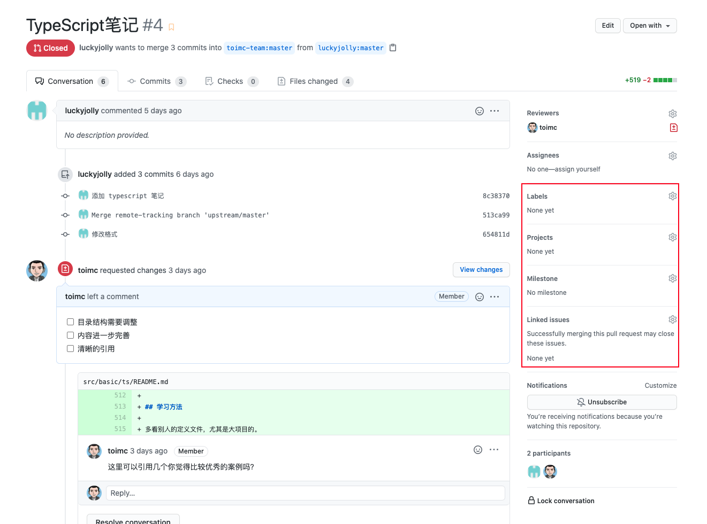

# Pull Request规范

## 概述

**pull request（以下用pr代称） 需要严格遵循以下原则**：

- 一个 pr 只围绕一件事
- 避免过大的 pr

### 一个 pr 只围绕一件事

一个 pr 应该只负责一件事，这遵循设计模式中的**单一职责原则**

如何定义*一件事*：

- 处理了一个 issue
- 解决了一个bug
- 新增了一个组件或功能
- 重构代码实现了某**一个**目的

> **一个 pr 可以包含多个 commit，但要注意尺度，保证 pr 不要过大**

### 避免过大的 pr

> 该条规则对于新增组件的 pr 例外

一个 pr 的文件改变最好少于**12个文件**（排除build产生的文件）

## 信息填写

### Title格式

#### Pr 仅包含一个 commit

直接使用 Github 默认填写的信息，即 Title 为 commit msg 的 subject 部分，Content 为 commit msg 的 body 部分

#### Pr 包含多个 commit

描述清楚这个 Pr 所做的事情，格式：`[名词]`+`动词`+`名词`+`[形容词]`+`[名词]`

例如：

- 修复 Collapse 组件无法展开的问题
- Collapse 组件添加 top 属性
- 新增 Message 组件
- 删除 Message 组件 color 属性
- 修改 Message 组件 top 属性单位为 rpx

> 注意英文单词左右添加一个空格方便阅读

动词建议从下列选项中选取：

- 新增（组件、属性、API）
- 修改
- 修正
- 删除

### Content格式

如果 title 已经描述清楚了此次 pr 的目的，则 Content 可以留空，否则应该对此次 pr 进行详细的描述

## 其他规则

连接 issue

如果这个 pr 解决了某个 issue 提出的 bug 或者 feature，则应在 pr 中将此 issue 关联起来

在 pr 描述中 使用如下关键字可将 issue 关联起来：

- close
- closes
- closed
- fix
- fixes
- fixed
- resolve
- resolves
- resolved

示例： close #756

然后在下图中设置关联issue：

## 流程说明

- 提交PR
- Review
- 建议 -> 修改
- 设置MileStone
- 关联issues（可选）
- 合并