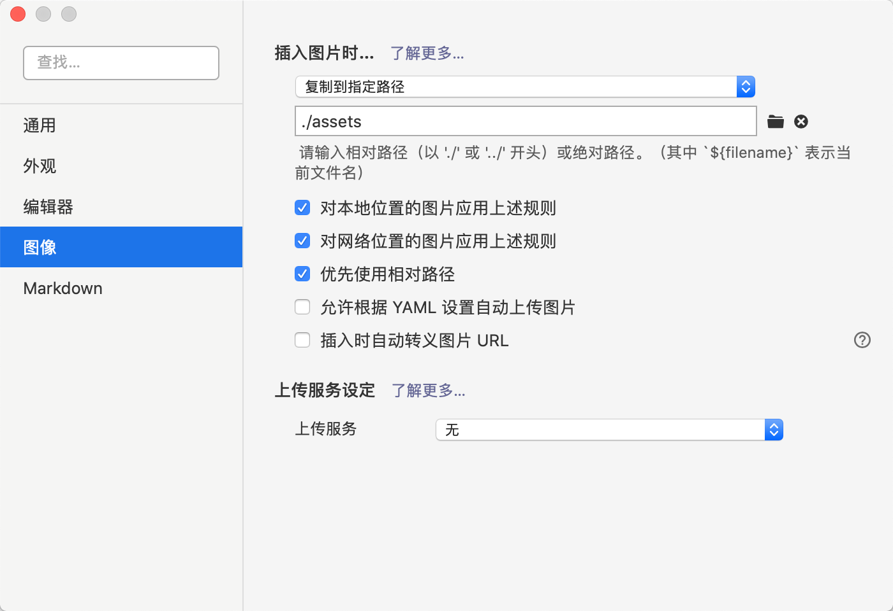

# VuePress文档

## 官方文档

官方文档：[https://vuepress.vuejs.org/zh/](https://vuepress.vuejs.org/zh/)

主题配置：[https://vuepress.vuejs.org/zh/theme/default-theme-config.html](https://vuepress.vuejs.org/zh/theme/default-theme-config.html)


参与贡献之前，请阅读：[**项目配置说明**](./01-配置说明.md)


## MD软件下载

Markdown软件推荐[Typora](https://typora.io/)：

- MacOS：[下载地址](https://typora.io/download/Typora.dmg)

- Windows 64位：[下载地址](https://typora.io/windows/typora-setup-x64.exe)

- Linux：[下载地址](https://typora.io/linux/Typora-linux-x64.tar.gz) 或者 使用如下命令行方式进行安装

  ```bash
  # or run:
  # sudo apt-key adv --keyserver keyserver.ubuntu.com --recv-keys BA300B7755AFCFAE
  wget -qO - https://typora.io/linux/public-key.asc | sudo apt-key add -
  
  # add Typora's repository
  sudo add-apt-repository 'deb https://typora.io/linux ./'
  
  sudo apt-get update
  
  # install typora
  sudo apt-get install typora
  ```

打开Typora的配置，配置图片的默认路径：




## 项目下载

github地址：

```
git clone https://github.com/toimc-team/front-end-notes
```

github加速地址：

```
git clone https://github.com.cnpmjs.org/toimc-team/front-end-notes.git

git clone https://github.91chifun.workers.dev//https://github.com/toimc-team/front-end-notes.git
```


gitee地址：

```
git clone https://gitee.com/toimc/front-end-notes.git
```


## 项目运行

```
cd front-end-notes

npm i

npm run dev
```

