# Jenkins

## 什么是CI/CD
`CI/CD`即持续集成(Continuous Integration)、持续交付(Continuous Delivery)和持续部署(Continuous Deployment)，是一种通过引入自动化构建部署来频繁向客户交付的方法。`CI/CD`是`DevOps`的基础核心，如果没有`CI/CD`自动化的工具和流程，`DevOps`是没有意义的，来看下图`DevOps`工作流程图：


具体的流程为：
- 先是计划`plan`，编码`code`，然后编译`build`，测试`test`（Dev）
- 然后发布`release`，部署`deploy`，运维`operate`，监控`monitor`（Ops）
- 然后发现问题或有新的需求，就重新计划plan...如此循环

这就是完整的`DevOps`流程，试想如果没有自动化，那将是很繁重的任务。

与传统的项目部署相比，自动化流程的意义：
- 减少人为失误，提高软件质量
- 效率迭代，便捷部署
- 快速交付，便于管理


**主流的自动化软件对比**

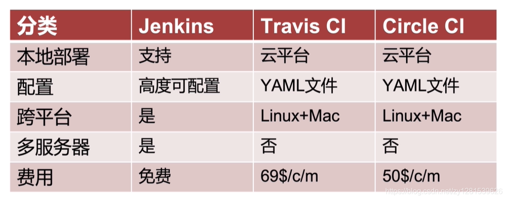

从上图可以看出主要的软件有`Jenkins`,`Travis CI`,`Circle CI`, 后面两个是云平台，而且只支持公有`Public`项目，私有项目需要付费；`Jenkins`支持本地化部署，而且免费，可高度配置，是开源CI&CD软件领导者， 提供超过1000个插件来支持构建、部署、自动化， 满足任何项目的需要。

## Jenkins 介绍

官网：[https://www.jenkins.io/](https://www.jenkins.io/)

Jenkins是一款开源 CI&CD 软件，用于自动化各种任务，包括构建、测试和部署软件。<br>
Jenkins 支持各种运行方式，可通过系统包、Docker 或者通过一个独立的 Java 程序。

**Jenkins & Gitee 持续集成流程**

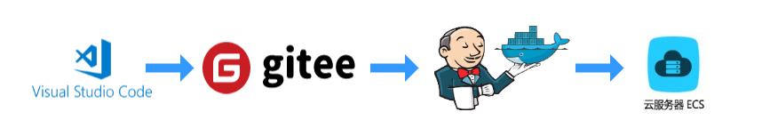

- 在本地编辑器编辑代码，提交到`Gitee`
- `git push` 操作触发 `Jenkins` 自动部署（`Jenkins` 安装在 `Docker` 中）
- `Jenkins` 开始构建、打包、最后部署到云服务器

::: tip 提示
除了Gitee，也可以使用GitLab,GitHub等代码仓库。
:::
## 安装Jenkins

本节的步骤适用于本地机器上的 `Jenkins` 新安装。

`Jenkins` 通常作为一个独立的应用程序在其自己的流程中运行， 内置 `Java servlet` 容器/应用程序服务器（Jetty）。
`Jenkins` 也可以运行在不同的`Java servlet`容器(如Apache Tomcat 或 GlassFish)中作为servlet运行。

尽管此页面重点关注`Jenkins`的本地安装，但此内容也可用于帮助在生产环境中设置`Jenkins`。

### 系统要求

最低推荐配置:
- 256MB可用内存
- 1GB可用磁盘空间(作为一个Docker容器运行jenkins的话推荐10GB)

为小团队推荐的硬件配置:
- 1GB+可用内存
- 50 GB+ 可用磁盘空间

软件配置:
- Java 8—​无论是Java运行时环境（JRE）还是Java开发工具包（JDK）都可以。

::: warning 注意
将Jenkins作为Docker 容器运行，这不是必需的，也可以直接安装Jenkins。
:::
### 在Docker中下载并运行Jenkins

```bash
$ docker run --name jenkins_test -p 11005:8080 -p 50000:50000 jenkins/jenkins:lts
```

- --name 容器名称定义为jenkins_test
- -p 将本地11005端口映射到Jenkins容器中的8080端口，这是访问Jenkins网页的端口
- -p 50000端口映射是与Jenkins主服务器上通信的端口号

上面没有挂载 `volume`, 如果有必要可以使用 `-v` 来映射容器内部文件：
```bash
-v jenkins-data:/var/jenkins_home
```

安装完成后这里提示有个初始密码，第一次登录需要用到，也可以在`/var/jenkins_home/secrets/initialAdminPassword`找到，通过 `docker ps | grep jenkins` 查看 Jenkins 是否已开启，如果没有开启可以使用 `docker start jenkins` 来开启。

::: warning 注意
注意添加本地的端口(11005)到防火墙，还有注意云主机也开放了此端口，否则不能访问哦。
:::

在浏览器访问11005端口开始使用 `Jenkins` ：

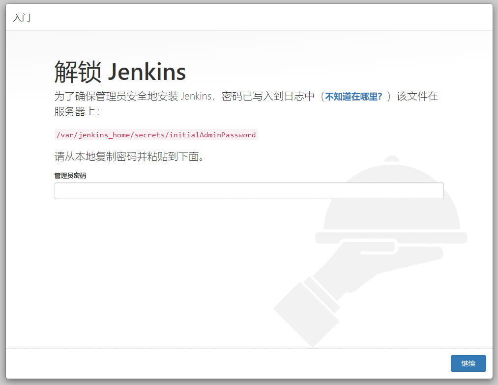

点击【继续】，然后开始安装插件：

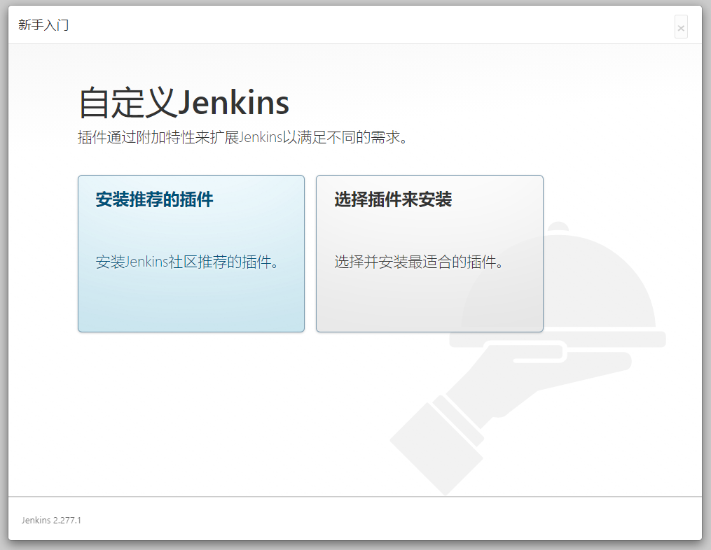

选择【安装推荐的插件】开始安装：

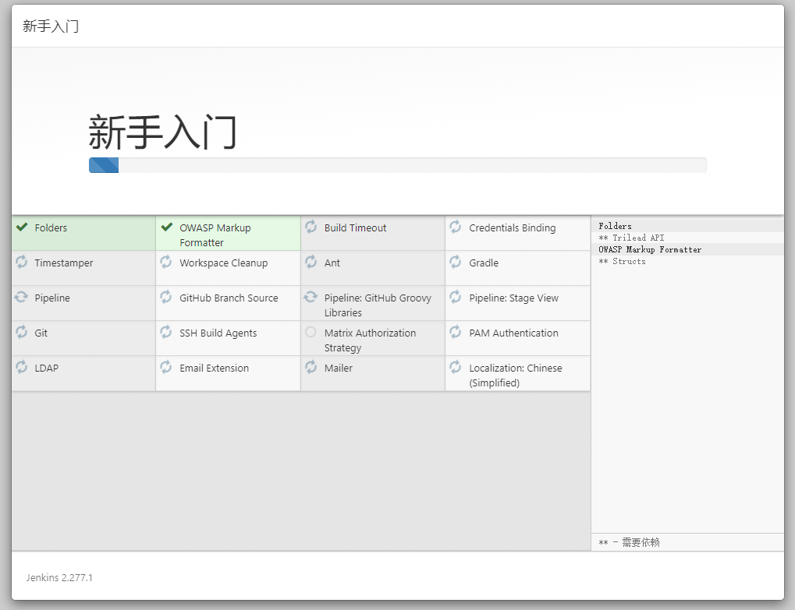

创建第一个管理员用户：

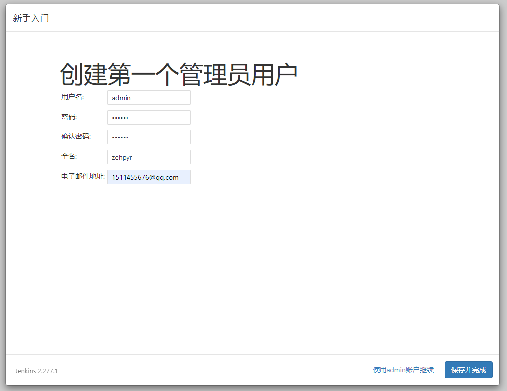

确认`Jenkins`访问路径：

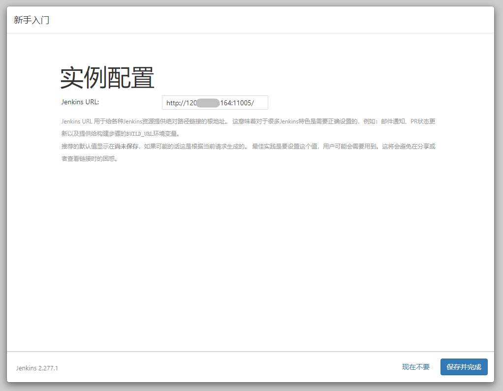

安装完毕，开始使用：

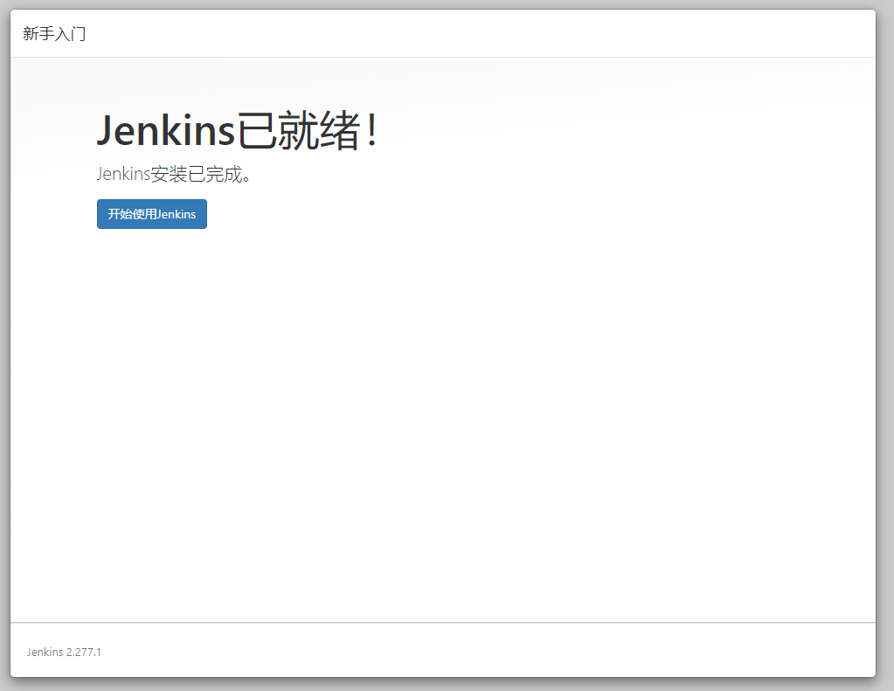

首页欢迎界面：

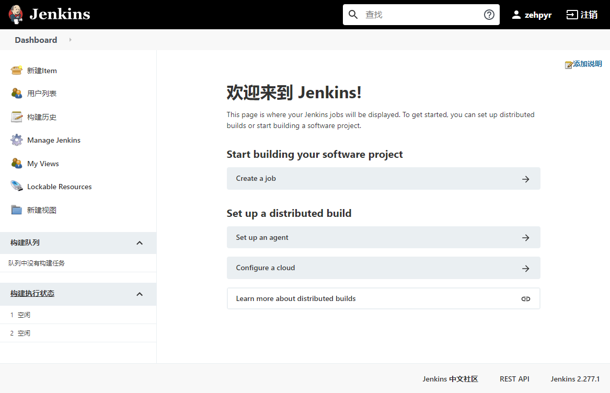


## 插件下载

`Jenkins` 官方提供了大量的插件给用户下载，如Git相关插件可以连接代码仓库、SSH相关插件可以远程连接到服务器、NodeJS插件可以构建前端项目、权限管理插件可以方便管理多用户协作等，丰富的插件可以帮助我们更好的运行、管理我们的自动化流程。

### 配置国内加速源

在安装插件之前我们先配置下国内加速源，这样下载插件更快些。

首先打开[清华大学开源软件镜像站](https://mirrors.tuna.tsinghua.edu.cn/)，搜索`jenkins`，选择 `update` 目录，复制该目录下的 `update-center.json` 的地址；

在`Jenkins`中打开Dashboard > 插件管理[Plugin Manager] > 高级[Advanced]：

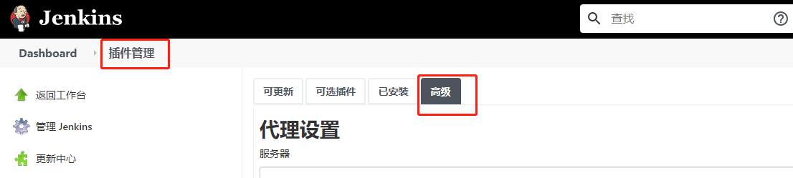

找到升级站点[Update Site]的位置，将刚才复制的清华源地址放进去，点击【提交】，那么后面更新插件都是从这个源下载安装，速度比较快。

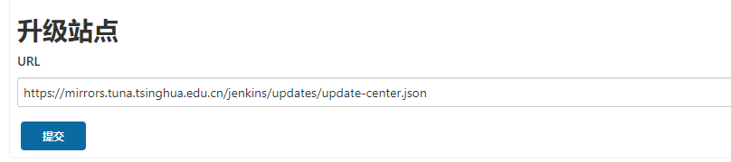


### 在线安装插件

在同一个目录的[可选插件] 选项卡，可以搜索没有安装的插件，勾选后点击下面的按钮即可安装（已经安装的插件只在[已安装]的选项卡）：


### 离线安装插件

若是本地环境或内网环境也可以使用离线安装的方式，可以去`Jenkins`的官网下载插件：[](https://plugins.jenkins.io/)

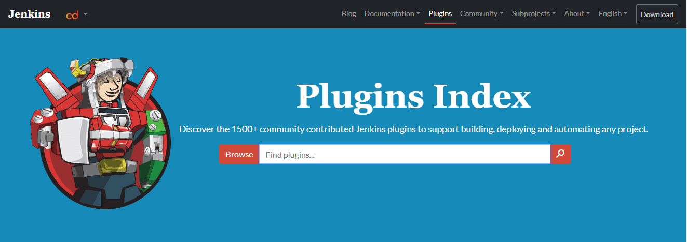

我们搜索一下 `Localization: Chinese` 然后就可以看到中文语言包：

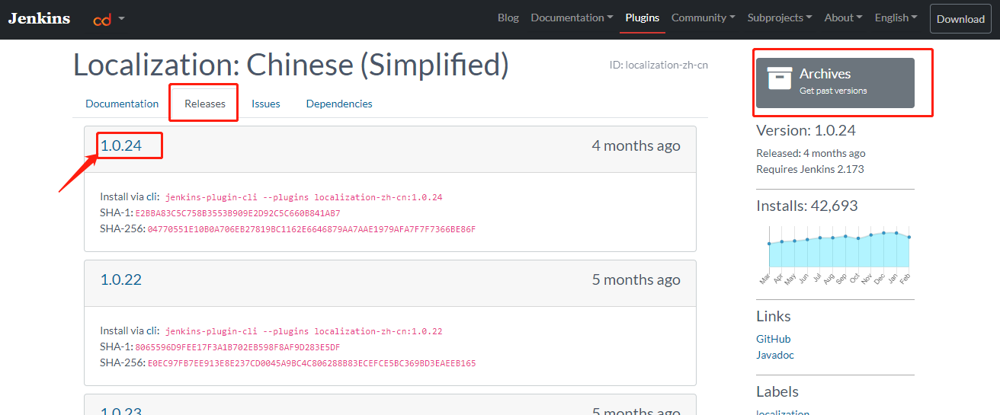

点击版本号就开始下载了，得到了 `localization-zh-cn.hpi` 文件，然后来安装：

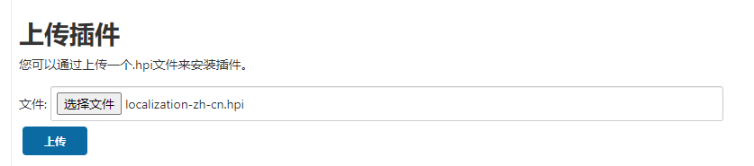

选择下载的文件，点击【上传】，安装完后，勾选【重启】，完事后就重新登录即可。


## 权限管理

权限管理的作用是给用户分配权限，方便多用户协作。首先我们来安装以下插件帮助我们管理安全配置：
- PAM Authentication plugin
- Matrix Authorization Strategy Plugin
- Role-based Authorization Strategy
- LDAP Plugin

安装完成重启Jenkins后生效。

### 基于角色安全管理

点击[系统管理] > [安全] > [全局安全配置] > [授权策略]，选择 `Role-Based Strategy`，然后保存，再回退到[系统管理] > [安全]，可以看到多出了一个菜单：

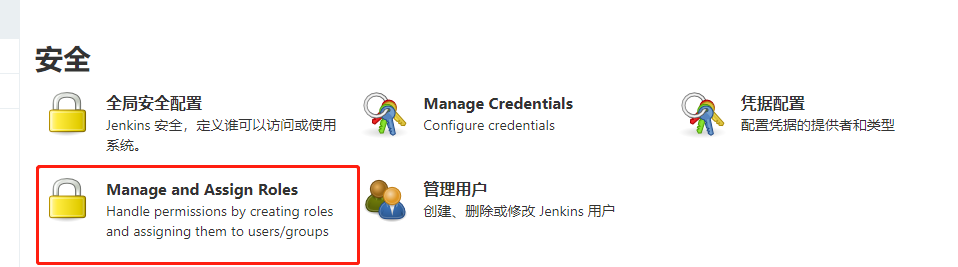

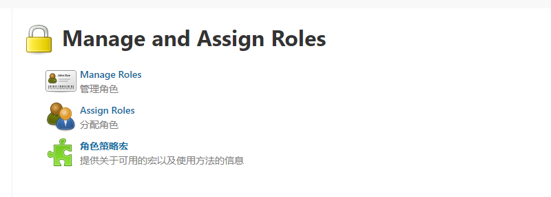

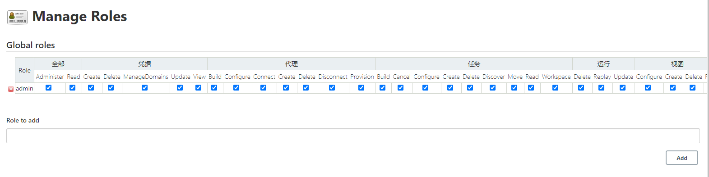


### 基于安全矩阵

在[授权策略]中选择`安全矩阵`，这个是基于用户的权限配置，这里需要注意的是需要吧管理员添加进来，如果没有添加是没有权限做任何事的，切记！！！

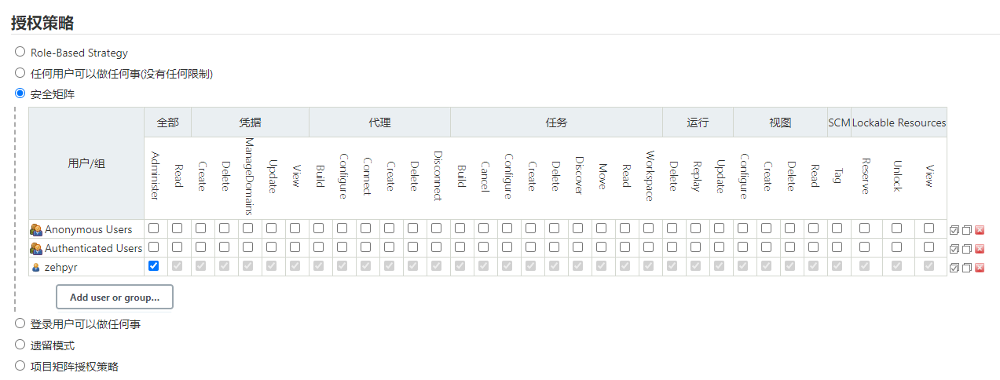


## Gitee + Jenkins自动化实战

当我们熟悉了`Jenkins` 的使用后，接下来我们来配置一个基于 `vue-element-admin` 的实战项目，来感受一下自动化流程带给我们的优势。

首先我们需要创建一个 `git` 项目，至于代码仓库可以自选，这里为了国内方便访问，我选择了 `Gitee` ，然后我们需要给 `Jenkins` 配置一些插件，比如 `NodeJS` 等，创建一个构建任务，关联 `git` 代码仓库，编写 `vue` 项目的编译打包脚本，再将打包后的产物部署到云服务器，这里演示的是阿里云的Nginx服务器。

### 创建git项目
这里以`Gitee`作为代码仓库，也可以使用`Github`/`Gitlab`等仓库。

假设创建的仓库地址是：`https://gitee.com/xxx/jenkins_test.git`（创建过程很简单，就不演示了）

::: tip 提示
Git 可以创建私有项目哦。
:::

### 安装Jenkins插件


**安装Gitee插件**

因为这里使用了`Gitee`，我们需要在`Jenkins`中安装Gitee插件：

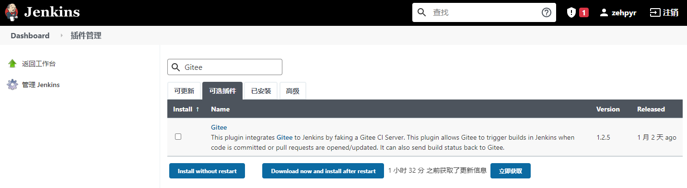

::: warning 注意
安装完记得重启Jenkins，否则新安装的插件不会显示哦。
:::

**配置Gitee**

在[Jenkins] > [系统管理] > [系统配置] > [Gitee配置] 配置 `Gitee` 信息：

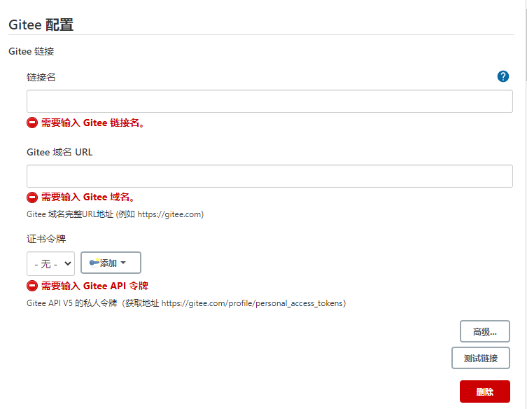

- 链接名：输入Gitee或随便输入你想要的名称
- Gitee域名URL：输入Gitee完整的URL地址 `https://gitee.com`
- 证书令牌：如没有添加需要新建一个，点击添加（如下图）

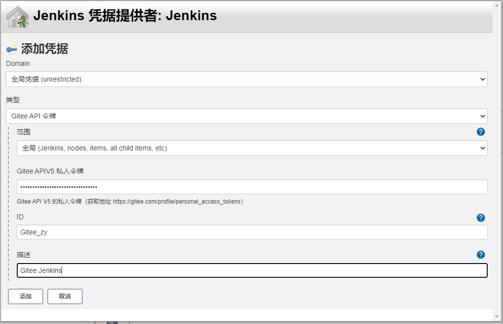

- Domain：选择全局凭据
- 类型：选择Gitee API令牌
- 范围：选择全局
- Gitee APIV5 私人令牌，[点击获取](https://gitee.com/profile/personal_access_tokens)
- ID 和 描述就随便写不一样的就行

添加完令牌就直接选择就行，然后点击【测试链接】，如果出现`成功`则表示配置正确：

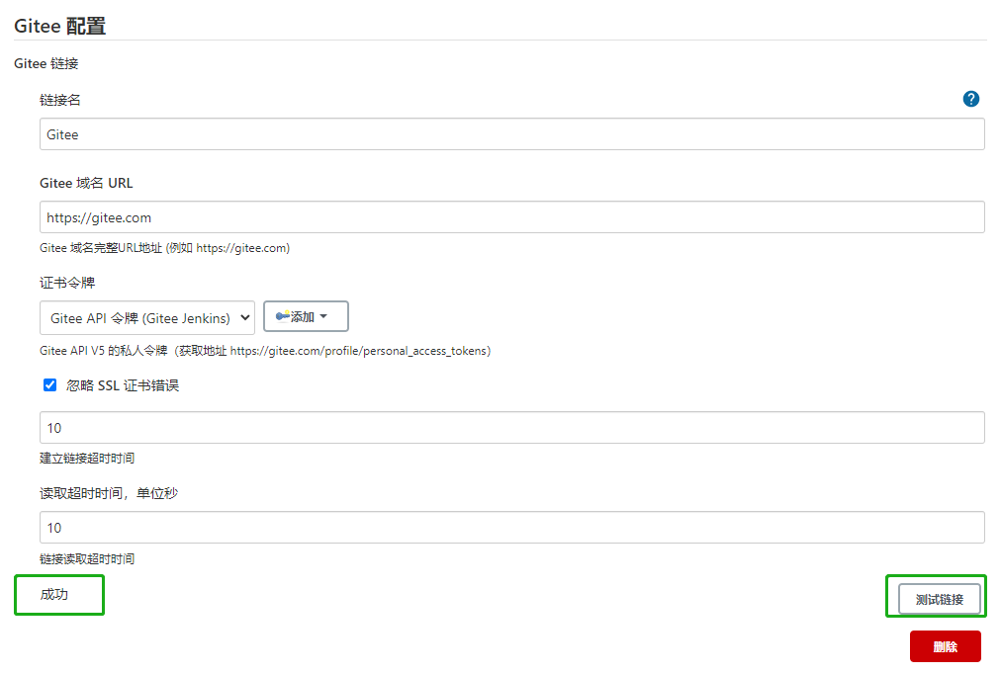

**安装NodeJS**

因为我们的Vue项目是基于 `NodeJS` 来打包构建的，所以需要在 `Jenkins` 中安装插件：

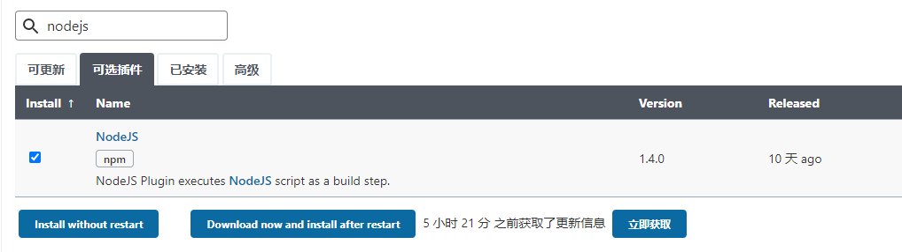

**配置NodeJS**

在[系统管理] > [系统配置] > [全局工具配置] > [NodeJS] 点击【NodeJS安装】：

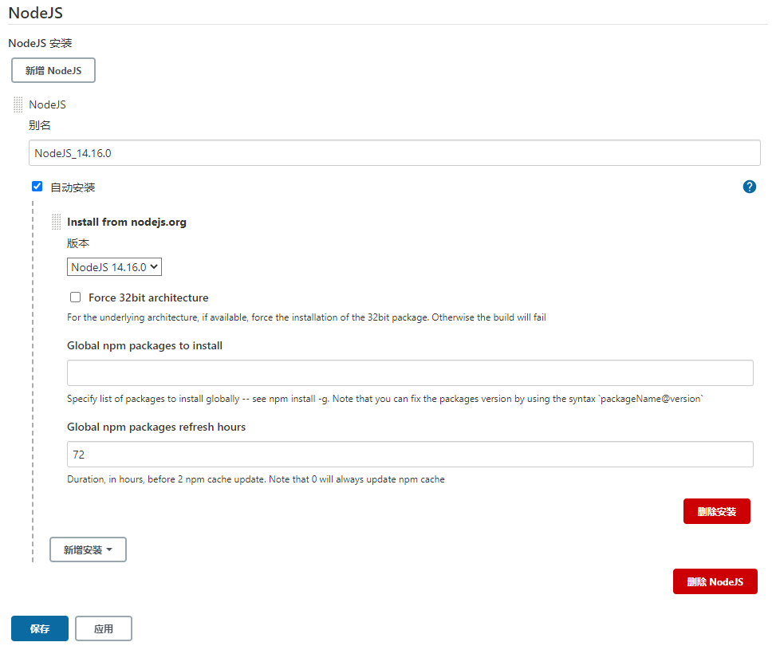

::: warning 注意
 `NodeJS` 版本不要选太高，选最新的LTS版本即可，否则可能因为版本不兼容导致构建失败，建议选择版本和本地开发的版本相同，这样就不会有问题了。
:::

### 新建构建任务

在 `Jenkins` 首页点击【新建任务】开始第一个流水线的构建，选择`构建一个自由风格的软件项目` 点击保存即可创建构建项目：

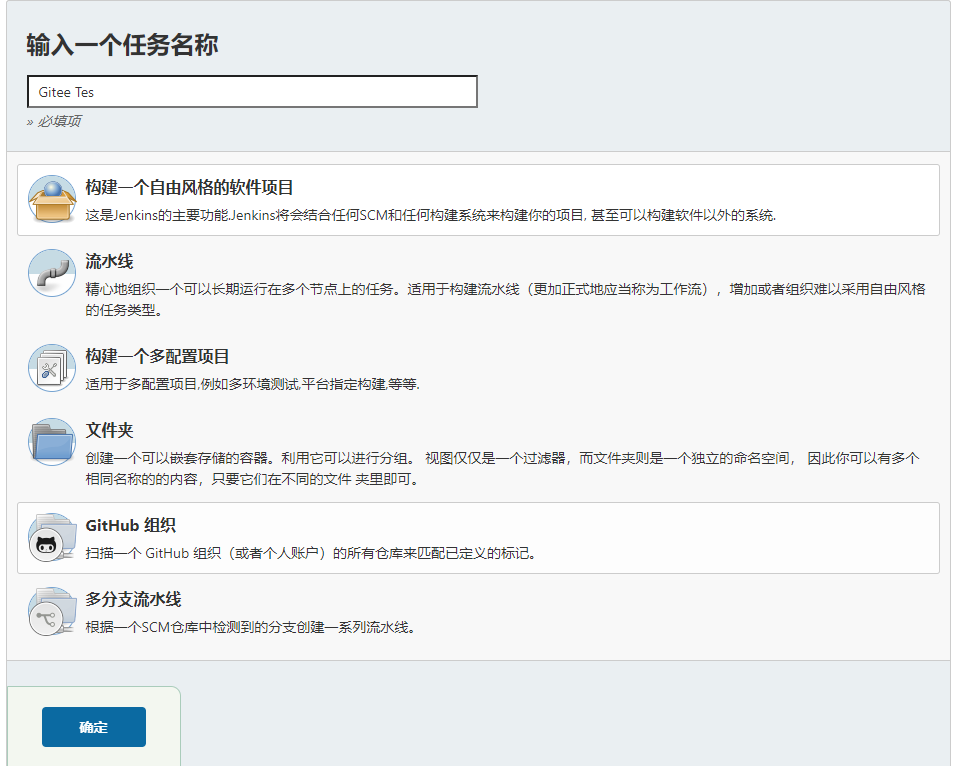

新建完成后进入配置，流水线会按照 [General] > [源码管理] > [构建触发器] > [构建环境] > [构建] > [构建后操作]的步骤来执行自动化任务。

#### General

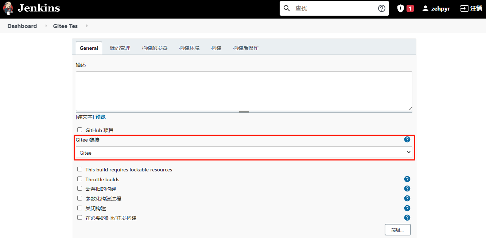

#### 源码管理

- 选择 `Git` 选项
- Repository URL: 创建的git项目地址
- Credentials：点击添加一个凭据（注意 `Gitee API Token` 凭据不可用于源码管理的凭据，只用于`gitee`插件的 API 调用凭据）
- 点击【高级】 Advanced 按钮，Name输入`origin`，Refspec输入`+refs/heads/*:refs/remotes/origin/*`
- 指定分支：`master`

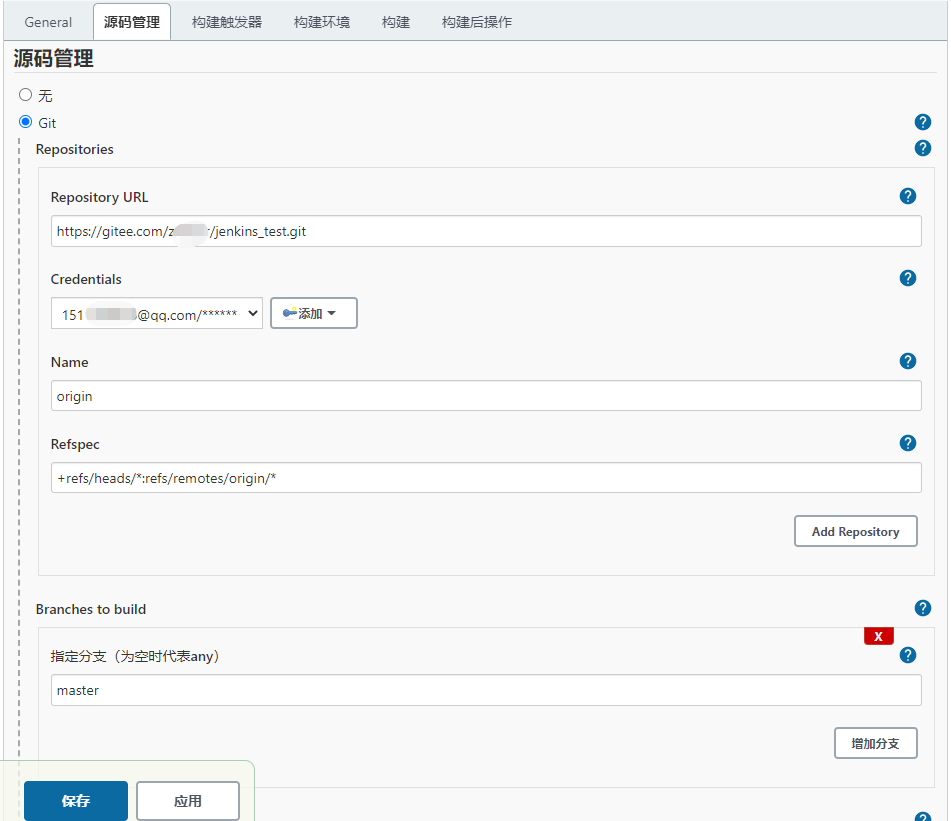

#### 触发器配置

这里选择配置 `push` 代码立即触发构建任务，勾选 `Gitee webhook触发构建`，后面有个地址这个后面需要配置到`Gitee`，`Gitee`触发构建策略勾选推送代码，其他先默认就行。

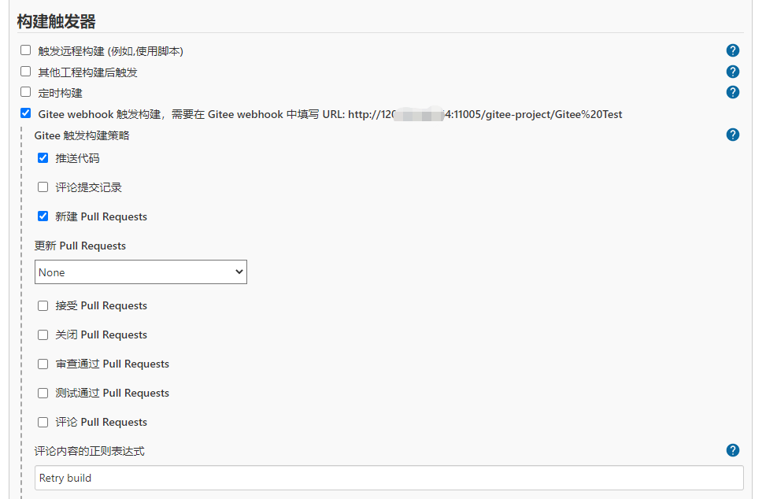

后面有个 `Gitee WebHook密码` 栏位需要配置到Gitee，点击生成就会生成一个密码：

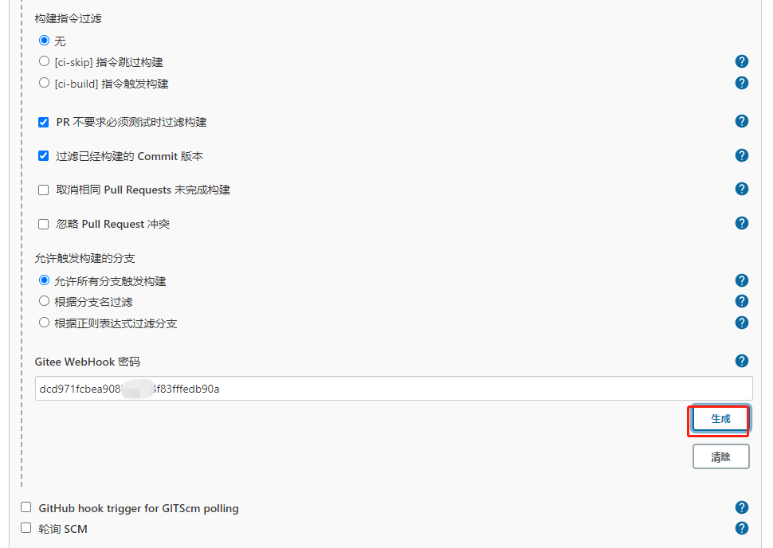

打开 `Gitee` 项目的管理选项卡，左侧有个[WebHooks]菜单 ，点击【添加webHook】:

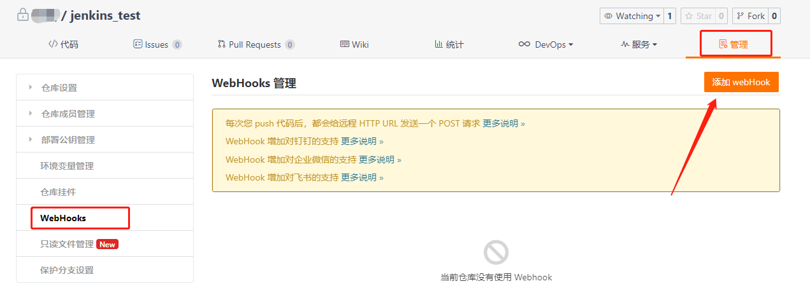

将上一步 `Jenkins` 生成的`URL`和`密码`填进去，点击【添加】：

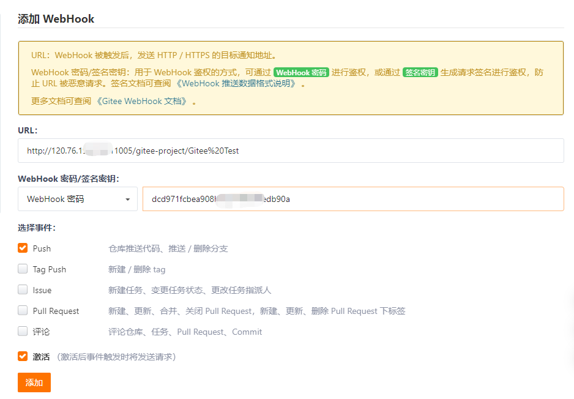


#### 构建环境

修改构建任务的构建环境，勾选 `Provide Node & npm bin/ folder to PATH` ，默认会选择`Jenkins`安装的`NodeJS`版本:

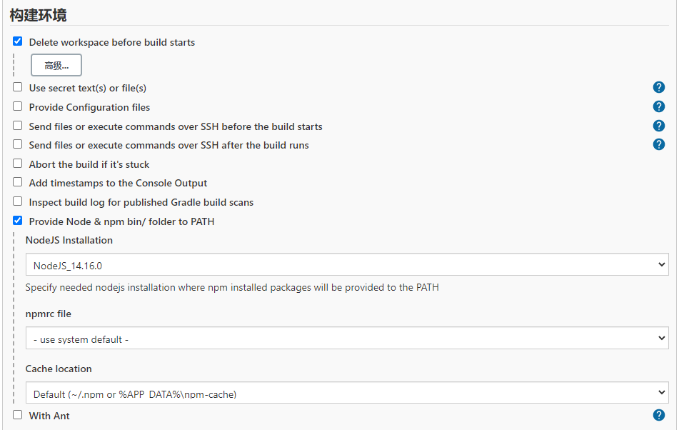

#### 构建脚本

选择【执行shell】：

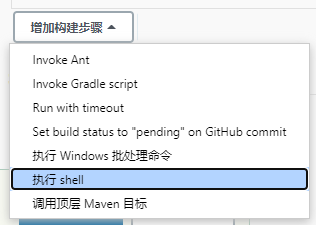

先随便写一个shell脚本试试：

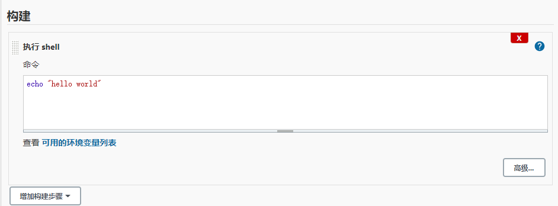

保存后，触发一次提交，看看`控制台输出`：

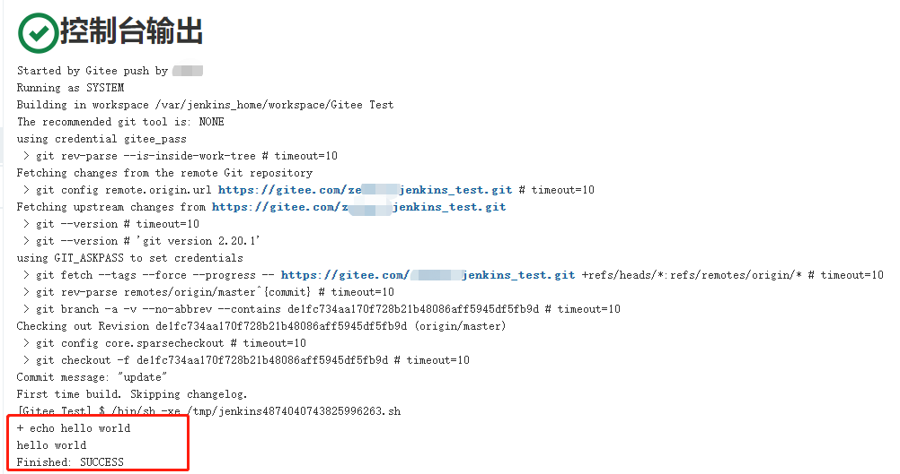


### Vue项目构建及部署

vue项目通过 `NodeJS` 构建后，需要将构建后的 `dist` 文件夹的内容部署到云服务器，因为 `Jenkins` 是 `Docker` 容器创建的，容器内部不能直接移动文件，因为没有挂载`volumn`，所以这里可以使用 `SSH` 的方式来传输容器的构建文件到`nginx`服务器。先来安装下`Publish over SSH`，进入插件管理：

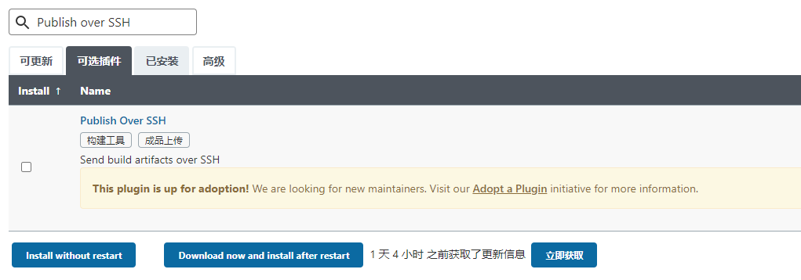

安装完成后，在[系统管理] > [系统配置] 会多出一个`Publish over SSH`:

在需要部署的目标云服务器生成密钥：
```bash
$ ssh-keygen -t rsa -C "xxxx@qq.com"
# 将公钥放到authorized_keys，否则SSH Server配置会不成功
$ cat id_rsa.pub >> authorized_keys
```

在 `Key` 栏位填写私钥：


设置 `SSH` 目标服务器的信息：

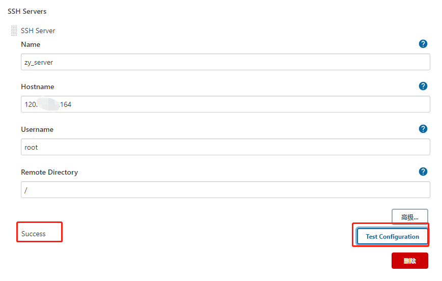

点击 【Test Configuration】按钮，左侧显示 `Success` 即表示`SSH`可以连接成功。


[构建步骤]修改下 `shell` 脚本，进行 `vue` 的`安装`和`打包`：

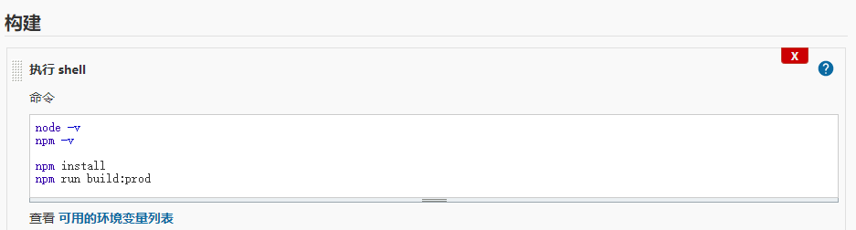

先添加一个`Transfer Set `删除部署目录的文件，假如 `nginx` 配置的 `root` 目录为`/usr/share/nginx/flower_html/`：

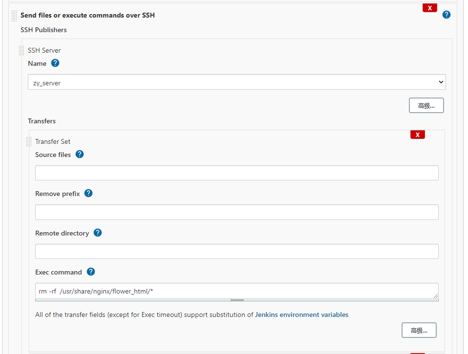

再加一个 `Transfer Set` 传送文件到部署目录：

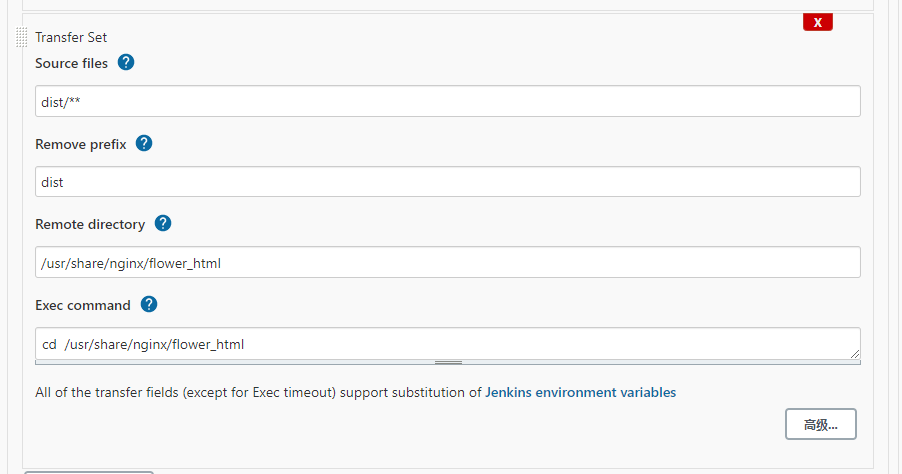

都设置好了，来触发一次构建，部署效果：

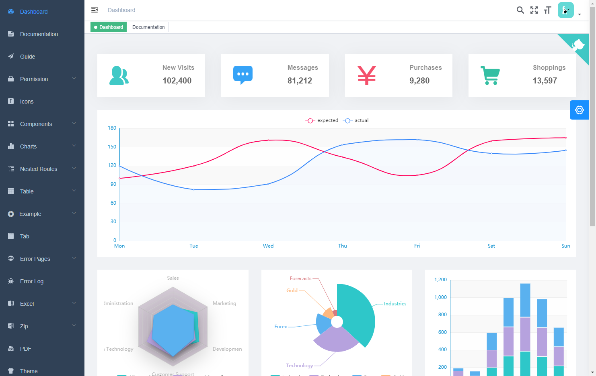

有了 `Jenkins` 自动化部署，以后我们只需要关注代码层面即可，修改完代码，提交到 `Git` 仓库，然后 `Jenkins` 会自动帮我们构建、打包、部署，是不是很方便呢。

