# 搭建开发环境

## 集成scss/sass编译

为了方便编写样式（例如`<style lang="scss">`），建议大家安装`sass/scss编译`插件，插件的下载地址：[scss/sass编译](https://ext.dcloud.net.cn/plugin?name=compile-node-sass)

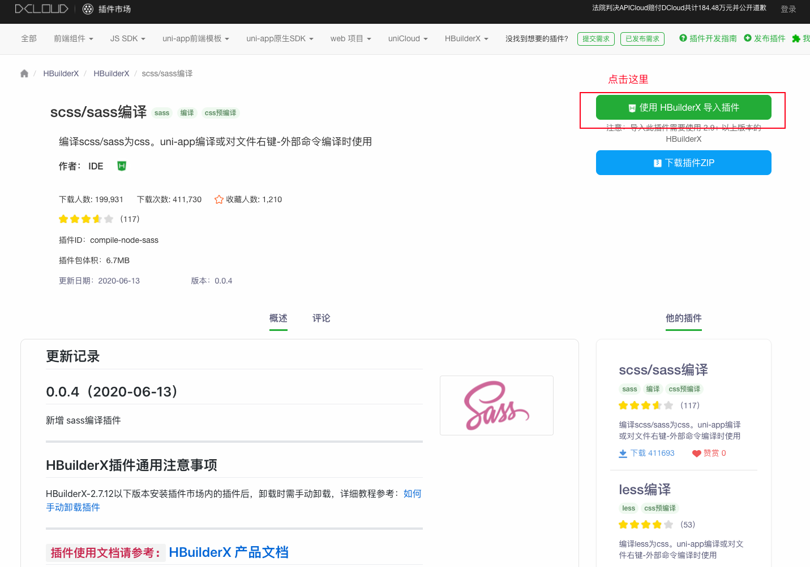


登录账号 -> 无账号，即注册（邮箱验证） -> 再次点击安装插件 -> 打开HBuilderX


## 自定义主题、快捷键等

1. 快捷键切换

在`工具 -> 预设快捷键方案切换` 中可以切换自己喜欢的快捷键方案，对HBuilderX进行自定义：

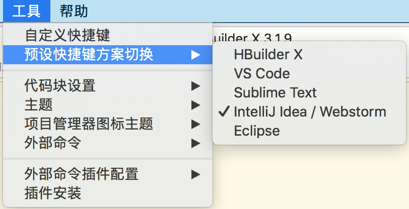

2. 设置主题

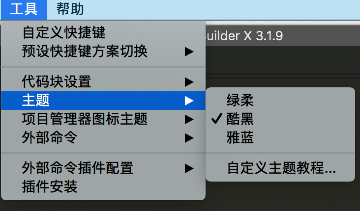

3. 字号设置

macOS的快捷键是 `Command + ,`，windows的快捷键是`Ctrl + ,`

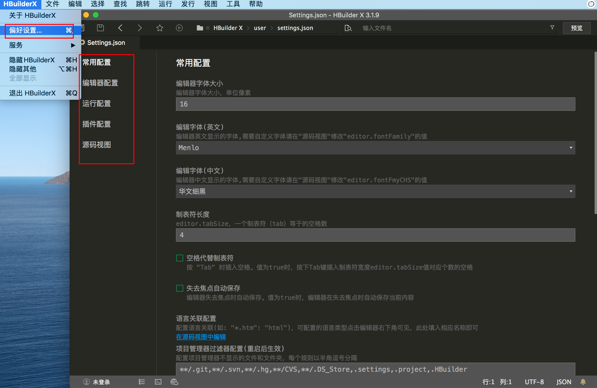

常见配置：

```json
{
    "editor.colorScheme" : "Default",
    "editor.fontFamily" : "Consolas",
    "editor.fontSize" : 14,
    "editor.insertSpaces" : true,
    "editor.lineHeight" : "1.5",
    "editor.mouseWheelZoom" : true,
    "editor.onlyHighlightWord" : false,
    "editor.tabSize" : 2,
    "editor.wordWrap" : true,
    "editor.codeassist.px2rem.enabel": false,
    "editor.codeassist.px2upx.enabel": false
}
```

## 创建项目

### 使用HBuilderX

步骤：

- 下载HBuilderX：[官方IDE下载地址](https://www.dcloud.io/hbuilderx.html) ——建议使用标准版本

  > HBuilderX标准版可直接用于web开发、markdown、字处理场景。做App仍需要安装插件。
  >
  > App开发版预置了App/uni-app开发所需的插件，开箱即用。
  >
  > 标准版也可以在插件安装界面安装App开发所需插件，App开发版只是一个预集成作用。
  >
  > App开发插件体积大的原因主要有2方面：
  >
  > 1. 真机运行基座，Android版、iOS版、iOS模拟器版，加起来体积就1百多M。真机运行基座需要把所有模块都内置进去，方便大家开发调试。开发者自己做app打包是不会这么大的，因为可以在manifest里选模块来控制体积。
  > 2. uni-app的编译器，依赖webpack和各种node模块，node_modules就是这么一个生态现状，文件超级多，几万个文件，解压起来很慢。

- 在点击工具栏里的文件 -> 新建 -> 项目：

  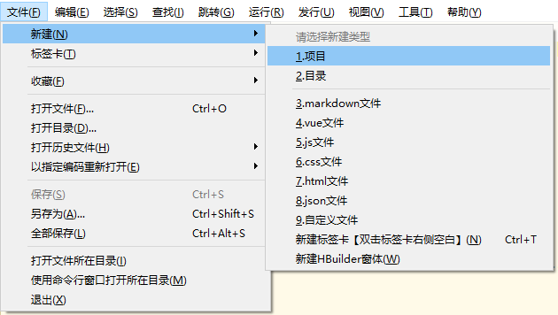

 - 选择`uni-app`类型，输入工程名，选择模板，点击创建，即可成功创建。

   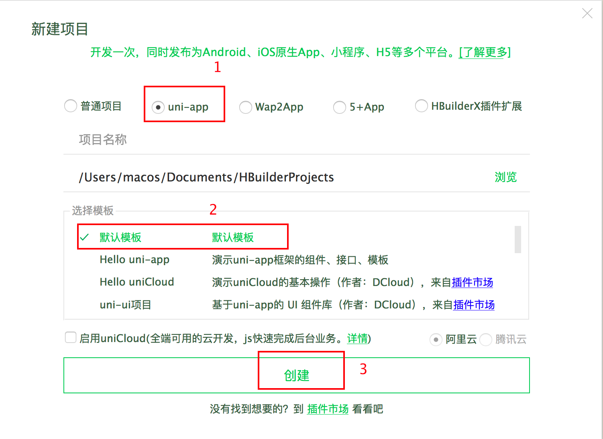

- 在微信开发者工具里运行：进入hello-uniapp项目，点击工具栏的运行 -> 运行到小程序模拟器 -> 微信开发者工具，即可在微信开发者工具里面体验uni-app。

  ​	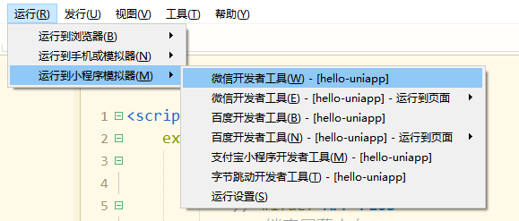

  第一次运行的提示：

  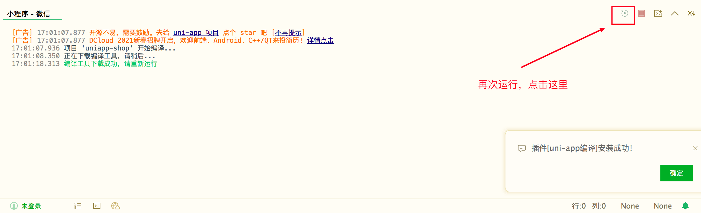

  成功运行：

  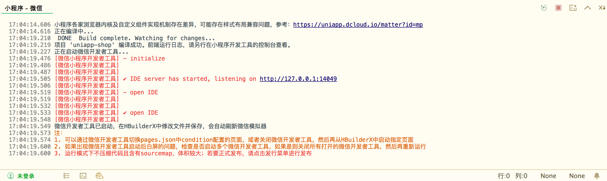

  

  

  **注意：**

  - 如果是第一次使用，需要先配置小程序ide的相关路径，才能运行成功。如下图，需在输入框输入微信开发者工具的安装路径，uni-app默认把项目编译到根目录的unpackage目录。

    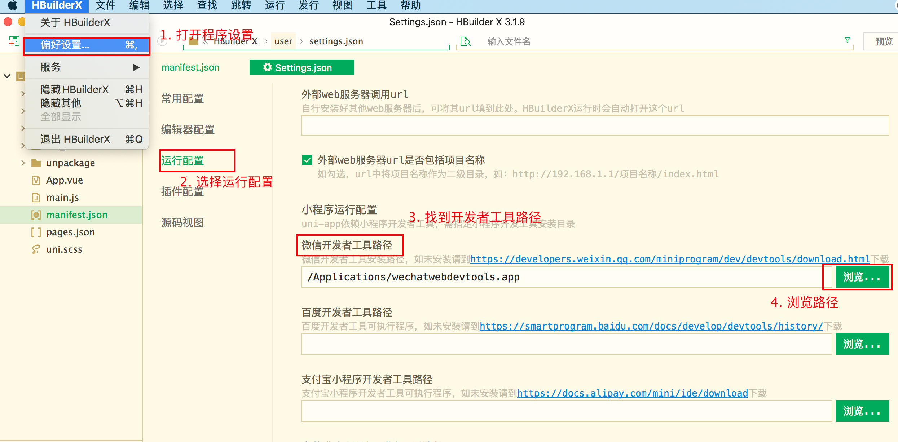

  - 若HBuilderX不能正常启动微信开发者工具，需要开发者手动启动，然后将uni-app生成小程序工程的路径拷贝到微信开发者工具里面，在HBuilderX里面开发，在微信开发者工具里面就可看到实时的效果。

  - 如果提示`[error] 工具的服务端口已关闭。要使用命令行调用工具，请在下方输入 y 以确认开启，或手动打开工具 -> 设置 -> 安全设置，将服务端口开启`，如图：

    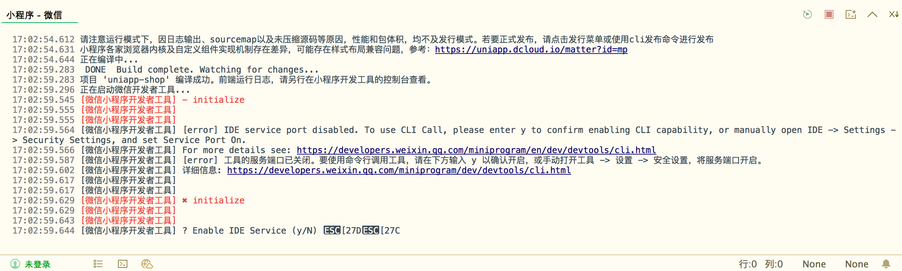

    微信开发者工具设置菜单，安全中打开服务端口：

    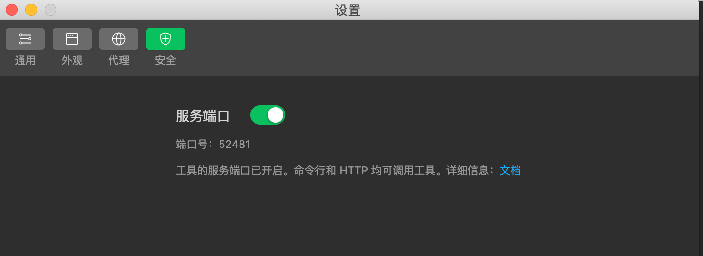

  

### 使用vue-cli命令行(VSCode)

1. 初始化项目

```
// 全局安装 vue-cli 3.x（如已安装请跳过此步骤）
npm install -g @vue/cli

// 通过 CLI 创建 uni-app 项目
vue create -p dcloudio/uni-preset-vue my-project
```

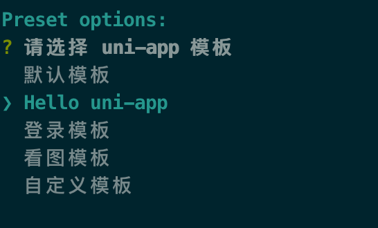


2. 安装组件语法提示

组件语法提示是uni-app的亮点，其他框架很少能提供。

```
npm i @dcloudio/uni-helper-json
```


如果是HBuilderX的项目，可以使用

```
npm i @types/uni-app @types/html5plus -D
```

另外，uni-app 项目下的 manifest.json、pages.json 等文件可以包含注释。vscode 里需要改用 jsonc 编辑器打开。


### 配置AppID

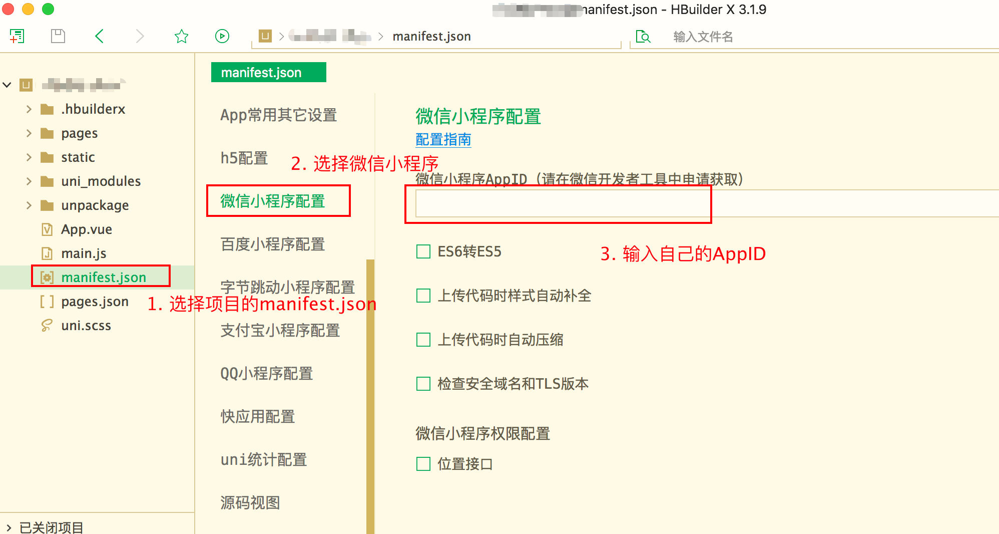


## ESLint与代码格式化

:::tip

ESLint与代码保存即自动格式化，仅在VSCode上有效

:::

### 使用第三方npm包

uni-app支持使用**npm**安装第三方包。

此文档要求开发者们对**npm**有一定的了解，因此不会再去介绍**npm**的基本功能。如若之前未接触过**npm**，请翻阅[NPM官方文档](https://docs.npmjs.com/getting-started/what-is-npm)进行学习。

**1. 初始化npm工程**

若项目之前未使用npm管理依赖（项目根目录下无package.json文件），先在项目根目录执行命令初始化npm工程：

```shell
npm init -y
```

cli项目默认已经有package.json了。HBuilderX创建的项目默认没有，需要通过初始化命令来创建。

**2. 安装依赖**

在项目根目录执行命令安装npm包：

```shell
npm install packageName --save
```

**3. 使用**

安装完即可使用npm包，js中引入npm包：

:::tip

- 为多端兼容考虑，建议优先从 [uni-app插件市场](https://ext.dcloud.net.cn/) 获取插件。直接从 npm 下载库很容易只兼容H5端。
- 非 H5 端不支持使用含有 dom、window 等操作的 vue 组件和 js 模块，安装的模块及其依赖的模块使用的 API 必须是 uni-app 已有的 [API](https://uniapp.dcloud.io/api/README)（兼容小程序 API），比如：支持[高德地图微信小程序 SDK](https://www.npmjs.com/package/amap-wx)。类似[jQuery](https://www.npmjs.com/package/jquery) 等库只能用于H5端。
- node_modules 目录必须在项目根目录下。不管是cli项目还是HBuilderX创建的项目。
- 支持安装 mpvue 组件，但npm方式不支持小程序自定义组件（如 wxml格式的vant-weapp），使用小程序自定义组件请参考：[小程序组件支持](https://uniapp.dcloud.io/frame?id=小程序组件支持)。
- 关于ui库的获取，详见[多端UI库](https://ask.dcloud.net.cn/article/35489)

:::


### 初始化ESLint

```
# 初始化npm包管理
npm init -y

# 安装eslint依赖
npm i -D eslint eslint-config-standard eslint-plugin-import eslint-plugin-node eslint-plugin-promise eslint-plugin-vue
```

package.json文件配置如下：

```json
  "devDependencies": {
    "eslint": "^7.24.0",
    "eslint-config-standard": "^16.0.2",
    "eslint-plugin-import": "^2.22.1",
    "eslint-plugin-node": "^11.1.0",
    "eslint-plugin-promise": "^4.3.1",
    "eslint-plugin-vue": "^7.8.0"
  }
```

新建 两个文件，`.eslintrc.js`：

```js
module.exports = {
  env: {
    browser: true,
    commonjs: true,
    es2021: true,
    node: true
  },
  extends: ['eslint:recommended', 'standard', 'plugin:vue/essential'],
  parserOptions: {
    ecmaVersion: 12
  },
  plugins: ['vue'],
  rules: {
    // 这里有一些自定义配置
    'no-console': [
      'warn',
      {
        allow: ['warn', 'error']
      }
    ],
    'no-eval': 'error',
    'no-alert': 'error'
  },
  globals: {
    uni: 'readonly',
    plus: 'readonly',
    wx: 'readonly'
  }
}
```

创建`.eslintignore`文件：

```
node_modules
.hbuilderx
static
uni_modules
unpackage
```


### 配置vscode自动修复功能

安装`vetur`、`eslint`插件

打开vscode的首选项配置，`settings.json`文件

```json
{
  // ... 你自己的配置
  "editor.codeActionsOnSave": {
  "source.fixAll.eslint": true
  },
  "eslint.format.enable": true,
  //autoFix默认开启，只需输入字符串数组即可
  "eslint.validate": ["javascript", "vue", "html"],

  // 关闭vue文件的自动格式化工具, vetur，使用eslint
  "[vue]": {
  	"editor.defaultFormatter": "octref.vetur"
  },

  "vetur.format.defaultFormatter.ts": "none",
  "vetur.format.defaultFormatter.js": "none",

  // ... 
}
```


## 下载官方代码提示

点击 [下载地址](https://github.com/zhetengbiji/uniapp-snippets-vscode)，放到项目目录下的 .vscode 目录即可拥有和 HBuilderX 一样的代码块。

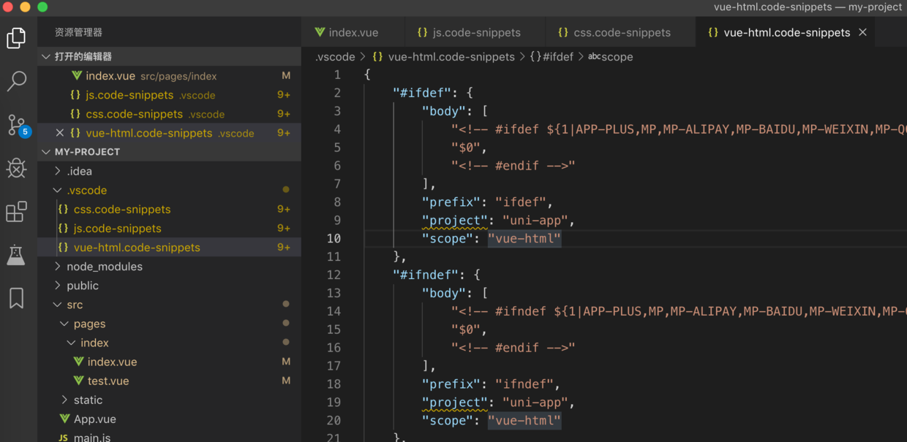


