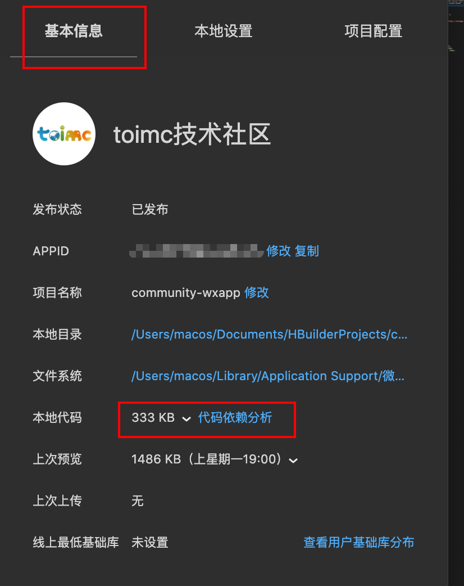
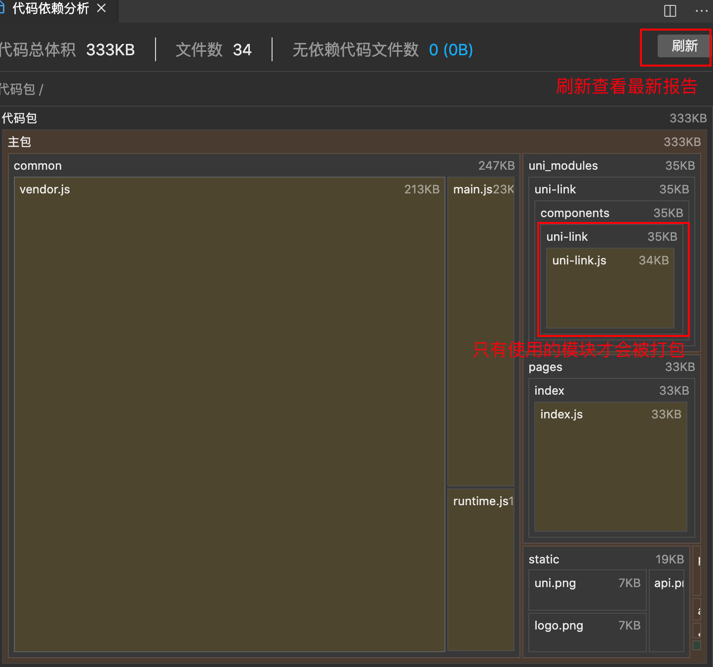
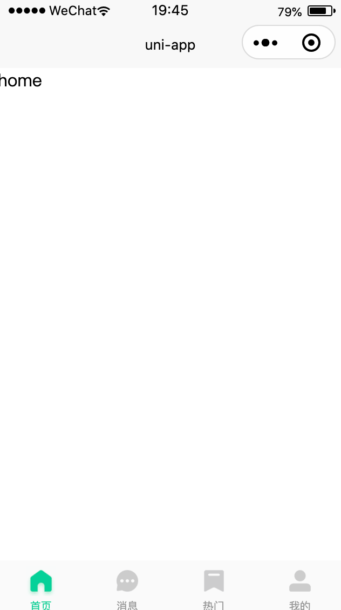
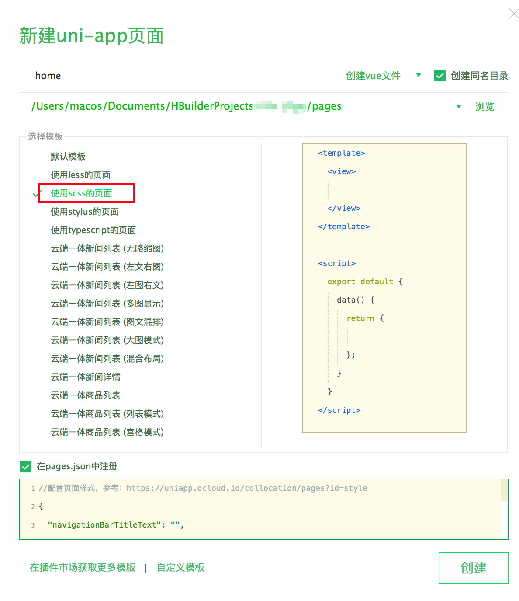
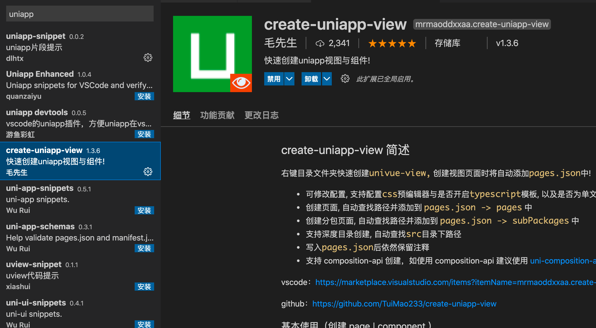
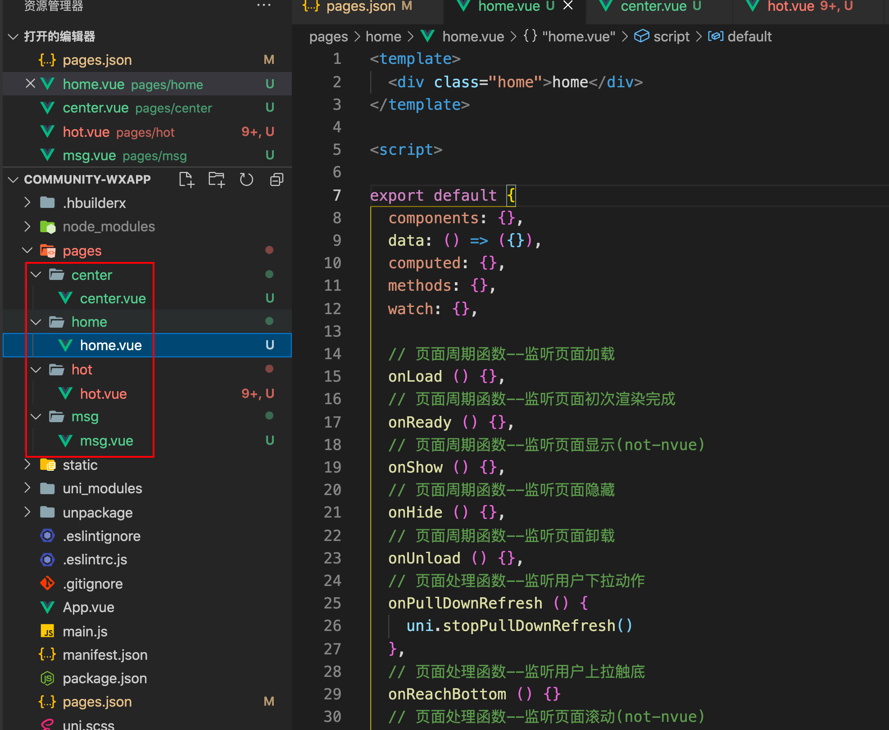
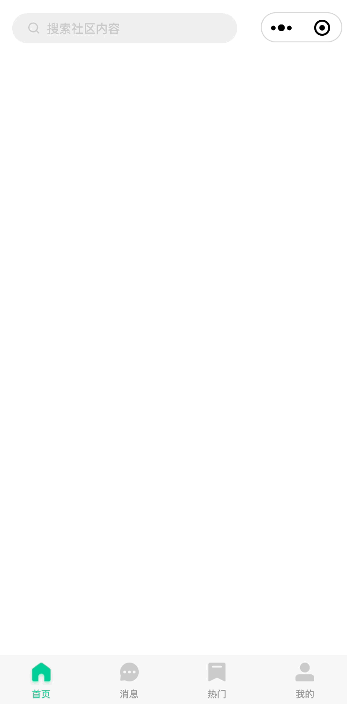
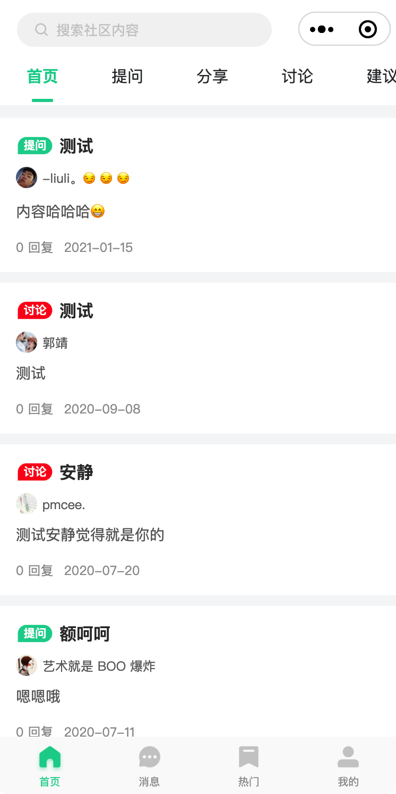
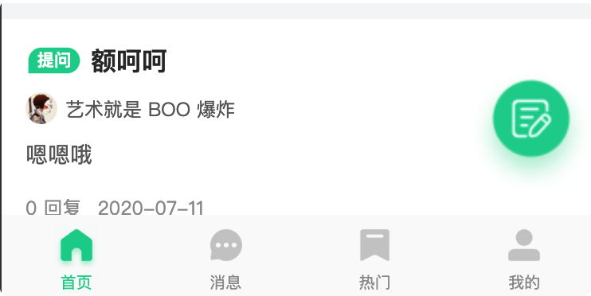

# 首页模块

## 首页tabBar

### 代码依赖分析

可以在基本信息中选择代码依赖分析



查看本地代码与分包大小：




### 导入静态资源

- 删除原`static`目录中的文件；
- 下载课程的静态资源文件夹，并放置于`static`的`images`目录中。

### 布局与样式

完成效果：



创建tabBar的步骤：

- 创建tabBar对应的页面；
- 修改pages.json中的配置项：`pages`和`tabBar`


创建页面HBuilderx方式：




创建页面的VSCode插件方式：




快速创建4个页面



并调整`pages.json`：

```json
{
	"pages": [
		{
			"path": "pages/home/home"
		},
		{
			"path": "pages/msg/msg"
		},
		{
			"path": "pages/hot/hot"
		},
		{
			"path": "pages/center/center"
		}
	],
	"globalStyle": {
		"navigationBarTextStyle": "black",
		"navigationBarTitleText": "uni-app",
		"navigationBarBackgroundColor": "#F8F8F8",
		"backgroundColor": "#F8F8F8",
		"app-plus": {
			"background": "#efeff4"
		}
	}
}
```

新建tabBar属性：

```json
"tabBar": {
	"color": "#999",
	"backgroundColor": "#fafafa",
	"selectedColor": "#02D199",
	"borderStyle": "white",
	"list": [
		{
			"text": "首页",
			"pagePath": "pages/home/home",
			"iconPath": "static/images/tab_home_no.png",
			"selectedIconPath": "static/images/tab_home_yes.png"
		},
		{
			"text": "消息",
			"pagePath": "pages/msg/msg",
			"iconPath": "static/images/tab_news_no.png",
			"selectedIconPath": "static/images/tab_news_yes.png"
		},
		{
			"text": "热门",
			"pagePath": "pages/hot/hot",
			"iconPath": "static/images/tab_popular_no.png",
			"selectedIconPath": "static/images/tab_popular_yes.png"
		},
		{
			"text": "我的",
			"pagePath": "pages/center/center",
			"iconPath": "static/images/tab_my_no.png",
			"selectedIconPath": "static/images/tab_my_yes.png"
		}
	],
	"position": "bottom"
}
```


底部的阴影：

```vue
<view class="bottom-line"></view>

<style lang="scss">
.bottom-line {
  position: fixed;
  bottom: -5px;
  left: 0;
  width: 100vw;
  height: 5px;
  background: transparent;
  box-shadow: 0 -5px 5px rgba(0, 0, 0, 0.05);
}
</style>
```


### 导入uView UI

准备工作

```js
// 安装sass依赖
npm i node-sass sass-loader@10 -D

// 安装uView
npm install uview-ui
```


在`main.js`中引入：

```
import uView from 'uview-ui'
Vue.use(uView)
```


在项目根目录的`uni.scss`中引入样式文件：

```css
/* uni.scss */
@import 'uview-ui/theme.scss';
```


调整`App.vue`的样式

```vue
<style lang="scss">
/* 注意要写在第一行，同时给style标签加入lang="scss"属性 */
@import "uview-ui/index.scss";
</style>
```


配置`pages.json`：

```json
	// ....
	"easycom": {
		"^u-(.*)": "uview-ui/components/u-$1/u-$1.vue"
	}
```


## 搜索

### 添加分包

在uniapp中添加分包

- 新增页面，比如`/sub-pkg/search/search`
- 配置`pages.json`


### 布局与样式

```vue
<template>
  <view class="search">
    <div class="search-box">
      <u-search :focus="true"></u-search>
    </div>
    <!-- 搜索建议列表 -->
    <view class="list" v-if="searchResults.length !== 0">
      <view class="item" v-for="(item, i) in searchResults" :key="i">
        <view class="name">{{item.name}}</view>
        <u-icon type="arrow-right" size="16"></u-icon>
      </view>
    </view>
    <!-- 搜索历史 -->
    <view class="history-box" v-else>
      <!-- 标题区域 -->
      <view class="history-title" v-if="historyList.length !== 0">
        <text>搜索历史</text>
        <u-icon type="trash" size="17" @click="clean"></u-icon>
      </view>
      <!-- 列表区域 -->
      <view class="history-list">
        <uni-tag :text="item" v-for="(item, i) in historyList" :key="i"></uni-tag>
      </view>
    </view>
    <!-- 热门推荐 -->
    <view class="history-box">
      <!-- 标题区域 -->
      <view class="history-title" v-if="hotList.length !== 0">
        <text>热门推荐</text>
      </view>
      <!-- 列表区域 -->
      <view class="history-list">
        <uni-tag :text="item" v-for="(item, i) in hotList" :key="i"></uni-tag>
      </view>
    </view>
  </view>
</template>

<style lang="scss" scoped>
.search {
  padding: 24rpx;
}

.search-box {
  position: sticky;
  top: 0;
  z-index: 999;
  padding-bottom: 50rpx;
}

.list {
  padding: 0 5px;
  .item {
    font-size: 12px;
    padding: 13px 0;
    border-bottom: 1px solid #efefef;
    display: flex;
    align-items: center;
    justify-content: space-between;
    .name {
      white-space: nowrap;
      overflow: hidden;
      text-overflow: ellipsis;
      margin-right: 3px;
    }
  }
}

.history-box {
  padding: 0 10rpx 50rpx;

  .history-title {
    display: flex;
    justify-content: space-between;
    align-items: center;
    height: 40px;
    font-size: 16px;
    font-weight: bold;
  }

  .history-list {
    display: flex;
    flex-wrap: wrap;
    ::v-deep .uni-tag {
      margin-top: 5px;
      margin-right: 5px;
      border-radius: 25rpx;
    }
  }
}
</style>
```


`pages.json`中配置分包：

```json
"subPackages": [
	{
		"root": "subpkg",
		"pages": [
			{
				"path": "search/search",
				"style": {
					"navigationBarTitleText": "搜索"
				}
			},
      // ...
    ]
  }
]
```


使用easycom，添加`search.vue`组件：

```vue
<template>
  <view :style="{'padding-top': barHeight + 'px'}" class="search" @click="$emit('click')">
    <view class="search-box">
      <u-icon name="search" color="#CCCCCC" size="28" class="icon"></u-icon>
      <text>搜索社区内容</text>
    </view>
  </view>
</template>

<script>

export default {
  props: {},
  data: () => ({
    barHeight: 80
  }),
  computed: {},
  methods: {
    getNavBarHeight () {
      uni.getSystemInfo({
        success: (result) => {
          const statusBarHeight = result.statusBarHeight
          const isiOS = result.system.indexOf('iOS') > -1
          if (isiOS) {
            this.barHeight = statusBarHeight + 5
          } else {
            this.barHeight = statusBarHeight + 7
          }
          // getApp().globalData.barHeight = this.barHeight
          // 存储至store中
          // uni.setStorage({
          //   key: 'setBarHeight',
          //   data: this.barHeight
          // })
        },
        fail: () => {},
        complete: () => {}
      })
    }
  },
  beforeMount () {
    this.getNavBarHeight()
  }
}
</script>

<style lang="scss" scoped>
// search
.search {
  // padding-top: 25px;
  position: relative;
  background: #fff;
  width: 100vw;
  padding: 0 32rpx 12rpx;
  z-index: 999;
  .search-box {
    position: relative;
    width: 70%;
    @media (max-width: 320px) {
      width: 60%;
    }
    height: 64rpx;
    line-height: 64rpx;
    background: #f3f3f3;
    border-radius: 32rpx;
    color: #ccc;
    font-size: 26rpx;
    padding-left: 74rpx;
  }
  .icon {
    position: absolute;
    left: 32rpx;
    top: 19rpx;
  }
}
</style>
```


`home.vue`添加导航：

```vue
<search @click="gotoSearch"></search>
```


完成效果：


### 添加事件


`home.vue`添加`gotoSearch`方法，完成页面跳转。

```javascript
gotoSearch () {
  uni.navigateTo({
    url: '/subcom-pkg/search/search'
  })
}
```


完成效果：



## 首页Tabs

### 布局与样式

`home.vue`添加tabs

```vue
<u-tabs ref="uTabs" :is-scroll="true" active-color="#02D199" height="88" gutter="50"></u-tabs>
```


添加tabs数据

```vue
<u-tabs ref="uTabs" :list="tabs" :name="'value'" :current="current" :is-scroll="true" active-color="#02D199" height="88" gutter="50"></u-tabs>
<script>
  export default {
  data: () => ({
    tabs: [
      {
        key: '',
        value: '首页'
      },
      {
        key: 'ask',
        value: '提问'
      },
      {
        key: 'share',
        value: '分享'
      },
      {
        key: 'discuss',
        value: '讨论'
      },
      {
        key: 'advise',
        value: '建议'
      },
      {
        key: 'advise',
        value: '公告'
      },
      {
        key: 'advise',
        value: '动态'
      }
    ],
    // 因为内部的滑动机制限制，请将tabs组件和swiper组件的current用不同变量赋值
    current: 0, // tabs组件的current值，表示当前活动的tab选项
    swiperCurrent: 0, // swiper组件的current值，表示当前那个swiper-item是活动的
  })
}
</script>
```


完成效果


### 添加事件

tabs添加切换事件`tabsChange`

```vue
<u-tabs ref="uTabs" :list="tabs" :name="'value'" :current="current" @change="tabsChange" :is-scroll="true" active-color="#02D199" height="88" gutter="50"></u-tabs>

<script>
	export default {
    ...
    methods: {
      // tabs通知swiper切换
      tabsChange (index) {
        this.current = index
      }
    }
  }
</script>
```


## 内容列表

### 布局与样式

添加`list-item`组件

```vue
<template>
  <view class="list-item">
    <view class="list-head">
      <view class="title">
        <text class="ellipsis"><text class="type" :class="['type-'+item.catalog]" v-if="item.catalog === 'share'">分享</text>
          <text class="type" :class="['type-'+item.catalog]" v-else-if="item.catalog === 'ask'">提问</text>
          <text class="type" :class="['type-'+item.catalog]" v-else-if="item.catalog === 'discuss'">讨论</text>
          <text class="type" :class="['type-'+item.catalog]" v-else-if="item.catalog === 'advise'">建议</text>
          {{item.title}}
        </text>
      </view>
    </view>
    <view class="author">
      <view class="inline-block flex-left-center">
        <u-image class="head" :src="item.uid.pic" width="40" height="40" shape="circle" error-icon="/static/images/header.jpg">
        </u-image>
        <text class="name">{{item.uid.name || '未知用户'}}</text>
        <view class="vip" v-show="item.uid.isVip !== '0'">VIP{{item.uid.isVip}}</view>
      </view>
    </view>
    <view class="list-body">
      <view class="info">{{item.content}}</view>
      <image class="fmt" :src="item.snapshot" v-show="item.snapshot" />
    </view>
    <view class="list-footer">
      <view class="left">
        <text class="reply-num">{{item.answer}} 回复</text>
        <text class="timer">{{item.created | moment}}</text>
      </view>
    </view>
  </view>
</template>

<script>

export default {
  props: {
    item: {
      type: Object,
      default: () => ({})
    }
  },
  data: () => ({})
}
</script>

<style></style>
```


`home.vue`添加内容展示区

```vue
<view class="content" :style="{'padding-top': offsetTop + 'px'}">
  <view class="wrapper">
    <view v-for="(item,index) in finalList" :key="index" class="list-box" @click="gotoDetail(item)">
      <list-item :item="item"></list-item>
    </view>
  </view>
</view>

<script>
export default {
  data: () => ({
    ...
    offsetTop: 50,
    lists: [],
    page: {
      page: 0,
      limit: 10,
      catagory: '',
      sort: 'created'
    },
    loading: false
  })
}
</script>
```


添加内容区域样式

```css
// content lists
.content {
  background: #f5f6f7;
  .wrapper {
    padding: 24rpx 0;
  }
  // .nomore {
  //   text-align: center;
  //   padding: 15px 0 25px 0;
  //   color: #999;
  //   font-size: 24rpx;
  // }
}
.list-box {
  padding: 30rpx;
  background-color: #fff;
  margin-bottom: 20rpx;
}
.list-head {
  /*  display: flex;
  align-items: center; */
  margin-bottom: 18rpx;
  .type {
    display: inline-block;
    height: 36rpx;
    width: 72rpx;
    text-align: center;
    line-height: 36rpx;
    white-space: nowrap;
    margin-right: 10rpx;
    font-size: 24rpx;
    border-radius: 18rpx;
    border-bottom-left-radius: 0;
    color: #fff;
  }
  .type-share {
    background-color: #feb21e;
  }
  .type-ask {
    background-color: #02d199;
  }
  .type-discuss {
    background-color: #fe1e1e;
  }
  .type-advise {
    background-color: #0166f8;
  }
  .title {
    color: #333;
    font-size: 32rpx;
    line-height: 44rpx;
    font-weight: bold;
    .ellipsis {
      overflow: hidden;
      text-overflow: ellipsis;
      display: -webkit-box;
      -webkit-line-clamp: 2;
      -webkit-box-orient: vertical;
    }
    .type {
      min-width: 40rpx;
      transform: scale(0.9);
      position: relative;
      top: -4rpx;
      align-self: flex-start;
    }
  }
}
.author {
  display: flex;
  align-items: center;
  font-size: 24rpx;
  margin-right: 30rpx;
  margin-bottom: 18rpx;
  color: #666;
  .head {
    margin-right: 10rpx;
  }
}
.list-body {
  margin-bottom: 30rpx;
  display: flex;
  .info {
    font-size: 28rpx;
    color: #666;
    max-height: 94rpx;
    flex: 1;
    margin-right: 20rpx;
    overflow: hidden;
    text-overflow: ellipsis;
    display: -webkit-box;
    -webkit-line-clamp: 2;
    -webkit-box-orient: vertical;
  }
  .fmt {
    width: 192rpx;
    height: 122rpx;
    border-radius: 8rpx;
  }
}

.list-footer {
  color: #999;
  font-size: 24rpx;
  display: flex;
  align-items: center;
  .left {
    flex: 1;
    display: flex;
    align-items: center;
    .svg-icon {
      margin-right: 5rpx;
    }
    .timer {
      margin-left: 20rpx;
    }
  }
}
```


监听页面加载，处理内容列表容器的padding

```javascript
onLoad () {
  const query = uni.createSelectorQuery().in(this)
  query.select('.fixed-top').boundingClientRect(data => {
    this.offsetTop = data.height
  }).exec()
  // const { windowHeight } = uni.getSystemInfoSync()
  // const query = uni.createSelectorQuery().in(this)
  // query.select('#tabs').boundingClientRect(data => {
  // }).exec()
}
```


### 获取数据

在通过后台接口获取数据前，我们需要对request和api进行简单的封装。

创建`common`文件夹，新建 request.js

```javascript
// console.log(process.env)

export const config = {
  baseUrl: 'https://mp.toimc.com', // 请求的本域名
  // 设置为json，返回后会对数据进行一次JSON.parse()
  dataType: 'json',
  showLoading: true, // 是否显示请求中的loading
  loadingText: '请求中...', // 请求loading中的文字提示
  loadingTime: 800, // 在此时间内，请求还没回来的话，就显示加载中动画，单位ms
  originalData: false, // 是否在拦截器中返回服务端的原始数据
  loadingMask: true, // 展示loading的时候，是否给一个透明的蒙层，防止触摸穿透
  // 配置请求头信息
  header: {
    'content-type': 'application/json;charset=UTF-8'
  }
}

const install = (Vue) => {
  const http = Vue.prototype.$u.http
  http.setConfig(config)

  http.interceptor.request = (config) => {
    console.log('🚀 ~ file: request.js ~ line 24 ~ install ~ config', config)

    // 可以对某个url进行特别处理，此url参数为this.$u.get(url)中的url值
    // 最后需要将config进行return
    return config
    // 如果return一个false值，则会取消本次请求
    // if(config.url == '/user/rest') return false; // 取消某次请求
  }

  http.interceptor.response = (data) => {
    console.log('🚀 ~ file: request.js ~ line 46 ~ install ~ data', data)
    return data
  }
}

export default {
  install
}
```


创建`api`文件夹，新建 index.js，按模块进行接口划分


index.js

```javascript
const req = require.context('./modules', false, /\.js$/)
// console.log('🚀 ~ file: index.js ~ line 2 ~ req', req)

const install = (Vue) => {
  const http = Vue.prototype.$u.http
  req.keys().forEach(item => {
    const module = req(item)
    const keys = Object.keys(module)
    keys.forEach(key => {
      http.api = {
        ...http.api,
        [key]: module[key]
      }
    })
  })
}

export default {
  install
}
```

public.js

```javascript
import Vue from 'vue'

const HttpRequest = Vue.prototype.$u

// ---------------------------------------首页----------------------------------------- //
// 获取首页列表数据
export const getContentList = params => HttpRequest.get('/public/list', params)
```


在`main.js`中引入

```javascript
import apis from '@/api/index'
import interceptors from '@/common/request'

Vue.use(interceptors)
Vue.use(apis)
```


下面我们来获取首页列表数据，创建`getList`方法

```javascript
async getList () {
  this.loading = true
  try {
    const { data } = await this.$u.http.api.getContentList(this.page)
    this.lists = data
  } finally {
    this.loading = false
  }
}
```


通过计算属对列表数据中的头像进行处理

```javascript
computed: {
  finalList () {
    return this.lists.map(item => {
      if (!item.pic) {
        if (item.uid && item.uid.pic) {
          // 网络图片 -> https，服务器的图片 -> /img/
          if (!item.uid.pic.startsWith('http')) {
            item.pic = config.baseUrl + item.uid.pic
          } else {
            // 这是一张网络图片
            item.pic = item.uid.pic
          }
        } else {
          // 默认如果未设置pic
          item.pic = '/static/images/header.jpg'
        }
      }
      return item
    })
  }
}
```


最后在`onshow`周期请求数据

```javascript
onShow () {
    this.getList()
}
```


完成效果：



### 分页与切换

上拉分页加载列表数据

```javascript
// 页面处理函数--监听用户上拉触底
async onReachBottom () {
  if (this.loading) return
  this.page.page++
  const { data } = await this.$u.http.api.getContentList(this.page)
  this.lists = [...this.lists, ...data]
}
```


同时在tab切换时加载不同分类的数据，在tabs切换方法`tabsChange`中添加 getList 方法

```javascript
tabsChange (index) {
  this.current = index
  this.page = {
    page: 0,
    limit: 10,
    catalog: this.tabs[this.current].key || '',
    sort: 'created'
  }
  this.getList()
}
```


## 发帖入口

### 布局与样式

在`home.vue`添加发帖入口

```vue
<image class="add-post" src="/static/images/add-post.png" />
```


修改`add-post`样式

```css
.add-post {
  position: fixed;
  width: 150rpx;
  height: 150rpx;
  bottom: 30rpx;
  right: 10rpx;
  z-index: 999;
}
```


完成效果



### 添加事件

添加点击事件，点击跳转发帖页面

```javascript
newContent () {
  uni.navigateTo({
    url: '/subcom-pkg/post/post'
  })
}
```

