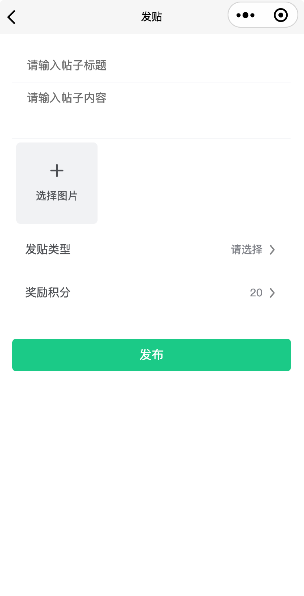

# 发贴功能

## 添加分包

在uniapp中添加分包

- 新增页面，`/subcom-pkg/post/post`

* 配置`pages.json`


## 布局与样式

```vue
<template>
  <view class="container">
    <u-field v-model="title" placeholder="请输入帖子标题" clearable label-width="0" />
    <view class="edit-post">
      <u-field type="textarea" v-model="content" placeholder="请输入帖子内容" label-width="0" />
    </view>

    <view class="upload-img">
      <u-upload :fileList="fileList" multiple />
    </view>
    <view @click="show1=true">
      <u-cell-item title="发贴类型" :arrow="true" arrow-direction="right" :value="listSelect.label">
      </u-cell-item>
      <u-select v-model="show1" :list="list" @confirm="confirm"></u-select>
    </view>
    <view @click="show=true">
      <u-cell-item title="奖励积分" :arrow="true" arrow-direction="right" :value="favSelect.label">
      </u-cell-item>
      <u-select v-model="show" :list="tempFavs" @confirm="confirmFav"></u-select>
    </view>
    <view class="btn">
      <u-button size="default" type="primary" @click="addPost">发布</u-button>
    </view>
  </view>
</template>

<script>

export default {
  components: {},
  data: () => ({
    show: false,
    show1: false,
    title: '',
    content: '',
    list: [
      {
        value: '',
        label: '请选择'
      },
      {
        value: 'ask',
        label: '提问'
      },
      {
        value: 'share',
        label: '分享'
      },
      {
        value: 'discuss',
        label: '讨论'
      },
      {
        value: 'advise',
        label: '建议'
      }
    ],
    listSelect: {
      value: '',
      label: '请选择'
    },
    tempFavs: [
      {
        label: 20,
        value: 20
      },
      {
        label: 30,
        value: 30
      },
      {
        label: 50,
        value: 50
      },
      {
        label: 100,
        value: 100
      }
    ],
    favSelect: {
      label: 20,
      value: 20
    },
    favs: [],
    fileList: [],
    imgList: [], // 已经上传到后台去的图片
    disabledButton: true
  }),
  computed: {},
  methods: {
    confirm (e) {
      this.listSelect = e[0]
    },
    confirmFav (e) {
      this.favSelect = e[0]
    }
  },
  watch: {},

  // 页面周期函数--监听页面加载
  onLoad () {},
  // 页面周期函数--监听页面初次渲染完成
  onReady () {},
  // 页面周期函数--监听页面显示(not-nvue)
  onShow () {},
  // 页面周期函数--监听页面隐藏
  onHide () {},
  // 页面周期函数--监听页面卸载
  onUnload () {},
  // 页面处理函数--监听用户下拉动作
  onPullDownRefresh () {
    uni.stopPullDownRefresh()
  },
  // 页面处理函数--监听用户上拉触底
  onReachBottom () {}
  // 页面处理函数--监听页面滚动(not-nvue)
  /* onPageScroll(event) {}, */
  // 页面处理函数--用户点击右上角分享
  /* onShareAppMessage(options) {}, */
}
</script>

<style lang="scss" scoped>
.container {
  padding: 32rpx;
}

::v-deep .edit-post {
  position: relative;
  textarea {
    max-height: 400rpx;
  }
  .u-clear-icon {
    position: absolute;
    right: 10rpx;
    bottom: 30rpx;
  }
}

.btn {
  margin-top: 60rpx;
}
</style>

```


`pages.json`中配置分包：

```json
"subPackages": [
  {
    "root": "subcom-pkg",
    "pages": [
      ...
      {
        "path": "post/post",
        "style": {
          "navigationBarTitleText": "发贴"
        }
      }
    ]
  }
]
```


完成效果：


