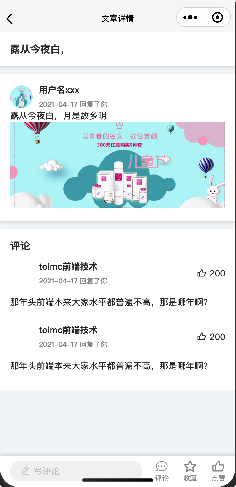

# 文章详情

完成效果：




## 添加分包

在uniapp中添加分包

- 新增页面，`/subcom-pkg/detail/detail`

* 配置`pages.json`


## 页面布局与样式

分析页面，我们可以把详情页拆分成4块区域：标题区、内容区、评论区、底部操作区。新增页面`/subcom-pkg/detail/detail`，创建4块区域的容器，并完成相关样式

```vue
<template>
  <view class="detail">
    <view class="header title">
    </view>
    <view class="content">
    </view>
    <view class="comments">
    </view>
    <view class="footer flex-between-center">
    </view>
  </view>
</template>

<script>

export default {
  components: {},
  data: () => ({}),
  computed: {},
  methods: {},
  watch: {},

  // 页面周期函数--监听页面加载
  onLoad () {},
  // 页面周期函数--监听页面初次渲染完成
  onReady () {},
  // 页面周期函数--监听页面显示(not-nvue)
  onShow () {},
  // 页面周期函数--监听页面隐藏
  onHide () {},
  // 页面周期函数--监听页面卸载
  onUnload () {},
  // 页面处理函数--监听用户下拉动作
  onPullDownRefresh () {
    uni.stopPullDownRefresh()
  },
  // 页面处理函数--监听用户上拉触底
  onReachBottom () {}
  // 页面处理函数--监听页面滚动(not-nvue)
  /* onPageScroll(event) {}, */
  // 页面处理函数--用户点击右上角分享
  /* onShareAppMessage(options) {}, */
}
</script>

<style lang="scss">
.detail {
  background: #f4f6f8;
  min-height: 100vh;
}

.header,
.content,
.footer,
.comments {
  background: #fff;
  padding: 32rpx;
}

.header,
.content {
  margin-bottom: 24rpx;
  box-shadow: 0 5rpx 5px rgba($color: black, $alpha: 0.1);
}

.footer {
  position: fixed;
  bottom: 0;
  left: 0;
  width: 100vw;
  height: 100rpx;
  box-shadow: 0 -5rpx 5px rgba($color: black, $alpha: 0.1);
}

.title {
  font-size: 32rpx;
  color: #333;
  font-weight: bold;
}
</style>
```


填充标题区内容

```vue
...
<view class="header title">
  {{contentData.title}}
</view>
...

<script>
export default {
  components: {},
  data: () => ({
    contentData: {
      title: '露从今夜白，',
      created: '2021-04-17T02:46:29.406Z'
    }
  })
}
</script>
```


丰富内容区

```vue
...
<view class="content">
  <view class="user">
    <image class="photo" src="https://cdn.uviewui.com/uview/swiper/2.jpg" />
    <view class="user-column">
      <span class="name">用户名xxx</span>
      <span class="label left-10">{{ contentData.created | moment }} 回复了你</span>
    </view>
  </view>
  <u-parse :html="content">
    <view class="title"></view>
  </u-parse>
</view>
...

<script>

export default {
  components: {},
  data: () => ({
    content: `
      <p>露从今夜白，月是故乡明</p>
      
    `,
    contentData: {
      title: '露从今夜白，',
      created: '2021-04-17T02:46:29.406Z'
    }
  })
}
</script>
<style lang="scss">
...
.user {
  display: flex;
  align-items: center; /* 垂直居中 */
  margin-right: 20rpx;
  .name {
    margin-left: 20rpx;
    margin-bottom: 10rpx;
    font-size: 28rpx;
    font-family: PingFang SC;
    font-weight: bold;
    color: rgba(51, 51, 51, 1);
  }
  .photo {
    width: 72rpx;
    height: 72rpx;
    border-radius: 50%;
  }
  .user-column {
    display: flex;
    flex-direction: column;
  }
  .label {
    font-size: 22rpx;
    font-family: PingFang SC;
    font-weight: 500;
    color: rgba(153, 153, 153, 1);
  }
  .left-10 {
    margin-left: 20rpx;
  }
}
</style>
```


完成评论区

```vue
...
<view class="comments">
  <view class="title">评论</view>
  <view class="item">
    <view class="flex-between-center">
      <view class="user">
        <image class="photo" :src="uid.pic" />
        <view class="user-column">
          <span class="name">{{ uid.name }}</span>
          <span class="label left-10">{{ contentData.created | moment }} 回复了你</span>
        </view>
      </view>
      <view class="reply">
        <u-icon name="thumb-up" size="30"></u-icon>
        <text>200</text>
      </view>
    </view>
    <view class="comments-content">那年头前端本来大家水平都普遍不高，那是哪年啊？</view>
  </view>
  <view class="item">
    <view class="flex-between-center">
      <view class="user">
        <image class="photo" :src="uid.pic" />
        <view class="user-column">
          <span class="name">{{ uid.name }}</span>
          <span class="label left-10">{{ contentData.created | moment }} 回复了你</span>
        </view>
      </view>
      <view class="reply">
        <u-icon name="thumb-up" size="30"></u-icon>
        <text>200</text>
      </view>
    </view>
    <view class="comments-content">那年头前端本来大家水平都普遍不高，那是哪年啊？</view>
  </view>
</view>
...

<script>

export default {
  components: {},
  data: () => ({
    content: `
      <p>露从今夜白，月是故乡明</p>
      
    `,
    contentData: {
      title: '露从今夜白，',
      created: '2021-04-17T02:46:29.406Z'
    },
    uid: {
      pic: 'http://localhost:3000/Snipaste_2021-04-29_15-32-34.jpg',
      name: 'toimc前端技术'
    }
  })
}
</script>
<style lang="scss">
...
.item {
  padding: 24rpx 0;
  .comments-content {
    padding-top: 32rpx;
  }
  .reply {
    text {
      padding-left: 10rpx;
    }
  }
}
</style>
```


编写底部操作区

```vue
...
<view class="footer flex-between-center">
  <view class="add-comment">
    <u-icon name="edit-pen" size="32" color="#cccccc"></u-icon>
    <text class="text">写评论</text>
  </view>
  <view class="ctrls flex-between-center">
    <view class="comment flex-column-center">
      <u-icon name="chat" size="45"></u-icon>
      <text>评论</text>
    </view>
    <view class="fav flex-column-center">
      <u-icon name="star" size="45"></u-icon>
      <text>收藏</text>
    </view>
    <view class="like flex-column-center">
      <u-icon name="thumb-up" size="45"></u-icon>
      <text>点赞</text>
    </view>
  </view>
</view>
...

<script>
...
</script>
<style lang="scss">
...
.ctrls {
  color: #999;
  font-size: 22rpx;
  width: 35%;
}

.add-comment {
  background: #f3f3f3;
  height: 64rpx;
  border-radius: 32rpx;
  line-height: 64rpx;
  padding: 0 32rpx;
  width: 65%;
  margin-right: 40rpx;
  color: #ccc;
  .text {
    padding-left: 10rpx;
  }
}
</style>
```


配置`pages.json`

```json
"subPackages": [
  {
    "root": "subcom-pkg",
    "pages": [
      ...
      {
        "path": "detail/detail",
        "style": {
          "navigationBarTitleText": "文章详情"
        }
      }
    ]
  }
]
```

