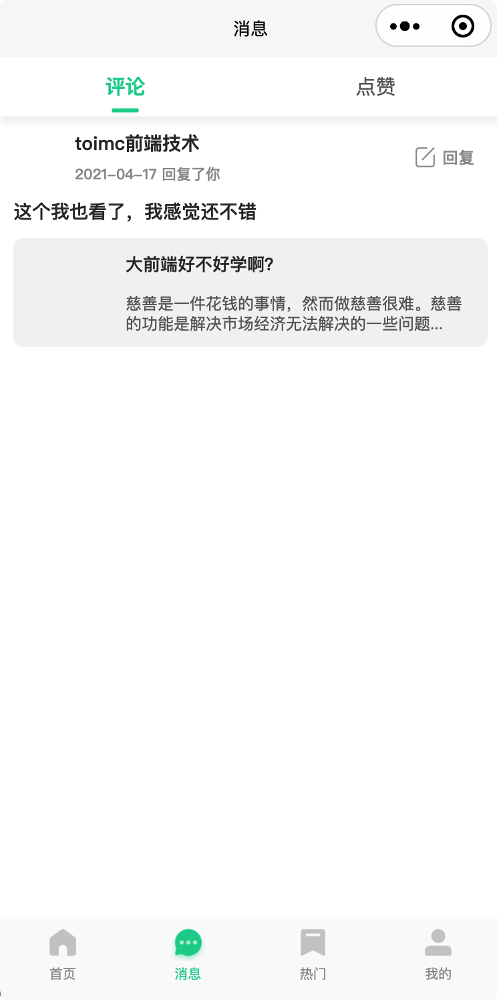
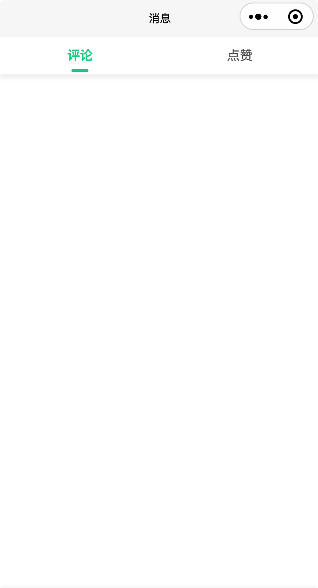
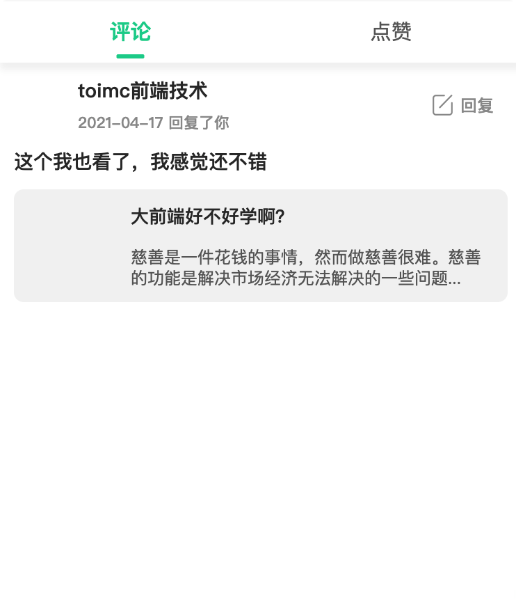

# 消息模块

完成效果：




## 页面布局和样式

添加 tabs 切换，并设置吸顶

```vue
<template>
  <view class="msg">
    <u-sticky>
      <view class="tabs">
        <u-tabs :list="tabs" :name="'value'" :current="current" @change="tabsChange" :is-scroll="false" active-color="#02D199" inactive-color="#666" height="88"></u-tabs>
      </view>
    </u-sticky>
  </view>
</template>

<script>

export default {
  components: {},
  data: () => ({
    tabs: [
      {
        key: 'comments',
        value: '评论'
      },
      {
        key: 'like',
        value: '点赞'
      }
    ],
    current: 0
  }),
  computed: {},
  methods: {
    tabsChange (value) {
      this.current = value
    }
  }
</script>

<style lang="scss" scoped>
</style>
```


效果：




因评论消息与点赞消息，展示的内容不同，我们根据当前所处的tab页，通过`v-if v-else`来展示不同的消息内容

```vue
<template>
  <view class="msg">
    ...
    <view>
      <view v-if="current === 0">
        <view v-for="(item, index) in comments" :key="index">
          <view class="box">
            <view class="user">
              <image class="photo" :src="item.uid.pic" />
              <view class="user-column">
                <span class="name">{{ item.uid.name }}</span>
                <span class="label left-10">{{ item.created | moment }} 回复了你</span>
              </view>
            </view>
            <view class="reply">
              <image src="/static/images/advice.png" />
              回复
            </view>
          </view>
          <view class="comment">{{ item.content }}</view>
          <view class="post">
            <view v-if="item.tid.shotpic">
              <view class="img">
                <image :src="item.tid.shotpic" mode="aspectFill"></image>
              </view>
            </view>
            <view class="post-content">
              <text class="title">{{ item.tid.title }}</text>
              <text class="content">{{ item.tid.content }}</text>
            </view>
          </view>
        </view>
      </view>
      <!-- 点赞 -->
      <view v-else>
        <view v-for="(item, index) in handUsers" :key="index">
          <view class="box">
            <view class="user">
              <image class="photo" :src="item.uid.pic" />
              <view class="user-column">
                <span class="name">{{ item.uid.name }}</span>
                <span class="label left-10">{{ item.created | moment }}</span>
              </view>
            </view>
          </view>
          <view class="comment">赞了你的帖子 {{item.tid.title}}</view>
        </view>
      </view>
    </view>
  </view>
</template>

<script>

export default {
  components: {},
  data: () => ({
    ...
    comments: [
      {
        uid: {
          pic: 'http://localhost:3000/Snipaste_2021-04-29_15-32-34.jpg',
          name: 'toimc前端技术'
        },
        tid: {
          title: '大前端好不好学啊？',
          content: '慈善是一件花钱的事情，然而做慈善很难。慈善的功能是解决市场经济无法解决的一些问题...',
          shotpic: 'http://localhost:3000/Snipaste_2021-04-29_15-32-34.jpg'
        },
        created: '2021-04-17T02:46:29.406Z',
        content: '这个我也看了，我感觉还不错'
      }
    ],
    handUsers: [
      {
        uid: {
          pic: 'http://localhost:3000/Snipaste_2021-04-29_15-32-34.jpg',
          name: 'toimc前端技术'
        },
        tid: {
          title: '大前端好不好学啊？',
          content: '慈善是一件花钱的事情，然而做慈善很难。慈善的功能是解决市场经济无法解决的一些问题...',
          shotpic: 'http://localhost:3000/Snipaste_2021-04-29_15-32-34.jpg'
        },
        created: '2021-04-17T02:46:29.406Z',
        content: '这个我也看了，我感觉还不错'
      }
    ]
  }),
  computed: {},
  methods: {
    tabsChange (value) {
      this.current = value
    }
  },
  watch: {},

  // 页面周期函数--监听页面加载
  onLoad () {},
  // 页面周期函数--监听页面初次渲染完成
  onReady () {},
  // 页面周期函数--监听页面显示(not-nvue)
  onShow () {},
  // 页面周期函数--监听页面隐藏
  onHide () {},
  // 页面周期函数--监听页面卸载
  onUnload () {},
  // 页面处理函数--监听用户下拉动作
  onPullDownRefresh () {
    uni.stopPullDownRefresh()
  },
  // 页面处理函数--监听用户上拉触底
  onReachBottom () {}
  // 页面处理函数--监听页面滚动(not-nvue)
  /* onPageScroll(event) {}, */
  // 页面处理函数--用户点击右上角分享
  /* onShareAppMessage(options) {}, */
}
</script>

<style lang="scss" scoped>
.box {
  display: flex;
  justify-content: space-between;
}
.box-shadow {
  box-shadow: 0px 4px 6px 0px rgba(36, 37, 37, 0.08);
  position: relative;
  z-index: 999;
}

.user {
  display: flex;
  align-items: center; /* 垂直居中 */
  margin: 20rpx;
  .name {
    margin-left: 20rpx;
    margin-bottom: 10rpx;
    font-size: 28rpx;
    font-family: PingFang SC;
    font-weight: bold;
    color: rgba(51, 51, 51, 1);
  }
  .photo {
    width: 72rpx;
    height: 72rpx;
    border-radius: 50%;
  }
  .user-column {
    display: flex;
    flex-direction: column;
  }
  .label {
    font-size: 22rpx;
    font-family: PingFang SC;
    font-weight: 500;
    color: rgba(153, 153, 153, 1);
  }
  .left-10 {
    margin-left: 20rpx;
  }
}
.reply {
  display: flex;
  align-items: center; /* 垂直居中 */
  margin-right: 40rpx;
  font-size: 24rpx;
  font-family: PingFang SC;
  font-weight: 500;
  color: rgba(153, 153, 153, 1);
  line-height: 40rpx;
}
.reply image {
  width: 30rpx;
  height: 30rpx;
  margin-right: 10rpx;
}
.comment {
  margin: 0 20rpx 20rpx 20rpx;
  font-size: 28rpx;
  font-family: PingFang SC;
  font-weight: 500;
  color: rgba(51, 51, 51, 1);
}
.post {
  display: flex;
  flex-flow: row nowrap;
  margin: 0 20rpx 20rpx 20rpx;
  padding: 20rpx;
  background-color: #f3f3f3;
  border-radius: 15rpx;
  .img {
    margin-right: 26rpx;
    width: 122rpx;
    height: 122rpx;
    image {
      width: 100%;
      height: 100%;
      border-radius: 8rpx;
    }
  }
  .post-content {
    display: flex;
    flex-flow: column nowrap;
    justify-content: space-between;
  }
}
.title {
  margin-bottom: 10rpx;
  font-size: 26rpx;
  font-family: PingFang SC;
  font-weight: 500;
  color: rgba(51, 51, 51, 1);
  display: -webkit-box;
  -webkit-line-clamp: 1; /*这个数字是设置要显示省略号的行数*/
  -webkit-box-orient: vertical;
  overflow: hidden;
}
.content {
  font-size: 24rpx;
  font-family: PingFang SC;
  font-weight: 400;
  color: rgba(102, 102, 102, 1);
  line-height: 30rpx;
  display: -webkit-box;
  -webkit-line-clamp: 2; /*这个数字是设置要显示省略号的行数*/
  -webkit-box-orient: vertical;
  overflow: hidden;
}
</style>
```

完成效果（点赞）：


完成效果（评论）：



