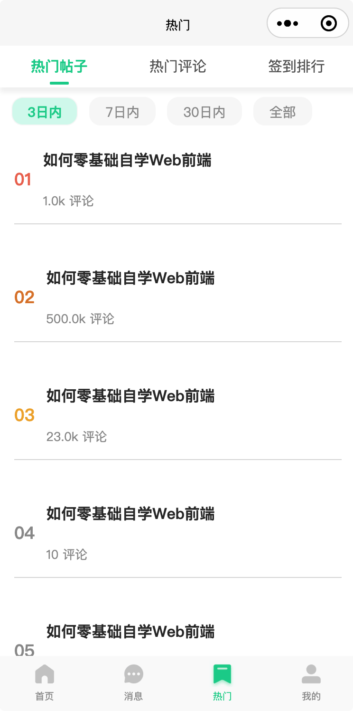
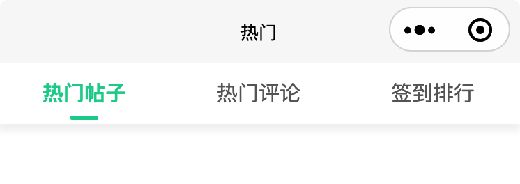
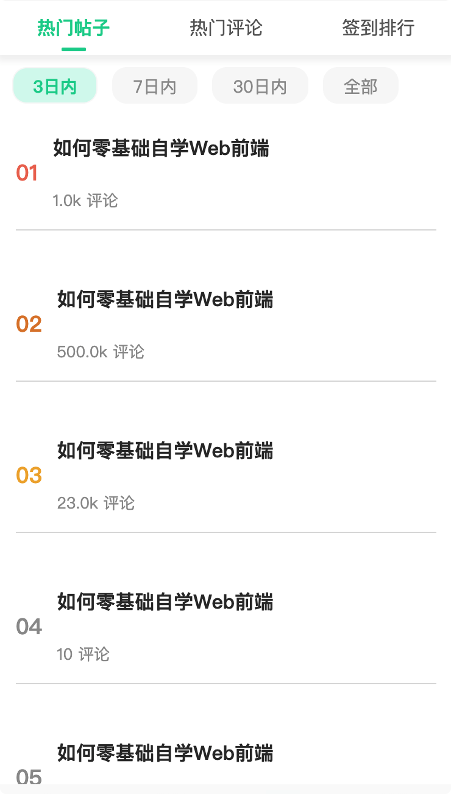
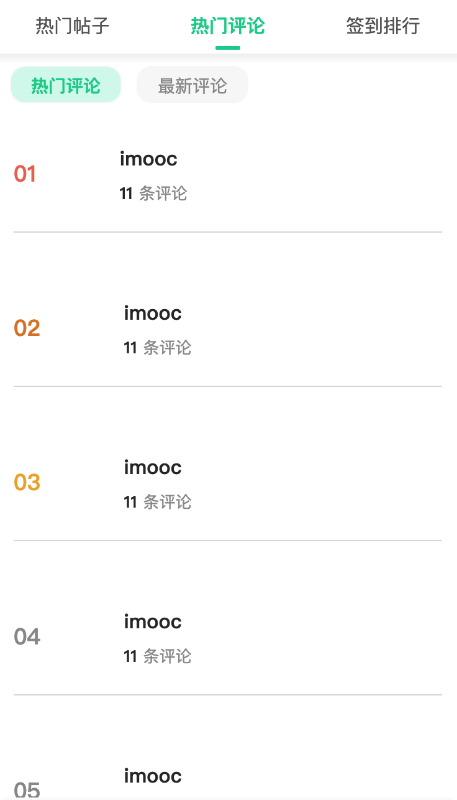
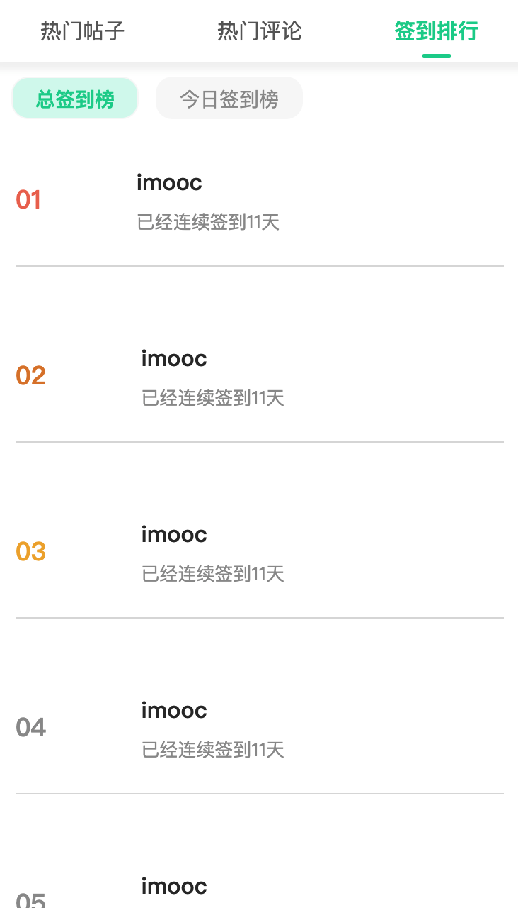

# 热门模块

完成效果：




## 页面布局和样式

热门模块与消息模块类似，都是tabs+列表的形式。

添加 tabs 切换，并设置吸顶

```vue
<template>
  <view>
    <u-sticky>
      <view class="tabs">
        <u-tabs :list="tabs" :name="'value'" :current="current" @change="tabsChange" :is-scroll="false" active-color="#02D199" inactive-color="#666" height="88"></u-tabs>
      </view>
    </u-sticky>
  </view>
</template>

<script>

export default {
  components: {},
  data: () => ({
    tabs: [
      {
        key: 'posts',
        value: '热门帖子'
      },
      {
        key: 'comments',
        value: '热门评论'
      },
      {
        key: 'sign',
        value: '签到排行'
      }
    ],
    current: 0
  }),
  computed: {},
  methods: {
    tabsChange (value) {
      this.current = value
    }
  }
</script>

<style lang="scss" scoped>
</style>
```


效果：




因热门帖子、热门评论与签到排行，展示的内容不同，我们根据当前所处的tab页，通过`v-if v-else-if v-else`来展示不同的消息内容

```vue
<template>
  <view>
    ...
    <view class="content">
      <view class="tags">
        <uni-tag :text="item.value" v-for="(item, i) in types[tabs[current].key]" :class="{'active': tagCur === i}" :key="i" @click="tagsChange(i)"></uni-tag>
      </view>
      <view class="list" v-for="(item,index) in lists" :key="index">
        <!-- 帖子 -->
        <view class="list-item" v-if="tabs[current].key === 'posts'">
          <view class="num first" v-if="index === 0">01</view>
          <view class="num second" v-else-if="index === 1">02</view>
          <view class="num third" v-else-if="index === 2">03</view>
          <view class="num common" v-else-if="index < 9">{{ '0' + (index+1) }}</view>
          <view class="num common" v-else-if="index < 50 && index >=9">{{ index+1 }}</view>
          <view class="num" v-else></view>
          <view class="column">
            <view class="title">{{item.title}}</view>
            <view class="read">{{parseInt(item.answer) > 1000?parseInt(item.answer/1000).toFixed(1) + 'k': item.answer}} 评论</view>
          </view>
          <view class="img" v-if="item.shotpic">
            <image :src="item.shotpic" mode="aspectFill" />
          </view>
        </view>
        <!-- 评论 -->
        <view class="list-item" v-else-if="tabs[current].key === 'comments'">
          <view class="num first" v-if="index === 0">01</view>
          <view class="num second" v-else-if="index === 1">02</view>
          <view class="num third" v-else-if="index === 2">03</view>
          <view class="num common" v-else-if="index < 9">{{ '0' + (index+1) }}</view>
          <view class="num common" v-else-if="index < 50 && index >=9">{{ index+1 }}</view>
          <view class="num" v-else></view>
          <image class="user" :src="item.cuid? item.cuid.pic : '/bear-200-200.jpg'" mode="aspectFit" />
          <view class="column no-between">
            <view class="title">{{item.cuid && item.cuid.name? item.cuid.name : 'imooc'}}</view>
            <view class="read" v-if="tagCur === 0">
              <text>{{item.count}}</text> 条评论
            </view>
            <view class="read" v-else>{{item.created | moment}} 发表了评论</view>
          </view>
        </view>
        <!-- 签到 -->
        <view class="list-item" v-else>
          <view class="num first" v-if="index === 0">01</view>
          <view class="num second" v-else-if="index === 1">02</view>
          <view class="num third" v-else-if="index === 2">03</view>
          <view class="num common" v-else-if="index < 9">{{ '0' + (index+1) }}</view>
          <view class="num common" v-else-if="index < 50 && index >=9">{{ index+1 }}</view>
          <view class="num" v-else></view>
          <image v-if="tagCur === 0" class="user" :src="item.pic" alt />
          <image v-else class="user" :src="item.uid.pic" />
          <view class="column no-between">
            <view class="title">{{item.uid ?item.uid.name: 'imooc'}}</view>
            <view class="read" v-if="tagCur === 0">
              已经连续签到
              <span>{{item.count}}</span> 天
            </view>
            <view class="read" v-else>{{item.created | hours}}</view>
          </view>
        </view>
      </view>
    </view>
  </view>
</template>

<script>

export default {
  components: {},
  data: () => ({
    ...
    types: {
      posts: [
        {
          key: '3',
          value: '3日内'
        },
        {
          key: '7',
          value: '7日内'
        },
        {
          key: '30',
          value: '30日内'
        },
        {
          key: 'all',
          value: '全部'
        }
      ],
      comments: [
        {
          key: 'hot',
          value: '热门评论'
        },
        {
          key: 'current',
          value: '最新评论'
        }
      ],
      sign: [
        {
          key: 'total',
          value: '总签到榜'
        },
        {
          key: 'today',
          value: '今日签到榜'
        }
      ]
    },
    current: 0,
    tagCur: 0,
    lists: [
      {
        title: '如何零基础自学Web前端',
        answer: 1023,
        shotpic: 'http://localhost:3000/Snipaste_2021-04-29_15-32-34.jpg',
        cuid: {
          name: 'imooc',
          pic: 'http://localhost:3000/img/bear-200-200.jpg'
        },
        uid: {
          name: 'imooc',
          pic: 'http://localhost:3000/img/bear-200-200.jpg'
        },
        pic: 'http://localhost:3000/img/bear-200-200.jpg',
        count: 11,
        created: '2021-04-17T02:46:29.406Z'
      },
      {
        title: '如何零基础自学Web前端',
        answer: 500123,
        shotpic: 'http://localhost:3000/Snipaste_2021-04-29_15-32-34.jpg',
        cuid: {
          name: 'imooc',
          pic: 'http://localhost:3000/img/bear-200-200.jpg'
        },
        count: 11,
        created: '2021-04-17T02:46:29.406Z'
      },
      {
        title: '如何零基础自学Web前端',
        answer: 23938,
        shotpic: 'http://localhost:3000/Snipaste_2021-04-29_15-32-34.jpg',
        cuid: {
          name: 'imooc',
          pic: 'http://localhost:3000/img/bear-200-200.jpg'
        },
        count: 11,
        created: '2021-04-17T02:46:29.406Z'
      },
      {
        title: '如何零基础自学Web前端',
        answer: 10,
        shotpic: 'http://localhost:3000/Snipaste_2021-04-29_15-32-34.jpg',
        cuid: {
          name: 'imooc',
          pic: 'http://localhost:3000/img/bear-200-200.jpg'
        },
        count: 11,
        created: '2021-04-17T02:46:29.406Z'
      },
      {
        title: '如何零基础自学Web前端',
        answer: 120,
        shotpic: 'http://localhost:3000/Snipaste_2021-04-29_15-32-34.jpg',
        cuid: {
          name: 'imooc',
          pic: 'http://localhost:3000/img/bear-200-200.jpg'
        },
        count: 11,
        created: '2021-04-17T02:46:29.406Z'
      },
      {
        title: '如何零基础自学Web前端',
        answer: 320,
        shotpic: 'http://localhost:3000/Snipaste_2021-04-29_15-32-34.jpg',
        cuid: {
          name: 'imooc',
          pic: 'http://localhost:3000/img/bear-200-200.jpg'
        },
        count: 11,
        created: '2021-04-17T02:46:29.406Z'
      }
    ]
  }),
  methods: {
    tabsChange (value) {
      this.current = value
      this.tagCur = 0
    },
    tagsChange (value) {
      this.tagCur = value
    }
  },
  onPullDownRefresh () {
    uni.stopPullDownRefresh()
  },
  // 页面处理函数--监听用户上拉触底
  onReachBottom () {}
  // 页面处理函数--监听页面滚动(not-nvue)
  /* onPageScroll(event) {}, */
  // 页面处理函数--用户点击右上角分享
  /* onShareAppMessage(options) {}, */
}
</script>

<style lang="scss" scoped>
.tags {
  display: flex;
  padding: 20rpx 25rpx;
  width: 100vw;
  background-color: #fff;
  z-index: 200;
  ::v-deep .uni-tag {
    // margin-top: 20rpx;
    margin-right: 25rpx;
    border-radius: 25rpx;
    text {
      color: #999;
    }
  }
  .active {
    ::v-deep .uni-tag {
      background-color: #d6f8ef;
      text {
        color: #02d199;
        font-weight: bold;
      }
    }
  }
}

.list {
  z-index: 100;
  padding: 0 30rpx 60rpx 30rpx;
  .list-item {
    display: flex;
    flex-flow: row nowrap;
    justify-content: space-between;
    align-items: center;
    border-bottom: 1px solid #ddd;
  }
  .num {
    font-size: 36rpx;
    font-weight: bold;
    &.first {
      color: #ed745e;
    }
    &.second {
      color: #e08435;
    }
    &.third {
      color: #f1ae37;
    }
    &.common {
      color: #999;
    }
  }
  .user {
    width: 90rpx;
    height: 90rpx;
    border-radius: 50%;
    margin-left: 20rpx;
  }
  .column {
    flex: 1;
    display: flex;
    flex-flow: column nowrap;
    justify-content: space-between;
    height: 186rpx;
    padding: 30rpx 24rpx;

    &.no-between {
      justify-content: center;
      .title {
        padding-bottom: 16rpx;
      }
    }
    .title {
      color: #333;
      font-size: 32rpx;
      font-weight: bold;
    }
    .read {
      font-size: 26rpx;
      color: #999;
      text {
        color: #333;
        font-weight: bold;
        padding-right: 10rpx;
      }
    }
  }
  .img {
    width: 200rpx;
    height: 125rpx;
    border-radius: 12rpx;
    overflow: hidden;
    img {
      width: 100%;
      height: 100%;
    }
  }
}
</style>
```

完成效果（热门帖子）：



完成效果（热门评论）：



完成效果（签到排行）：


