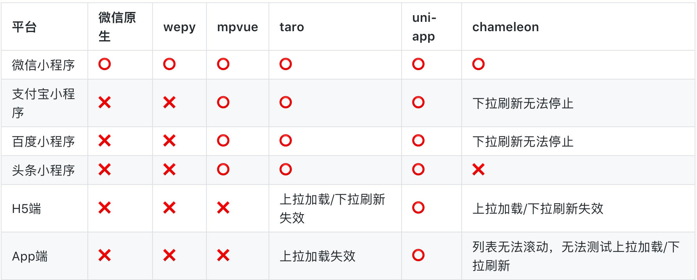

# uniapp介绍

## 什么是快应用？

快应用是指用户无需下载安装，即点即用，享受原生性能体验的应用，例如：微信小程序，支付宝小程序，百度小程序等。


快应用的优势：

- 无需下载安装App，节约手机空间；
- 性能好，体验接近原生；
- 背靠流量；


快应用的缺点：

- 平台多，语法多，开发成本高；
- 管控难；


快应用的发展趋势：平台底层支持，扫码即用，无需安装微信、支付宝等平台，可以参看，[链接](https://www.zhihu.com/question/269267011)


为什么PWA不香了？

- 浏览器环境需要考虑兼容性；
- 支付会被限制；
- 缺乏原生能力；
- 追求原生体验；
- 更高的安全性的要求（内容、代码）；


## 背景介绍

### 技术人想偷懒

困境：

- 小程序的平台太多，需要学习多个平台的语法；
- 前端人也想用vue，react语法来写小程序；
- 想在小程序中使用npm包（庞大的第三方包）；
- 小程序代码 -> 原生App，一套代码多端运行；


### 各个平台之间的对比



数据源：[链接](https://juejin.cn/post/6844903810788245511)， 2020年横评：[链接](https://juejin.cn/post/6844904118901817351)

**结论：**

- 跨端支持度测评结论：`uni-app` > `taro` > `chameleon` > `mpvue` >`wepy`、`原生微信小程序`
- 微信原生框架可达到更好的性能，但 `uni-app`、`taro` 相比微信原生，性能差距并不大；
- 微信原生开发手工优化, `uni-app`>微信原生开发未手工优化, `taro` > `chameleon`> `wepy` > `mpvue`
- `mpvue`支持绝大部分的Vue语法；`uni-app` 编译到微信端曾经使用过`mpvue`，但后来重新编写，支持了更多vue语法如`filter`、复杂 `JavaScript` 表达式等；`wepy`、`chameleon` 都是 `类Vue` 的实现，仅支持 `Vue` 的部分语法，开发时需要单独学习它们的规则；`taro` 对于 `JSX` 的语法支持是相对完善的，React技术栈友好；
- 学习资料完善度：`uni-app` > `mpvue` , `taro` > `chameleon` > `wepy`
- 社区活跃度：`uni-app` > `taro`> `chameleon`  > `wepy` >`mpvue`

:::tip

没有最好的，只有最适合的。

:::


### 应用场景

- 熟悉Vue技术栈，推荐：uniapp > wepy > mpvue；熟悉React技术栈，taro；
- 项目初期，想法论证可以使用uniapp -> 多端开发；后续，推荐Flutter跨端开发，再到后期推荐原生开发；
- 框架的更新本身，不能作为使用框架的绝对指标；选择合适的框架，解决当下的问题；


## 什么是uniapp?

`uni-app` 是一个使用 [Vue.js](https://vuejs.org/) 开发所有前端应用的框架，开发者编写一套代码，可发布到iOS、Android、Web（响应式）、以及各种小程序（微信/支付宝/百度/头条/QQ/钉钉/淘宝）、快应用等多个平台。

:::tip

uni-app与mpvue的渊源：`uni-app`在初期借鉴了`mpvue`，实现了微信小程序端的快速兼容，[参考链接](https://ask.dcloud.net.cn/article/35699)。

:::


## 开发规范

为了实现多端兼容，综合考虑编译速度、运行性能等因素，`uni-app` 约定了如下开发规范：

- 页面文件遵循 [Vue 单文件组件 (SFC) 规范](https://vue-loader.vuejs.org/zh/spec.html)

- 组件标签靠近小程序规范，详见[uni-app 组件规范](https://uniapp.dcloud.io/component/README)

  有几点特别要注意的：

  1. 注意：所有组件与属性名都是小写，单词之间以连字符`-`连接；
  2. 每个vue文件的根节点必须为 `<template>`，且这个 `<template>` 下只能且必须有一个根 `<view>` 组件；
  3. 不推荐使用HTML标签，为了管理方便、策略统一，新写代码时仍然建议使用view等组件；
  4. 组件上的事件绑定，需要以 vue 的事件绑定语法来绑定，如 bindchange="eventName" 事件，需要写成 `@change="eventName"`；
  5. uni-app支持的组件分为vue组件和小程序自定义组件；如果扩展组件符合uni-app的`easycom`组件规范，则可以免注册，直接使用；如果组件不符合easycom规范，则需要在代码里手动import和注册组件，然后才能使用

- 接口能力（JS API）靠近微信小程序规范，但需将前缀 `wx` 替换为 `uni`，详见[uni-app接口规范](https://uniapp.dcloud.io/api/README)

- 数据绑定及事件处理同 `Vue.js` 规范，同时补充了App及页面的生命周期

- 为兼容多端运行，建议使用flex布局进行开发


## 目录结构

一个uni-app工程，默认包含如下目录及文件：

```markdown
┌─uniCloud              云空间目录，阿里云为uniCloud-aliyun,腾讯云为uniCloud-tcb（详见uniCloud）
│─components            符合vue组件规范的uni-app组件目录
│  └─comp-a.vue         可复用的a组件
├─hybrid                App端存放本地html文件的目录，详见
├─platforms             存放各平台专用页面的目录，详见
├─pages                 业务页面文件存放的目录
│  ├─index
│  │  └─index.vue       index页面
│  └─list
│     └─list.vue        list页面
├─static                存放应用引用的本地静态资源（如图片、视频等）的目录，注意：静态资源只能存放于此
├─uni_modules           存放uni_module规范的插件。
├─wxcomponents          存放小程序组件的目录，详见
├─main.js               Vue初始化入口文件
├─App.vue               应用配置，用来配置App全局样式以及监听 应用生命周期
├─manifest.json         配置应用名称、appid、logo、版本等打包信息
└─pages.json            配置页面路由、导航条、选项卡等页面类信息
```

:::tip

- 编译到任意平台时，`static` 目录下的文件均会被完整打包进去，且不会编译。非 `static` 目录下的文件（vue、js、css 等）只有被引用到才会被打包编译进去。
- `static` 目录下的 `js` 文件不会被编译，如果里面有 `es6` 的代码，不经过转换直接运行，在手机设备上会报错。
- `css`、`less/scss` 等资源不要放在 `static` 目录下，建议这些公用的资源放在自建的 `common` 目录下。
- HbuilderX 1.9.0+ 支持在根目录创建 `ext.json`、`sitemap.json` 等小程序需要的文件。

:::


## 导入静态资源

### 模板内引入静态资源

`template`内引入静态资源，如`image`、`video`等标签的`src`属性时，可以使用相对路径或者绝对路径，形式如下

```html
<!-- 绝对路径，/static指根目录下的static目录，在cli项目中/static指src目录下的static目录 -->
<image class="logo" src="/static/logo.png"></image>
<image class="logo" src="@/static/logo.png"></image>
<!-- 相对路径 -->
<image class="logo" src="../../static/logo.png"></image>
```

特别说明：

:::tip

- `@`开头的绝对路径以及相对路径会经过base64转换规则校验
- 引入的静态资源在非h5平台，均不转为base64。
- H5平台，小于4kb的资源会被转换成base64，其余不转。
- 自`HBuilderX 2.6.6`起`template`内支持`@`开头路径引入静态资源，旧版本不支持此方式
- App平台自`HBuilderX 2.6.9`起`template`节点中引用静态资源文件时（如：图片），调整查找策略为【基于当前文件的路径搜索】，与其他平台保持一致
- 支付宝小程序组件内 image 标签不可使用相对路径

:::

### js文件引入

`js`文件或`script`标签内（包括renderjs等）引入`js`文件时，可以使用相对路径和绝对路径，形式如下

```js
// 绝对路径，@指向项目根目录，在cli项目中@指向src目录
import add from '@/common/add.js'
// 相对路径
import add from '../../common/add.js'
```

:::warning

js文件不支持使用`/`开头的方式引入

:::


### css引入静态资源

1. `css`文件或`style标签`内引入`css`文件时（scss、less文件同理），可以使用相对路径或绝对路径（`HBuilderX 2.6.6`）

```css
/* 绝对路径 */
@import url('/common/uni.css');
@import url('@/common/uni.css');
/* 相对路径 */
@import url('../../common/uni.css');
```

:::warning

自`HBuilderX 2.6.6`起支持绝对路径引入静态资源，旧版本不支持此方式

:::


2. `css`文件或`style标签`内引用的图片路径可以使用相对路径也可以使用绝对路径，需要注意的是，有些小程序端css文件不允许引用本地文件（请看注意事项）。

```css
/* 绝对路径 */
background-image: url(/static/logo.png);
background-image: url(@/static/logo.png);
/* 相对路径 */
background-image: url(../../static/logo.png);
```

注意事项：

:::tip

- 引入字体图标请参考，[字体图标](https://uniapp.dcloud.io/frame?id=字体图标)
- `@`开头的绝对路径以及相对路径会经过base64转换规则校验
- 不支持本地图片的平台，小于40kb，一定会转base64。（共四个平台mp-weixin, mp-qq, mp-toutiao, app v2）
- h5平台，小于4kb会转base64，超出4kb时不转。
- 其余平台不会转base64

:::
