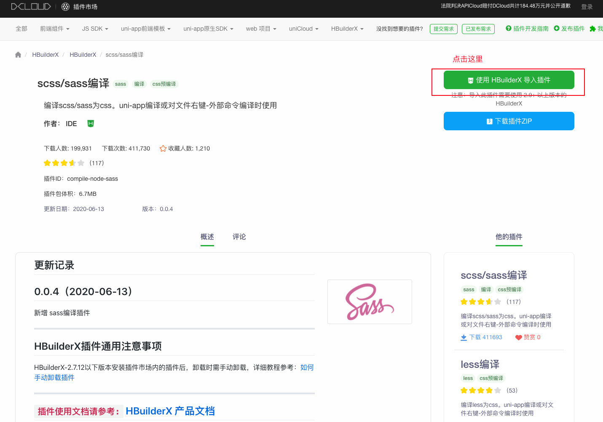
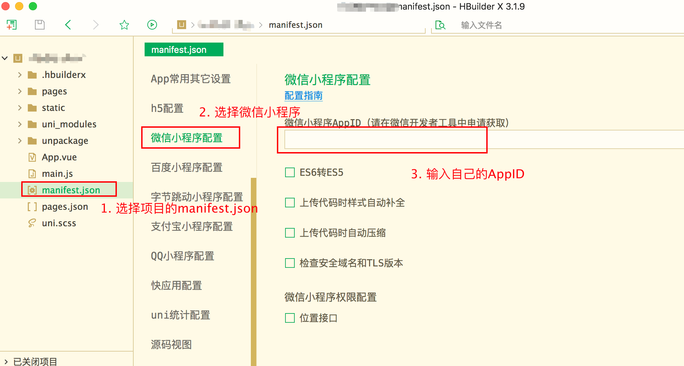
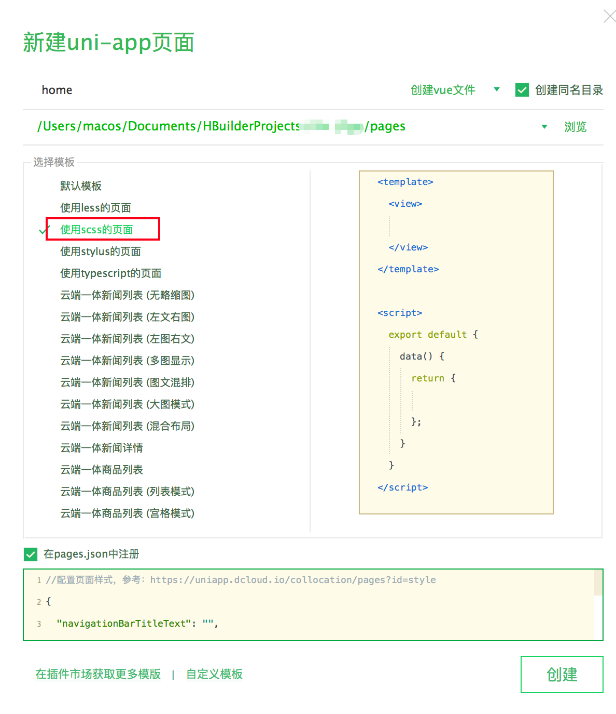

# 小程序uniapp

## 背景介绍

### 技术人想偷懒

困境：

- 小程序的平台太多，需要学习多个平台的语法；
- 前端人也想用vue，react语法来写小程序；
- 想在小程序中使用npm包（庞大的第三方包）；
- 小程序代码 -> 原生App，一套代码多端运行；


### 各个平台之间的对比


数据源：[链接](https://juejin.cn/post/6844903810788245511)

**结论：**

- 跨端支持度测评结论：`uni-app` > `taro` > `chameleon` > `mpvue` >`wepy`、`原生微信小程序`
- 微信原生框架可达到更好的性能，但 `uni-app`、`taro` 相比微信原生，性能差距并不大；
- 微信原生开发手工优化, `uni-app`>微信原生开发未手工优化, `taro` > `chameleon`> `wepy` > `mpvue`
- `mpvue`支持绝大部分的Vue语法；`uni-app` 编译到微信端曾经使用过`mpvue`，但后来重新编写，支持了更多vue语法如`filter`、复杂 `JavaScript` 表达式等；`wepy`、`chameleon` 都是 `类Vue` 的实现，仅支持 `Vue` 的部分语法，开发时需要单独学习它们的规则；`taro` 对于 `JSX` 的语法支持是相对完善的，React技术栈友好；
- 学习资料完善度：`uni-app` > `mpvue` , `taro` > `chameleon` > `wepy`
- 社区活跃度：`uni-app` > `taro`> `chameleon`  > `wepy` >`mpvue`

:::tip

没有最好的，只有最适合的。

:::


### 应用场景

- 熟悉Vue技术栈，推荐：uniapp > wepy > mpvue；熟悉React技术栈，taro；
- 项目初期，想法论证可以使用uniapp -> 多端开发；后续，推荐Flutter跨端开发，再到后期推荐原生开发；
- 框架的更新本身，不能作为使用框架的绝对指标；选择合适的框架，解决当下的问题；


## 什么是uniapp?

`uni-app` 是一个使用 [Vue.js](https://vuejs.org/) 开发所有前端应用的框架，开发者编写一套代码，可发布到iOS、Android、Web（响应式）、以及各种小程序（微信/支付宝/百度/头条/QQ/钉钉/淘宝）、快应用等多个平台。

:::tip

uni-app与mpvue的渊源：`uni-app`在初期借鉴了`mpvue`，实现了微信小程序端的快速兼容，[参考链接](https://ask.dcloud.net.cn/article/35699)。

:::


### 开发规范

为了实现多端兼容，综合考虑编译速度、运行性能等因素，`uni-app` 约定了如下开发规范：

- 页面文件遵循 [Vue 单文件组件 (SFC) 规范](https://vue-loader.vuejs.org/zh/spec.html)

- 组件标签靠近小程序规范，详见[uni-app 组件规范](https://uniapp.dcloud.io/component/README)

  有几点特别要注意的：

  1. 注意：所有组件与属性名都是小写，单词之间以连字符`-`连接；
  2. 每个vue文件的根节点必须为 `<template>`，且这个 `<template>` 下只能且必须有一个根 `<view>` 组件；
  3. 不推荐使用HTML标签，为了管理方便、策略统一，新写代码时仍然建议使用view等组件；
  4. 组件上的事件绑定，需要以 vue 的事件绑定语法来绑定，如 bindchange="eventName" 事件，需要写成 `@change="eventName"`；
  5. uni-app支持的组件分为vue组件和小程序自定义组件；如果扩展组件符合uni-app的`easycom`组件规范，则可以免注册，直接使用；如果组件不符合easycom规范，则需要在代码里手动import和注册组件，然后才能使用

- 接口能力（JS API）靠近微信小程序规范，但需将前缀 `wx` 替换为 `uni`，详见[uni-app接口规范](https://uniapp.dcloud.io/api/README)

- 数据绑定及事件处理同 `Vue.js` 规范，同时补充了App及页面的生命周期

- 为兼容多端运行，建议使用flex布局进行开发


### 目录结构

一个uni-app工程，默认包含如下目录及文件：

```markdown
┌─uniCloud              云空间目录，阿里云为uniCloud-aliyun,腾讯云为uniCloud-tcb（详见uniCloud）
│─components            符合vue组件规范的uni-app组件目录
│  └─comp-a.vue         可复用的a组件
├─hybrid                App端存放本地html文件的目录，详见
├─platforms             存放各平台专用页面的目录，详见
├─pages                 业务页面文件存放的目录
│  ├─index
│  │  └─index.vue       index页面
│  └─list
│     └─list.vue        list页面
├─static                存放应用引用的本地静态资源（如图片、视频等）的目录，注意：静态资源只能存放于此
├─uni_modules           存放uni_module规范的插件。
├─wxcomponents          存放小程序组件的目录，详见
├─main.js               Vue初始化入口文件
├─App.vue               应用配置，用来配置App全局样式以及监听 应用生命周期
├─manifest.json         配置应用名称、appid、logo、版本等打包信息
└─pages.json            配置页面路由、导航条、选项卡等页面类信息
```

:::tip

- 编译到任意平台时，`static` 目录下的文件均会被完整打包进去，且不会编译。非 `static` 目录下的文件（vue、js、css 等）只有被引用到才会被打包编译进去。
- `static` 目录下的 `js` 文件不会被编译，如果里面有 `es6` 的代码，不经过转换直接运行，在手机设备上会报错。
- `css`、`less/scss` 等资源不要放在 `static` 目录下，建议这些公用的资源放在自建的 `common` 目录下。
- HbuilderX 1.9.0+ 支持在根目录创建 `ext.json`、`sitemap.json` 等小程序需要的文件。

:::


### 静态资源

#### 模板内引入静态资源

`template`内引入静态资源，如`image`、`video`等标签的`src`属性时，可以使用相对路径或者绝对路径，形式如下

```html
<!-- 绝对路径，/static指根目录下的static目录，在cli项目中/static指src目录下的static目录 -->
<image class="logo" src="/static/logo.png"></image>
<image class="logo" src="@/static/logo.png"></image>
<!-- 相对路径 -->
<image class="logo" src="../../static/logo.png"></image>
```

特别说明：

:::tip

- `@`开头的绝对路径以及相对路径会经过base64转换规则校验
- 引入的静态资源在非h5平台，均不转为base64。
- H5平台，小于4kb的资源会被转换成base64，其余不转。
- 自`HBuilderX 2.6.6`起`template`内支持`@`开头路径引入静态资源，旧版本不支持此方式
- App平台自`HBuilderX 2.6.9`起`template`节点中引用静态资源文件时（如：图片），调整查找策略为【基于当前文件的路径搜索】，与其他平台保持一致
- 支付宝小程序组件内 image 标签不可使用相对路径

:::

#### js文件引入

`js`文件或`script`标签内（包括renderjs等）引入`js`文件时，可以使用相对路径和绝对路径，形式如下

```js
// 绝对路径，@指向项目根目录，在cli项目中@指向src目录
import add from '@/common/add.js'
// 相对路径
import add from '../../common/add.js'
```

:::warning

js文件不支持使用`/`开头的方式引入

:::


#### css引入静态资源

1. `css`文件或`style标签`内引入`css`文件时（scss、less文件同理），可以使用相对路径或绝对路径（`HBuilderX 2.6.6`）

```css
/* 绝对路径 */
@import url('/common/uni.css');
@import url('@/common/uni.css');
/* 相对路径 */
@import url('../../common/uni.css');
```

:::warning

自`HBuilderX 2.6.6`起支持绝对路径引入静态资源，旧版本不支持此方式

:::


2. `css`文件或`style标签`内引用的图片路径可以使用相对路径也可以使用绝对路径，需要注意的是，有些小程序端css文件不允许引用本地文件（请看注意事项）。

```css
/* 绝对路径 */
background-image: url(/static/logo.png);
background-image: url(@/static/logo.png);
/* 相对路径 */
background-image: url(../../static/logo.png);
```

注意事项：

:::tip

- 引入字体图标请参考，[字体图标](https://uniapp.dcloud.io/frame?id=字体图标)
- `@`开头的绝对路径以及相对路径会经过base64转换规则校验
- 不支持本地图片的平台，小于40kb，一定会转base64。（共四个平台mp-weixin, mp-qq, mp-toutiao, app v2）
- h5平台，小于4kb会转base64，超出4kb时不转。
- 其余平台不会转base64

:::


## 环境初始化

### 集成scss/sass编译

为了方便编写样式（例如`<style lang="scss">`），建议大家安装`sass/scss编译`插件，插件的下载地址：[scss/sass编译](https://ext.dcloud.net.cn/plugin?name=compile-node-sass)




登录账号 -> 无账号，即注册（邮箱验证） -> 再次点击安装插件 -> 打开HBuilderX


### 自定义主题、快捷键等

#### 1. 快捷键切换

在`工具 -> 预设快捷键方案切换` 中可以切换自己喜欢的快捷键方案，对HBuilderX进行自定义：


#### 2. 设置主题


#### 3. 字号设置

macOS的快捷键是 `Command + ,`，windows的快捷键是`Ctrl + ,`


常见配置：

```json
{
	"editor.colorScheme": "Monokai",
	"editor.fontSize": 14,
	"editor.fontFamily": "Consolas",
	"editor.insertSpaces": true,
	"editor.lineHeight": "1.5",
	"editor.mouseWheelZoom": true,
	"editor.onlyHighlightWord": false,
	"editor.tabSize": 2,
	"editor.wordWrap": true,
  "editor.codeassist.px2rem.enabel": false, //启用px转rem提示 true-开启，false-关闭
  "editor.codeassist.px2upx.enabel": false //启用px转upx提示, uni-app项目生效 true-生效， false-关闭
}
```


### 使用HBuilderX可视化界面

步骤：

- 下载HBuilderX：[官方IDE下载地址](https://www.dcloud.io/hbuilderx.html) ——建议使用标准版本

  > HBuilderX标准版可直接用于web开发、markdown、字处理场景。做App仍需要安装插件。
  >
  > App开发版预置了App/uni-app开发所需的插件，开箱即用。
  >
  > 标准版也可以在插件安装界面安装App开发所需插件，App开发版只是一个预集成作用。
  >
  > App开发插件体积大的原因主要有2方面：
  >
  > 1. 真机运行基座，Android版、iOS版、iOS模拟器版，加起来体积就1百多M。真机运行基座需要把所有模块都内置进去，方便大家开发调试。开发者自己做app打包是不会这么大的，因为可以在manifest里选模块来控制体积。
  > 2. uni-app的编译器，依赖webpack和各种node模块，node_modules就是这么一个生态现状，文件超级多，几万个文件，解压起来很慢。

- 在点击工具栏里的文件 -> 新建 -> 项目：

  

 - 选择`uni-app`类型，输入工程名，选择模板，点击创建，即可成功创建。

   

- 在微信开发者工具里运行：进入hello-uniapp项目，点击工具栏的运行 -> 运行到小程序模拟器 -> 微信开发者工具，即可在微信开发者工具里面体验uni-app。

  ​	

  第一次运行的提示：

  

  成功运行：

  

  

  

  **注意：**

  - 如果是第一次使用，需要先配置小程序ide的相关路径，才能运行成功。如下图，需在输入框输入微信开发者工具的安装路径，uni-app默认把项目编译到根目录的unpackage目录。

    

  - 若HBuilderX不能正常启动微信开发者工具，需要开发者手动启动，然后将uni-app生成小程序工程的路径拷贝到微信开发者工具里面，在HBuilderX里面开发，在微信开发者工具里面就可看到实时的效果。

  - 如果提示`[error] 工具的服务端口已关闭。要使用命令行调用工具，请在下方输入 y 以确认开启，或手动打开工具 -> 设置 -> 安全设置，将服务端口开启`，如图：

    

    微信开发者工具设置菜单，安全中打开服务端口：

    

  

### 使用vue-cli命令行(VSCode)

1. 初始化项目

```
// 全局安装 vue-cli 3.x（如已安装请跳过此步骤）
npm install -g @vue/cli

// 通过 CLI 创建 uni-app 项目
vue create -p dcloudio/uni-preset-vue my-project
```


2. 安装组件语法提示

组件语法提示是uni-app的亮点，其他框架很少能提供。

```
复制代码npm i @dcloudio/uni-helper-json
```


### 配置AppID




## ESLint与代码格式化

:::tip

ESLint与代码保存即自动格式化，仅在VSCode上有效

:::

### 使用第三方npm包

uni-app支持使用**npm**安装第三方包。

此文档要求开发者们对**npm**有一定的了解，因此不会再去介绍**npm**的基本功能。如若之前未接触过**npm**，请翻阅[NPM官方文档](https://docs.npmjs.com/getting-started/what-is-npm)进行学习。

**1. 初始化npm工程**

若项目之前未使用npm管理依赖（项目根目录下无package.json文件），先在项目根目录执行命令初始化npm工程：

```shell
npm init -y
```

cli项目默认已经有package.json了。HBuilderX创建的项目默认没有，需要通过初始化命令来创建。

**2. 安装依赖**

在项目根目录执行命令安装npm包：

```shell
npm install packageName --save
```

**3. 使用**

安装完即可使用npm包，js中引入npm包：

:::tip

- 为多端兼容考虑，建议优先从 [uni-app插件市场](https://ext.dcloud.net.cn/) 获取插件。直接从 npm 下载库很容易只兼容H5端。
- 非 H5 端不支持使用含有 dom、window 等操作的 vue 组件和 js 模块，安装的模块及其依赖的模块使用的 API 必须是 uni-app 已有的 [API](https://uniapp.dcloud.io/api/README)（兼容小程序 API），比如：支持[高德地图微信小程序 SDK](https://www.npmjs.com/package/amap-wx)。类似[jQuery](https://www.npmjs.com/package/jquery) 等库只能用于H5端。
- node_modules 目录必须在项目根目录下。不管是cli项目还是HBuilderX创建的项目。
- 支持安装 mpvue 组件，但npm方式不支持小程序自定义组件（如 wxml格式的vant-weapp），使用小程序自定义组件请参考：[小程序组件支持](https://uniapp.dcloud.io/frame?id=小程序组件支持)。
- 关于ui库的获取，详见[多端UI库](https://ask.dcloud.net.cn/article/35489)

:::


### 初始化ESLint

```
# 初始化npm包管理
npm init -y

# 安装eslint依赖
npm i -D eslint eslint-config-standard eslint-plugin-import eslint-plugin-node eslint-plugin-promise eslint-plugin-vue
```

package.json文件配置如下：

```json
  "devDependencies": {
    "eslint": "^7.24.0",
    "eslint-config-standard": "^16.0.2",
    "eslint-plugin-import": "^2.22.1",
    "eslint-plugin-node": "^11.1.0",
    "eslint-plugin-promise": "^4.3.1",
    "eslint-plugin-vue": "^7.8.0"
  }
```

新建 两个文件，`.eslintrc.js`：

```js
module.exports = {
  env: {
    browser: true,
    commonjs: true,
    es2021: true,
    node: true
  },
  extends: ['eslint:recommended', 'standard', 'plugin:vue/essential'],
  parserOptions: {
    ecmaVersion: 12
  },
  plugins: ['vue'],
  rules: {
    // 这里有一些自定义配置
    'no-console': [
      'warn',
      {
        allow: ['warn', 'error']
      }
    ],
    'no-eval': 'error',
    'no-alert': 'error'
  },
  globals: {
    uni: 'readonly',
    plus: 'readonly',
    wx: 'readonly'
  }
}
```

创建`.eslintignore`文件：

```
node_modules
.hbuilderx
static
uni_modules
unpackage
```


### 配置vscode自动修复功能

安装`vetur`、`eslint`插件

打开vscode的首选项配置，`settings.json`文件

```
{
  // ... 你自己的配置
  "editor.codeActionsOnSave": {
  "source.fixAll.eslint": true
  },
  "eslint.format.enable": true,
  //autoFix默认开启，只需输入字符串数组即可
  "eslint.validate": ["javascript", "vue", "html"],

  // 关闭vue文件的自动格式化工具, vetur，使用eslint
  "[vue]": {
  	"editor.defaultFormatter": "octref.vetur"
  },

  "vetur.format.defaultFormatter.ts": "none",
  "vetur.format.defaultFormatter.js": "none",

  // ... 
}
```


### 下载官方代码提示

点击 [下载地址](https://github.com/zhetengbiji/uniapp-snippets-vscode)，放到项目目录下的 .vscode 目录即可拥有和 HBuilderX 一样的代码块。


## 首页列表

创建页面




## 搜索功能


## 文章详情


## 代码高亮


## 登录授权&个人信息获取


## 个人中心


## HTTPS


## 订阅消息


## 内容安全